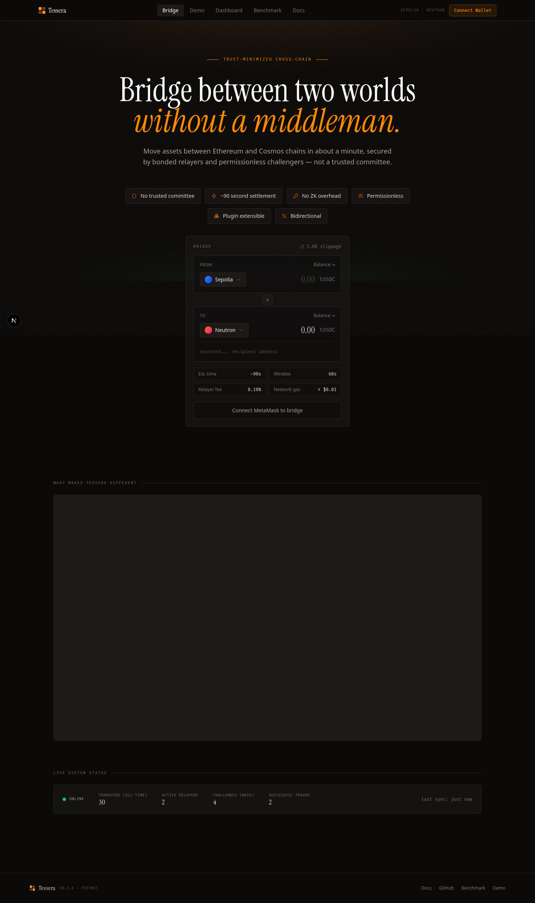
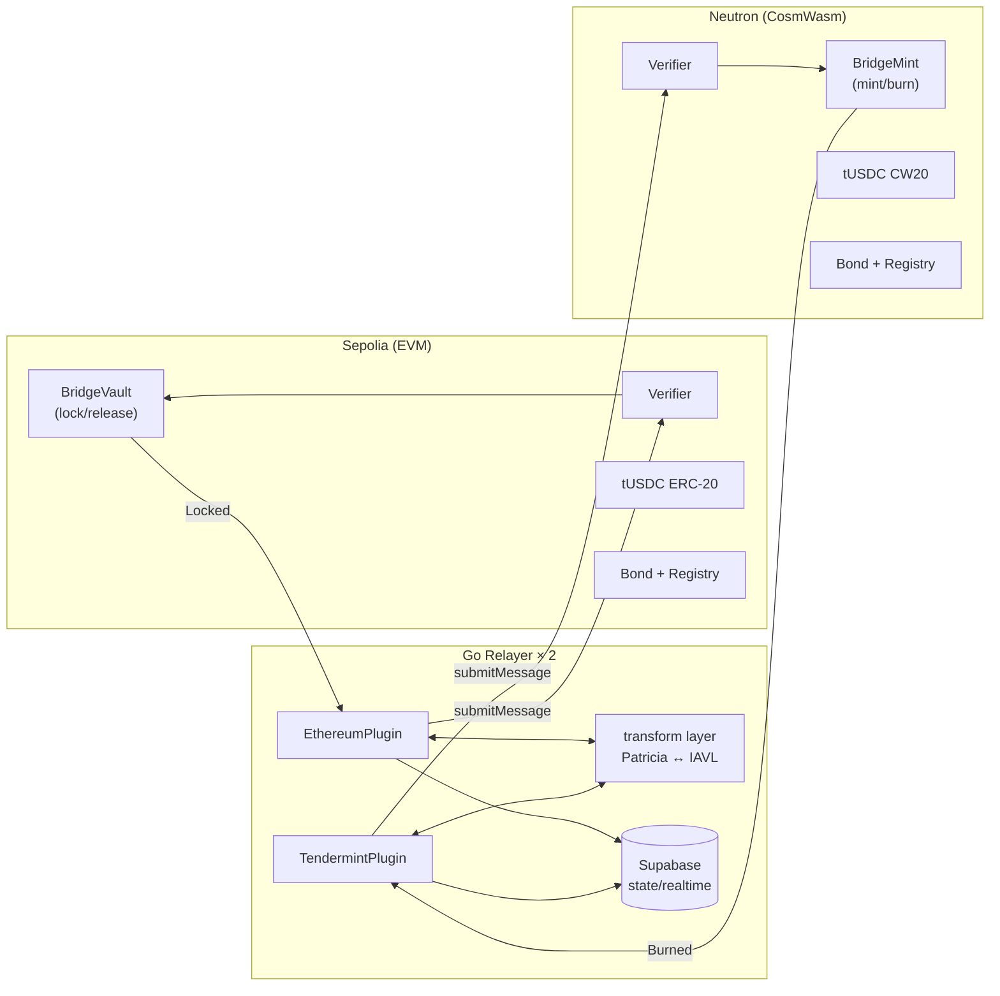
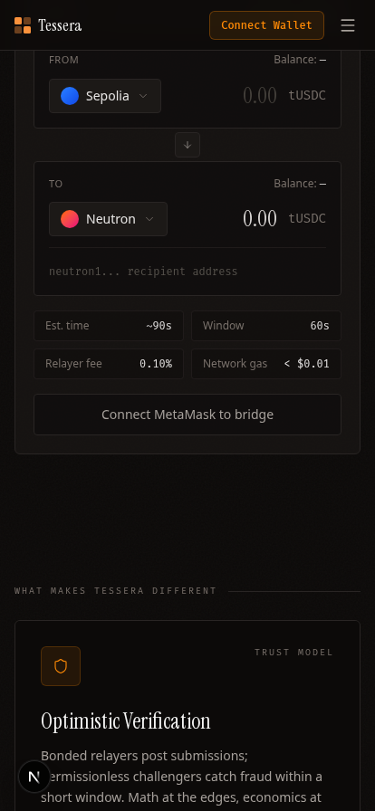

# Overview



Tessera is a trust-minimized cross-chain infrastructure layer. It moves assets and arbitrary messages between EVM and Cosmos chains without trusting any relay operator, running any ZK prover, or doing on-chain Ed25519 verification.

The first reference application is a bidirectional **tUSDC bridge** between Sepolia (Ethereum testnet) and Neutron (Cosmos / CosmWasm testnet).

---

## Three Problems Solved

| Problem | How most bridges handle it | How Tessera handles it |
|---------|---------------------------|------------------------|
| Relayer trust | Trust the operator, or use a multisig | Bond the relayer; slash on fraud. No trust required. |
| Cross-chain proof verification | ZK provers (expensive, slow, GPU-dependent) | Native proof verification in each VM's own format — no ZK. |
| Ed25519 on EVM | On-chain verify (~500k gas, impractical) | Off-chain verify in Go (commodity hardware); EVM never sees Tendermint signatures. |

---

## Novel Contributions

**Deterministic Patricia ↔ IAVL proof transformation.**
Ethereum uses Patricia Merkle Tries (Keccak-256 / RLP). Cosmos uses IAVL trees (SHA-256 / Protobuf). Tessera's relayer transforms proofs deterministically between these formats. Because the transformation is deterministic, any honest party can replicate it — making fraud detectable without a trusted oracle.

**Ed25519 bypass.**
Tendermint validator signatures are Ed25519. Verifying them on EVM costs ~500k gas per signature, making it unusable in practice. Tessera's Go relayer verifies the 2/3+ validator set off-chain, then submits the already-verified proof transformed to Patricia format. Sepolia never sees Ed25519.

**Bonded economic enforcement.**
Relayers post bonds. A relayer who submits a fraudulent proof loses 50% of their bond to the challenger who caught them. Punishment strictly exceeds any realistic gain from fraud — the network stays honest by economic design, not by social trust.

**VM-agnostic dispatch.**
Every cross-chain message uses a canonical envelope with a `destinationApp` field. After proof verification, the Verifier contract dispatches to that address via `onCrossChainMessage(...)`. New applications plug in without touching the Verifier.

---

## At a Glance



> **Deep dive:** [Architecture](./03-architecture) covers the full component map, proof pipeline, and message envelope format.

---

## External Documentation

The full Notion submission doc lives at: **https://www.notion.so/Tessera-35a23e3815fc81a08b60c8fd039ba123**

It mirrors this in-app guide and adds the PM brief, technical decisions, post-hackathon roadmap, and Form-2 reflection.

---

## Quick Start

```bash
cp .env.example .env             # then fill in keys
cd contracts-evm && forge install && forge test
cd ../relayer && go build ./...
go run ./cmd/tessera test-scenario mock   # in-process dry run, no funds needed
# Live demo: <LIVE_URL>
```

Operator: replace `<LIVE_URL>` with the deployed frontend URL before submission.

The bridge widget is the primary user-facing surface, designed to work identically on desktop and mobile:


