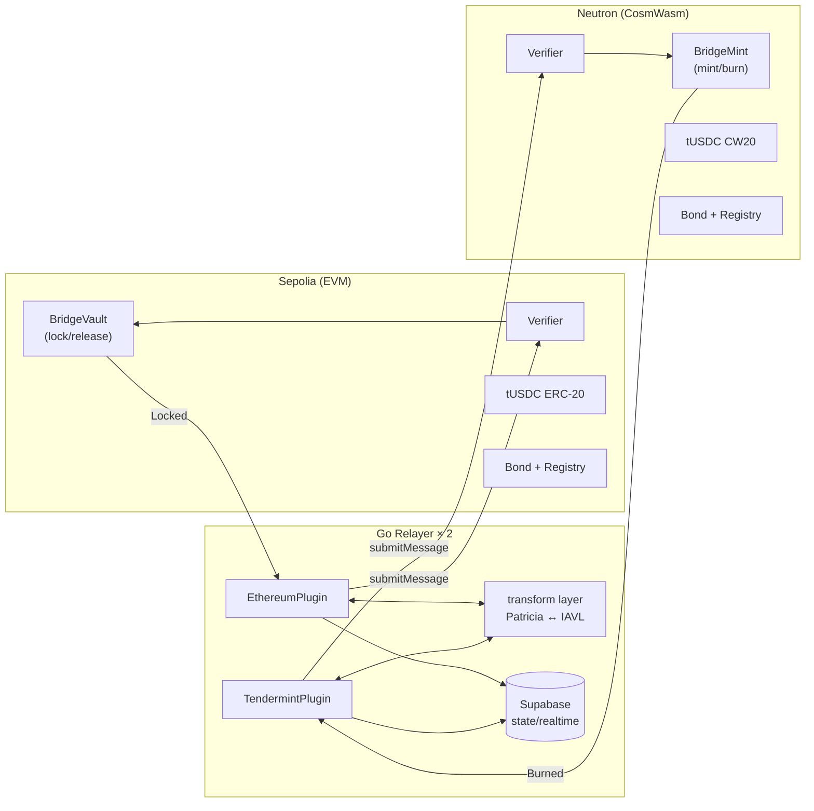
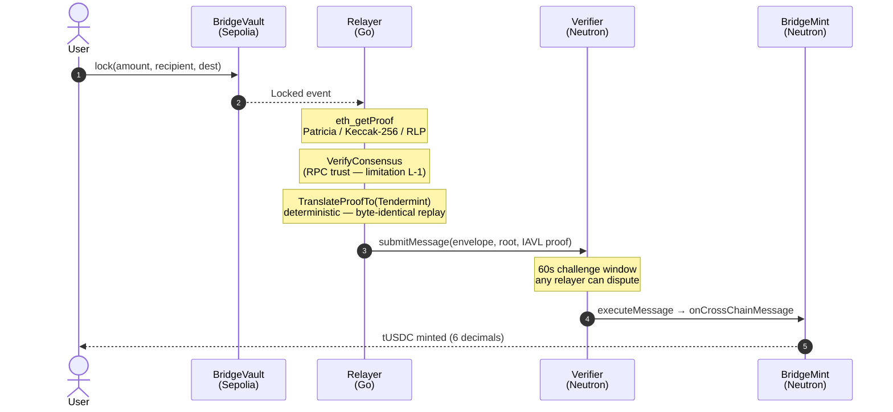
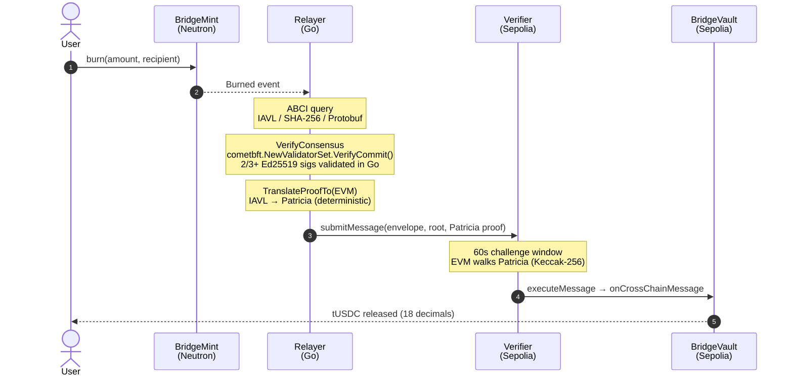

# Architecture

---

## System Components



---

## Six Contracts Per VM

The same logical contract set deploys on every supported chain. Solidity on EVM; Rust + CosmWasm on Cosmos.

| Contract | Role | Key entry points |
|----------|------|-----------------|
| `RelayerRegistry` | Identity + state tracking | `register`, `topUpBond`, `withdrawBond`, `rotateKey`, `recordSlash` |
| `Bond` | Fund custody + slash execution | `deposit`, `slash` (onlyVerifier), `withdraw`, `getBond` |
| `Verifier` | Proof verification + dispatch | `submitMessage`, `challenge`, `executeMessage`, `claimAbsenceSlash` |
| `BridgeVault` | Source-side lock / release | `lock`, `release` (onlyVerifier) |
| `BridgeMint` | Destination-side mint / burn | `mint` (onlyVerifier), `burn` |
| `tUSDC` | Test token | `claim` (rate-limited), standard transfer |

**Adding a new EVM chain:** deploy these six contracts. No new contract code.
**Adding a new Cosmos chain:** deploy the CosmWasm versions. No new contract code.
**Adding a new application:** implement `IApp` and register — no Verifier changes.

---

## Proof Pipeline

### Sepolia → Neutron



### Neutron → Sepolia (Ed25519 bypass)



---

## Message Envelope

Every cross-chain message uses this canonical structure:

```solidity
struct MessageEnvelope {
    bytes32 sourceChainId;
    bytes   sourceApp;          // contract that emitted source event
    bytes32 destinationChainId;
    bytes   destinationApp;     // IApp-implementing contract to dispatch to
    bytes4  action;             // function selector + encoding scheme
    bytes   payload;            // recipient, amount, etc.
    uint64  nonce;              // monotonic, per source chain + source app
}
```

The `nonce` drives per-message role assignment (see [Economics](./04-economics)).
The `destinationApp` field is what makes the system application-agnostic — any IApp-implementing contract can receive messages without Verifier changes.

---

## Relayer Plugin Model

The single source of truth is [`relayer/internal/chain/plugin.go`](https://github.com/sami-funavry/Tessera/blob/main/relayer/internal/chain/plugin.go). The interface below is copied verbatim:

```go
type Plugin interface {
    ChainID() string
    LatestBlock(ctx context.Context) (uint64, error)
    FetchBlockFingerprint(ctx context.Context, height uint64) (Fingerprint, error)
    FetchProof(ctx context.Context, event Event, height uint64) (Proof, error)
    VerifyConsensus(ctx context.Context, height uint64) error
    SubscribeEvents(ctx context.Context, fromBlock uint64) (<-chan Event, error)
    TranslateProofTo(proof Proof, destChainID string) (Proof, error)
    SubmitMessage(ctx context.Context, env MessageEnvelope, proof Proof) (txHash string, submissionID [32]byte, err error)
    ExecuteMessage(ctx context.Context, submissionID [32]byte, proof Proof) (string, error)
    SubmitChallenge(ctx context.Context, submissionID [32]byte, counterProof Proof) (string, error)
    ClaimAbsenceSlash(ctx context.Context, submissionID [32]byte) (string, error)
    Register(ctx context.Context, pubKeyBytes []byte) (string, error)
    DepositBond(ctx context.Context, amount string) (string, error)
}
```

Adding a new source chain = implementing this interface in a new Go file under `relayer/plugins/<chain>/`. Nothing else in the repository changes.

---

## Trust Model

| Layer | Trust assumption |
|-------|----------------|
| Source consensus (Neutron) | Go relayer verifies 2/3+ Ed25519 validator signatures. Cryptographic. |
| Source consensus (Sepolia) | RPC trust — relayer trusts its configured RPC node. Documented limitation; future work: sync committee. |
| Proof transformation | Deterministic. Any party can replicate. Fraud = detectable by challenger. |
| Destination verification | On-chain Merkle proof walk. No trust. |
| Economic enforcement | Bond at risk. Punishment > gain. Honest behavior is the rational strategy. |

> Liveness assumption: at least one honest, online relayer in the registered set.

---

## Live System Visibility

Every component of the architecture above emits structured data that the frontend renders in real time. The benchmark page summarises end-to-end performance — proof fetch latency, transformation time, on-chain submission gas, and the full source-to-destination wall-clock — across recent submissions on both directions.


This is what gives operators a single glance into whether the proof pipeline is healthy, where latency is concentrated, and how each plugin (Ethereum, Tendermint) is performing.

---

> Related: [Economics](./04-economics) · [Limitations](./10-limitations) · [Developer Guide](./07-developer-guide)
