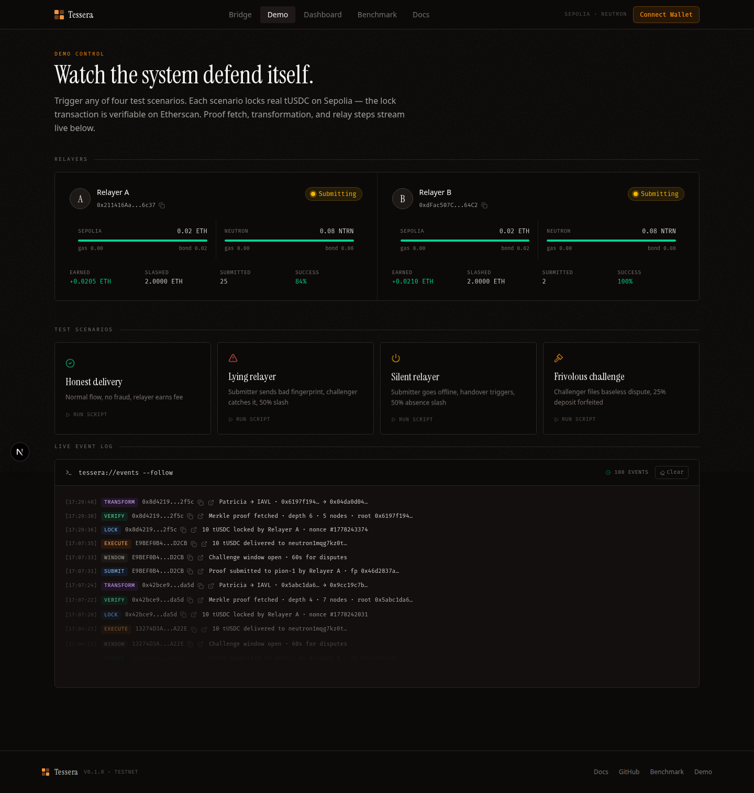
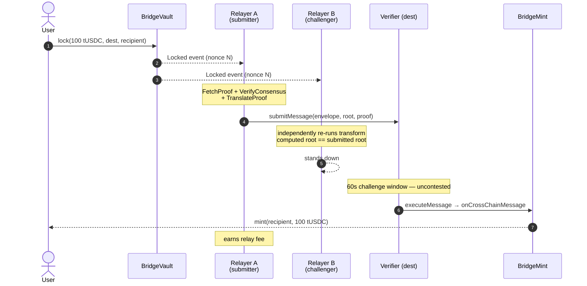
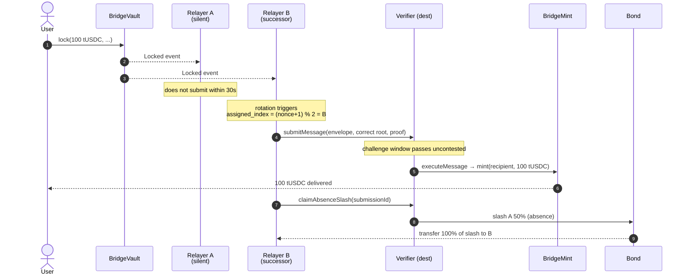
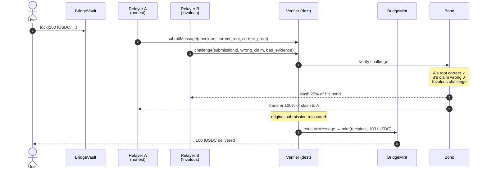

# Demo Scenarios

Four scenarios cover the complete state space of the economic enforcement model. Each is a real on-testnet execution, not a simulation.

Test scripts read on-chain rotation state at runtime to determine which physical relayer (A or B) is the assigned submitter for each scenario. Role assignment is never hardcoded.



---

## Outcome Summary

| Scenario | Submitter action | Challenger action | User outcome | Relayer outcome |
|----------|-----------------|-------------------|--------------|-----------------|
| S-1 Honest | Correct proof | Verifies, stands down | Receives bridged tokens | Submitter earns fee |
| S-2 Lying | Wrong fingerprint | Detects fraud, challenges | Source lock returned | Submitter slashed 50%; challenger +50% |
| S-3 Silent | Does not act | — | Receives bridged tokens | Original slashed 50%; successor +fee +slash |
| S-4 Frivolous | Correct proof | Challenges incorrectly | Receives bridged tokens | Challenger slashed 25%; submitter +25% |

---

## S-1: Honest Delivery

**Setup:** Two relayers registered. Message #N assigned to relayer[0].



**Pass condition:** User balance +100 tUSDC on destination. No slash events.

---

## S-2: Lying Relayer

**Setup:** Relayer A is assigned submitter. A submits a deliberately wrong proof fingerprint.

```mermaid
sequenceDiagram
    autonumber
    actor U as User
    participant SV as BridgeVault
    participant A as Relayer A<br/>(lying)
    participant B as Relayer B<br/>(challenger)
    participant V as Verifier (dest)
    participant Bd as Bond

    U->>SV: lock(100 tUSDC, ...)
    SV-->>A: Locked event
    SV-->>B: Locked event
    A->>V: submitMessage(envelope, WRONG_FINGERPRINT, fabricated proof)
    Note over B: re-runs transform → real_root<br/>real_root ≠ WRONG_FINGERPRINT
    B->>V: challenge(submissionId, real_root, evidence)
    V->>Bd: verify evidence
    Note over Bd: real_root matches source state ✓<br/>WRONG_FINGERPRINT does not ✗
    Bd-->>A: slash 50% of A's bond
    Bd-->>B: transfer 100% of slash to B
    V-->>U: submission reverted; lock returned
```

**Pass condition:** Relayer A bond −50%. Relayer B balance +50% of A's slashed bond. User source balance restored. No mint on destination.

---

## S-3: Silent Relayer

**Setup:** Relayer A is assigned submitter. A does not act within 30s handover period.



**Pass condition:** User receives 100 tUSDC on destination. Relayer A bond −50%. Relayer B earns fee + absence slash reward.

---

## S-4: Frivolous Challenge

**Setup:** Relayer A submits a correct proof. Relayer B files a baseless challenge.



**Pass condition:** Relayer B bond −25%. Relayer A balance +25% of B's slashed bond. User receives 100 tUSDC. Original submission executed.

---

## Running Scenarios

These run as in-process simulations. For testnet runs, see `scripts/scenarios/0N-*.sh`.

```bash
# From repo root — in-process simulations (no funds needed)
go run ./cmd/tessera test-scenario 1
go run ./cmd/tessera test-scenario 2
go run ./cmd/tessera test-scenario 3
go run ./cmd/tessera test-scenario 4
```

Each run prints the assigned roles, simulated transaction hashes, and final bond states. To exercise the same flows against live testnets (real gas, real bonds, real explorers), run the matching shell scripts under `scripts/scenarios/` after `.env` is populated.

> See [Developer Guide](./07-developer-guide) for environment setup prerequisites.
