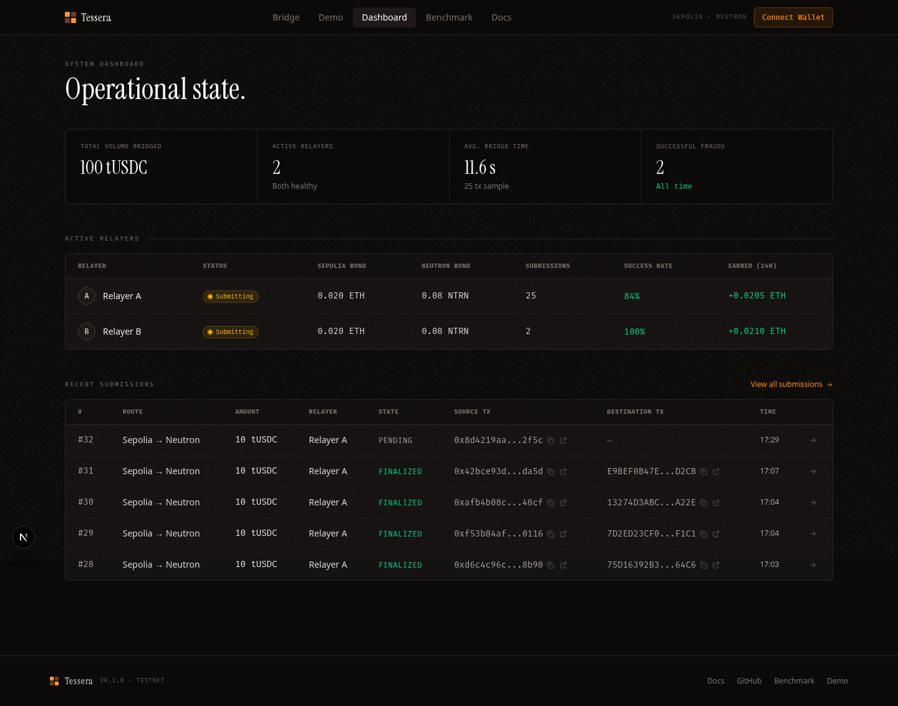

# Repo Structure & Scalability

---

## Directory Layout

Generated from `find . -maxdepth 3 -type d` (filtered to skip `node_modules`, `.git`, `target`, `.next`, `cache`, `out`, `info`, `dist`).

```
tessera/
├── contracts-evm/                       # Solidity contracts (Foundry)
│   ├── src/
│   │   ├── RelayerRegistry.sol
│   │   ├── Bond.sol
│   │   ├── Verifier.sol
│   │   ├── BridgeVault.sol
│   │   ├── BridgeMint.sol
│   │   ├── TUSDC.sol
│   │   ├── interfaces/                  # IApp.sol and friends
│   │   └── libraries/
│   ├── test/
│   │   ├── unit/
│   │   ├── integration/
│   │   └── helpers/
│   ├── script/                          # Deploy.s.sol etc.
│   └── broadcast/                       # forge broadcast artifacts
│
├── contracts-cosmwasm/                  # Rust + CosmWasm contracts
│   ├── contracts/
│   │   ├── relayer-registry/
│   │   ├── bond/
│   │   ├── verifier/
│   │   ├── bridge-vault/
│   │   ├── bridge-mint/
│   │   └── tusdc/
│   ├── packages/
│   │   └── tessera-types/               # shared message types
│   └── artifacts/                       # optimized .wasm output
│
├── relayer/                             # Go service
│   ├── cmd/tessera/                     # binary entry point (cmd/tessera/main.go)
│   ├── internal/
│   │   ├── chain/                       # Plugin interface (chain/plugin.go)
│   │   ├── cli/                         # cobra subcommands (relayer/bond/fetch/test-scenario)
│   │   ├── config/                      # env-var loading
│   │   ├── cosmwasm/                    # low-level CosmWasm/Tendermint client
│   │   ├── obs/                         # observability (slog, sentry)
│   │   ├── pipeline/                    # mock end-to-end pipeline runner
│   │   ├── relayer/                     # submitter, challenger, runner
│   │   ├── scenario/                    # in-process S-1..S-4 simulations
│   │   ├── supabase/                    # state persistence
│   │   └── transform/                   # Patricia ↔ IAVL transformation
│   └── plugins/
│       ├── ethereum/                    # EthereumPlugin
│       └── tendermint/                  # TendermintPlugin
│
├── frontend/                            # Next.js 14 App Router
│   ├── app/                             # routes (bridge, demo, dashboard, docs, benchmark, submissions, api)
│   ├── components/                      # shared UI (incl. components/ui)
│   ├── hooks/                           # data hooks
│   ├── lib/                             # wagmi, keplr, supabase, config
│   ├── public/
│   └── types/
│
├── scripts/                             # deploy + scenario + ops scripts
│   ├── addresses.json                   # canonical deployed contract addresses
│   ├── deploy/                          # solidity deploy helpers
│   ├── scenarios/                       # 01-honest.sh, 02-lying.sh, 03-silent.sh, 04-frivolous.sh (live testnet)
│   ├── register-relayers.sh             # cross-chain bond + register
│   ├── register-sepolia-relayers.sh
│   ├── register-neutron-relayers.js
│   ├── deploy-neutron-v4.js             # current Neutron deploy entrypoint
│   ├── deploy-tusdc-v2.js
│   ├── complete-neutron-deploy.js
│   ├── finalize-neutron-deploy.js
│   ├── redeploy-all-neutron.js
│   ├── redeploy-bond-neutron.js
│   ├── redeploy-tusdc-neutron.js
│   ├── redeploy-verifier-neutron.js
│   ├── claim-neutron-tusdc.js
│   ├── fund-all-neutron-v2.js
│   ├── fund-neutron-relayers.js
│   ├── smoke-test.sh
│   └── smoke-test.log
│
├── docs/                                # in-app documentation (this directory) + images/
└── supabase/
    └── migrations/                      # 001_initial_schema.sql, 002_indexes_and_constraints.sql
```

The Go binary lives at `relayer/cmd/tessera/`; invocations elsewhere in the docs use `go run ./cmd/tessera ...` from inside `relayer/`.

---

## What's in `frontend/`

The Next.js app is the single user- and operator-facing surface for the live deployment. It reads from Supabase (for relayer state, submissions, events) and from both chains directly (for bonds and balances). The dashboard is the primary operator view — every card, table, and metric below is rendered from real on-chain and Supabase data, not fixtures.



---

## Why This Layout

**One contract set, multiple chains.**
`contracts-evm/src/` contains six `.sol` files. The same compiled bytecode deploys on Sepolia today and on any other EVM chain tomorrow. The only change is deployment configuration. Same principle applies to `contracts-cosmwasm/` — same Rust code, new addresses.

**Plugin isolation.**
Each chain plugin lives in `relayer/plugins/<chain-name>/plugin.go`. The plugin has one responsibility: implement `ChainPlugin`. No other file in the relayer knows the difference between Ethereum and Tendermint at the implementation level.

**Shared packages for correctness.**
`packages/tessera-types/` is shared across all CosmWasm contracts so message-type definitions stay consistent — a single fix propagates to every destination app.

---

## Adding a New Source Chain

**What changes:** one new file.

```
relayer/plugins/polygon/plugin.go   ← new file
```

That file implements the `chain.Plugin` interface (defined in `relayer/internal/chain/plugin.go`) for the new chain. The 13-method interface is reproduced verbatim in the [Architecture → Relayer Plugin Model](./03-architecture#relayer-plugin-model) section.

The relayer wires plugins together in `internal/cli/root.go` (the `relayer` subcommand). Adding a chain there is a few lines: construct your plugin from env-var config and pass it to the runner. There is no YAML config file — all runtime configuration is via env vars (see [Developer Guide](./07-developer-guide#prerequisites)).

**What does not change:**
- No existing plugin files.
- No `internal/` files (the plugin pattern keeps chain-specific logic out of the core).
- No contract code.
- No frontend code (new chain appears in the chain selector automatically if the frontend reads from `scripts/addresses.json` / `frontend/lib/config.ts`).

---

## Adding a New Destination VM

**What changes:** one new directory of contracts, ported to the new VM's language.

```
contracts-<new-vm>/
├── relayer-registry/
├── bond/
├── verifier/
├── bridge-vault/
├── bridge-mint/
└── tusdc/
```

The six contracts implement the same logical interface. The Verifier dispatches to `IApp`-equivalent in the new VM's style. Existing contracts on Sepolia and Neutron are unchanged.

---

## Adding a New Application

**What changes:** one new contract.

```solidity
// MyApp.sol
contract MyApp is IApp {
    address public immutable verifier;

    modifier onlyVerifier() {
        require(msg.sender == verifier, "not verifier");
        _;
    }

    function onCrossChainMessage(
        bytes32 sourceChainId,
        bytes calldata sourceApp,
        bytes4 action,
        bytes calldata payload
    ) external onlyVerifier {
        // custom application logic
    }
}
```

Register `MyApp`'s address as the `destinationApp` in the message envelope. The Verifier dispatches to it after proof verification. No Verifier changes. No relayer changes. No registry changes.

---

## Contract Addresses (Deployed)

| Contract | Sepolia | Neutron (pion-1) |
|----------|---------|-----------------|
| tUSDC | [`0x7dcA285EFe722EdC1D9c93C3878fb58b255EC5B0`](https://sepolia.etherscan.io/address/0x7dcA285EFe722EdC1D9c93C3878fb58b255EC5B0) | [`neutron1fw6unz7a9j4zf9gnvhup5qe6dlftytdc0y0rwyn3lyxdazz22rtsck0vld`](https://neutron.celat.one/pion-1/contracts/neutron1fw6unz7a9j4zf9gnvhup5qe6dlftytdc0y0rwyn3lyxdazz22rtsck0vld) |
| Bond | [`0x8c7dc28559B75AF8c3d59B62C87309E65cb37912`](https://sepolia.etherscan.io/address/0x8c7dc28559B75AF8c3d59B62C87309E65cb37912) | [`neutron1nnz9j6c3d25wnwj4h3jqkvazgawcmgjjk5unysvf6e0j90gavvsseunvg8`](https://neutron.celat.one/pion-1/contracts/neutron1nnz9j6c3d25wnwj4h3jqkvazgawcmgjjk5unysvf6e0j90gavvsseunvg8) |
| RelayerRegistry | [`0x43677d5Da5701E061Eefa65e36A4fF6D4BFC1109`](https://sepolia.etherscan.io/address/0x43677d5Da5701E061Eefa65e36A4fF6D4BFC1109) | [`neutron1jq5kku3r0sxdkcxvkx7ke4dlcwq4my0m2gncrx4zf7g37hxtwj7qfrya5k`](https://neutron.celat.one/pion-1/contracts/neutron1jq5kku3r0sxdkcxvkx7ke4dlcwq4my0m2gncrx4zf7g37hxtwj7qfrya5k) |
| Verifier | [`0x2EfAB8cC7ed7C11cfC23C215731aaFA2A602F72a`](https://sepolia.etherscan.io/address/0x2EfAB8cC7ed7C11cfC23C215731aaFA2A602F72a) | [`neutron1sda4ucdq06de7h7lxg66n6sq29ft9hk76a5mpjwehk3a8wfga0eqf002f0`](https://neutron.celat.one/pion-1/contracts/neutron1sda4ucdq06de7h7lxg66n6sq29ft9hk76a5mpjwehk3a8wfga0eqf002f0) |
| BridgeVault | [`0x2C3544434185DD65F058494816bB816e5314a29E`](https://sepolia.etherscan.io/address/0x2C3544434185DD65F058494816bB816e5314a29E) | [`neutron12z7xqgwgp6vsk5s96z4n6vjupqjg3zmvv5v068vvy3n69gshvhaq8j7dam`](https://neutron.celat.one/pion-1/contracts/neutron12z7xqgwgp6vsk5s96z4n6vjupqjg3zmvv5v068vvy3n69gshvhaq8j7dam) |
| BridgeMint | [`0x61cab20856b16003b6a3FB213F86355515AD43cd`](https://sepolia.etherscan.io/address/0x61cab20856b16003b6a3FB213F86355515AD43cd) | [`neutron18am0spqaanz75mh2tl43ychhvf537wcklf3rjlv0y03tvrn6gdksq8ltt7`](https://neutron.celat.one/pion-1/contracts/neutron18am0spqaanz75mh2tl43ychhvf537wcklf3rjlv0y03tvrn6gdksq8ltt7) |

Source of truth: [`scripts/addresses.json`](../scripts/addresses.json)
