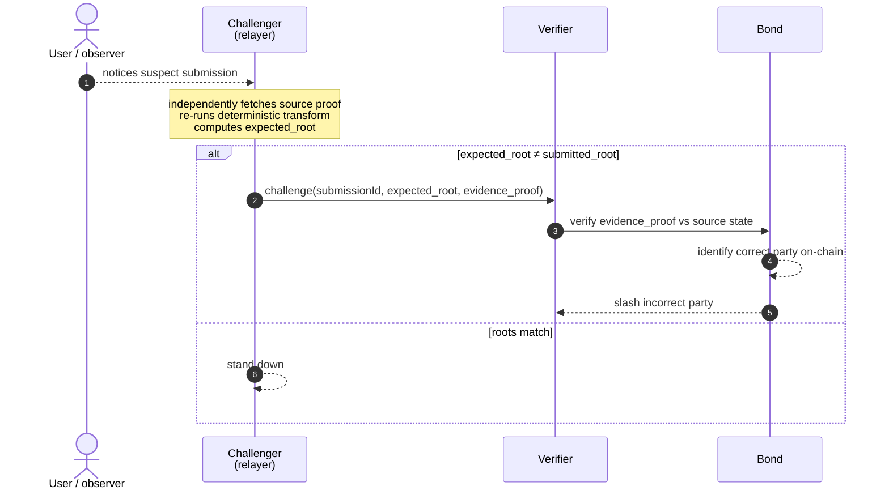

# Protocol User Guide

This section covers two audiences: **relayer operators** (who run the Go binary and post bonds) and **bridge users** (who lock/burn tokens). The bridge UI covers the user path visually — this page covers the protocol-level mechanics.

---

## Relayer Operator Guide

### Prerequisites

- A secp256k1 private key (same key works for both Sepolia and Neutron — it derives both `0x...` and `neutron1...` addresses)
- ETH on Sepolia for gas + bond: minimum 0.02 ETH bond + ~0.005 ETH gas
- NTRN on Neutron for gas + bond: minimum 80,000 uNTRN (0.08 NTRN) bond + ~5,000 uNTRN gas
- Tessera relayer binary built (see [Developer Guide](./07-developer-guide))

---

### Register and Bond

**Sepolia:**

```bash
# 1. Deposit bond to Bond contract
cast send <BOND_ADDRESS> "deposit(address)" <YOUR_ADDRESS> \
  --value 20000000000000000 \
  --private-key <YOUR_PRIVATE_KEY> \
  --rpc-url <SEPOLIA_RPC>

# 2. Register on RelayerRegistry
cast send <REGISTRY_ADDRESS> "register(bytes)" <YOUR_PUBKEY_HEX> \
  --private-key <YOUR_PRIVATE_KEY> \
  --rpc-url <SEPOLIA_RPC>

# 3. Verify active status
cast call <REGISTRY_ADDRESS> "isActive(address)(bool)" <YOUR_ADDRESS> \
  --rpc-url <SEPOLIA_RPC>
```

**Neutron (via neutrond CLI):**

```bash
# Deposit bond
neutrond tx wasm execute <BOND_ADDRESS> \
  '{"deposit":{"relayer":"<YOUR_NEUTRON_ADDRESS>"}}' \
  --amount 80000untrn \
  --from <YOUR_KEY_NAME> \
  --chain-id pion-1 \
  --node <NEUTRON_RPC>

# Register
neutrond tx wasm execute <REGISTRY_ADDRESS> \
  '{"register":{"pubkey":"<YOUR_PUBKEY_BASE64>"}}' \
  --from <YOUR_KEY_NAME> \
  --chain-id pion-1 \
  --node <NEUTRON_RPC>
```

Or use the relayer CLI which handles both chains. All runtime config is via env vars; copy `.env.example` to `.env` and fill in. To run a second relayer instance, set `RELAYER_PRIVATE_KEY` to the second key and rerun.

```bash
# register on both chains (or pass --chain sepolia | neutron)
go run ./cmd/tessera bond register

# deposit bond — amount is in wei for sepolia, uNTRN for neutron
go run ./cmd/tessera bond deposit --chain sepolia --amount 20000000000000000
go run ./cmd/tessera bond deposit --chain neutron --amount 80000
```

The available `bond` subcommands are `register`, `deposit`, `status`, and `fund-neutron`. Run `go run ./cmd/tessera bond --help` for the canonical list.

---

### Monitor Bond Status

```bash
go run ./cmd/tessera bond status
```

The current build prints a hint suggesting the block explorer until the on-chain query is wired up. For now, check live bonds via:

- Sepolia: `cast call <BOND_ADDRESS> "balanceOf(address)(uint256)" <YOUR_ADDRESS> --rpc-url <SEPOLIA_RPC>`
- Neutron: `neutrond query wasm contract-state smart <BOND_ADDRESS> '{"bond_of":{"relayer":"<YOUR_NEUTRON_ADDRESS>"}}' --node <NEUTRON_RPC>`

Or open the contract in [Etherscan / Celatone](./06-repo-structure#contract-addresses-deployed) and read `bondBalances` / `BondOf` directly.

---

### Top Up Bond

If your bond falls below the operating threshold (50% of initial), top up by depositing again on the affected chain:

```bash
# Sepolia top-up: 0.01 ETH
go run ./cmd/tessera bond deposit --chain sepolia --amount 10000000000000000

# Neutron top-up: 40,000 uNTRN
go run ./cmd/tessera bond deposit --chain neutron --amount 40000
```

---

### Withdraw Bond

> Not yet implemented in the CLI. The Bond contracts expose a withdraw entry point — call it directly via `cast` or `neutrond` until a `bond withdraw` subcommand is added.

```bash
# Sepolia
cast send <BOND_ADDRESS> "withdraw(uint256)" <AMOUNT_WEI> \
  --private-key <YOUR_PRIVATE_KEY> \
  --rpc-url <SEPOLIA_RPC>

# Neutron
neutrond tx wasm execute <BOND_ADDRESS> \
  '{"withdraw":{"amount":"<AMOUNT_UNTRN>"}}' \
  --from <YOUR_KEY_NAME> \
  --chain-id pion-1 \
  --node <NEUTRON_RPC>
```

A 1-hour idle period (no pending submissions) is enforced on-chain.

---

## How Disputes Work

When a challenge is filed, the Bond contract resolves it on-chain. No off-chain arbitration.

**Filing a challenge (automated — relayer does this):**



**Challenging a challenge (S-4 scenario):**
If the submitter's original proof was correct, the bond contract will find the challenger's "evidence" to be wrong and slash the challenger instead.

---

## Bridge User Guide

The steps below describe the protocol-level (CLI / `cast` / `neutrond`) flow. For UI users see [tUSDC Bridge → UI walkthrough](./09-tusdc-bridge#ui).

### Lock tUSDC (Sepolia → Neutron)

1. Connect MetaMask (Sepolia)
2. Approve `BridgeVault` to spend your tUSDC: `tUSDC.approve(BRIDGE_VAULT, amount)`
3. Call `BridgeVault.lock(amount, destinationChainId, recipientNeutronAddress)`
4. Note the `nonce` emitted in the `Locked` event — this is your message ID
5. Wait for the relayer to submit and the challenge window to pass (~75–90s)
6. tUSDC appears in your Neutron wallet

### Burn tUSDC (Neutron → Sepolia)

1. Connect Keplr (Neutron)
2. Call `BridgeMint.burn(amount, destinationChainId, recipientSepoliaAddress)`
3. Wait for relay + challenge window (~75–90s)
4. tUSDC released from BridgeVault on Sepolia

### Claim Test Tokens

Both chains have a no-argument `claim()` entry point on the tUSDC contract that mints 1000 tUSDC to `msg.sender` (per-address 24h cooldown).

```bash
# Sepolia — claim() takes no arguments; tokens go to msg.sender
cast send <TUSDC_SEPOLIA> "claim()" \
  --private-key <KEY> \
  --rpc-url <SEPOLIA_RPC>

# Neutron — Claim {} takes no fields; tokens go to the message sender
neutrond tx wasm execute <TUSDC_NEUTRON> \
  '{"claim":{}}' \
  --from <KEY> \
  --chain-id pion-1 \
  --node <NEUTRON_RPC>
```
