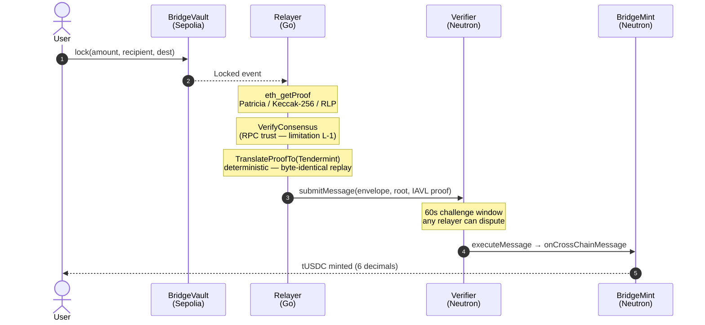
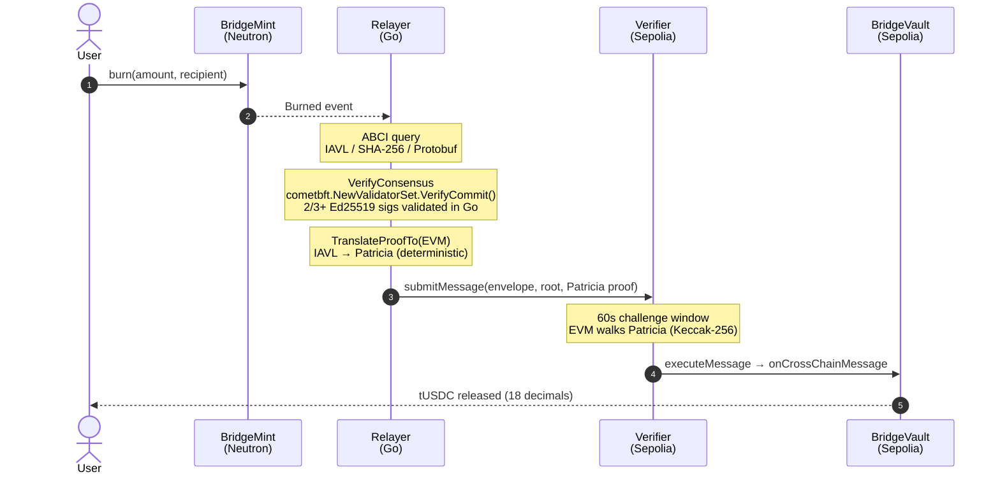

# Reference App — tUSDC Bridge

The tUSDC bridge is Tessera's reference application. It demonstrates the full cross-chain lifecycle — both directions — using a custom ERC20/CW20 test token. It is not real USDC.

The bridge exists to prove that the Tessera infrastructure works end-to-end. Every piece of the system is exercised: proof fetch, transformation, on-chain verification, `IApp` dispatch, economic enforcement.

---

## What It Demonstrates

| Capability | Demonstrated by |
|-----------|----------------|
| EVM → Cosmos asset transfer | Sepolia lock → Neutron mint |
| Cosmos → EVM asset transfer | Neutron burn → Sepolia release |
| Fraud prevention | S-2: challenger catches lying relayer |
| Liveness enforcement | S-3: successor submits; original slashed |
| Frivolous challenge prevention | S-4: bad challenger slashed |
| Ed25519 bypass | Neutron→Sepolia direction; Go verifies off-chain |
| Patricia ↔ IAVL transformation | Both directions |
| IApp dispatch pattern | BridgeMint + BridgeVault implement IApp |

---

## Sepolia → Neutron Flow

---

## Neutron → Sepolia Flow

---

## Token Details

| Property | Sepolia (ERC20) | Neutron (CW20) |
|----------|----------------|---------------|
| Name | tUSDC | tUSDC |
| Symbol | tUSDC | tUSDC |
| Decimals | 18 | 6 |
| Claim limit | 1000 tUSDC / address / 24h | 1000 tUSDC / address / 24h |
| Real USDC? | No | No |

Contract addresses:
- Sepolia: `0x7dcA285EFe722EdC1D9c93C3878fb58b255EC5B0`
- Neutron: `neutron1fw6unz7a9j4zf9gnvhup5qe6dlftytdc0y0rwyn3lyxdazz22rtsck0vld`

---

## UI

The bridge UI is the homepage of the live deployment. The same widget works on desktop and mobile; the steps below describe a full Sepolia → Neutron bridge using both wallets.

1. **Connect wallets.** Connect MetaMask on Sepolia (chainId `11155111`) and Keplr on Neutron (`pion-1`). The widget shows both connection statuses and the active source/destination direction.
2. **Click "Claim 1000 tUSDC".** First-time users click the claim button on the source chain. This triggers **MetaMask popup #1** — a `claim()` call on the tUSDC contract (no arguments, mints 1000 tUSDC to `msg.sender`, 24h cooldown). After confirmation your balance updates to 1000 tUSDC.
3. **Enter the amount.** Type the amount you want to bridge into the widget's amount field. The recipient field auto-fills with the connected destination wallet; you can override it.
4. **Click "Bridge".** On the very first bridge from this wallet, **MetaMask popup #2** asks you to approve `BridgeVault` to spend your tUSDC (`tUSDC.approve(BridgeVault, amount)`). This approval is one-time per wallet per direction.
5. **Confirm the lock.** **MetaMask popup #3** is the actual `BridgeVault.lock(amount, "pion-1", neutronRecipient)` transaction. After confirmation, the source-chain lock is on-chain and the relayer picks up the `Locked` event.
6. **Watch the curvy roadmap fill.** The bridge widget renders a progress roadmap that fills in as each stage completes — proof fetched, transformed, submitted, challenge window passed, executed. Each segment links to the corresponding transaction on Etherscan or Celatone.

   

7. **Tokens appear in Keplr.** Once `executeMessage` runs on Neutron and `BridgeMint.mint` fires, the bridged tUSDC shows up in the connected Keplr wallet.

The reverse direction (Neutron → Sepolia) is identical — flip the direction selector, sign the burn from Keplr, and watch the same roadmap drive the release on Sepolia.

After a bridge is submitted, a per-submission detail page exposes the full cryptographic state: source and destination tx hashes, proof inspector with the raw fingerprint and Merkle path, route summary, and a Cryptographic Roadmap that walks every stage in order.

---

> See [Demo Scenarios](./05-demo-scenarios) for step-by-step S-1 through S-4 walkthroughs.
> See [Protocol User Guide](./08-protocol-user-guide) for CLI-level bridge operations.
