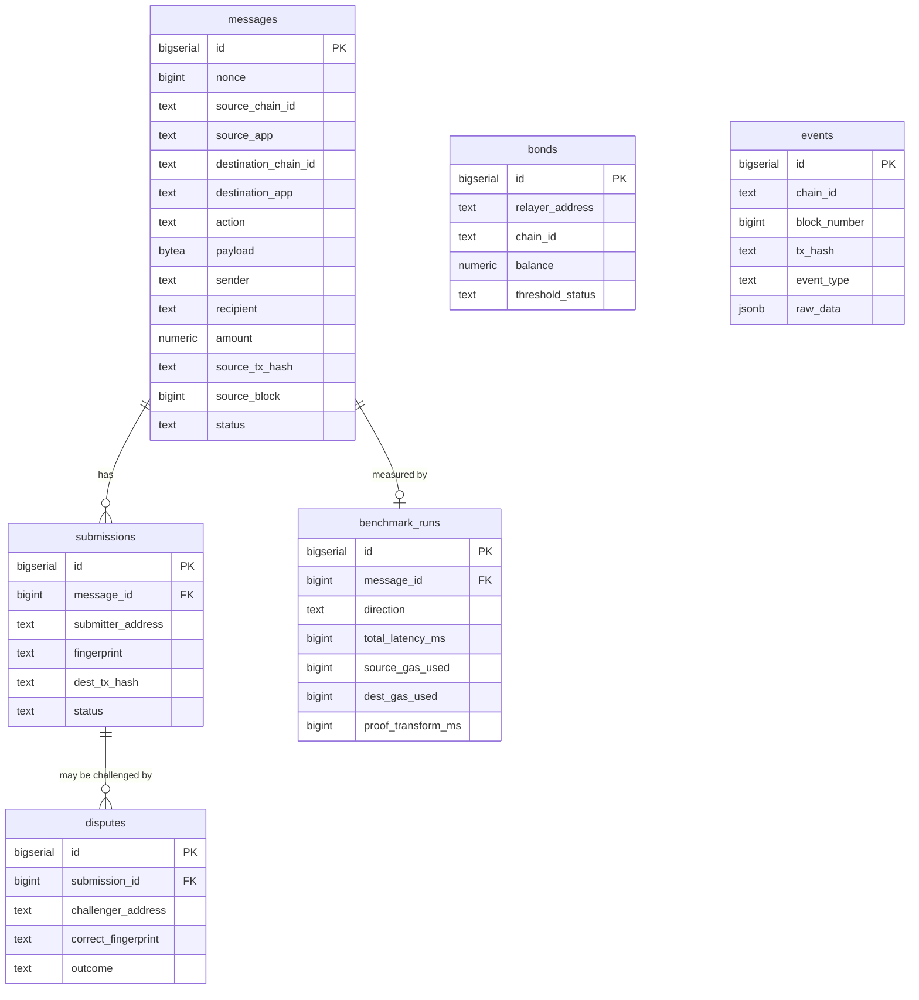
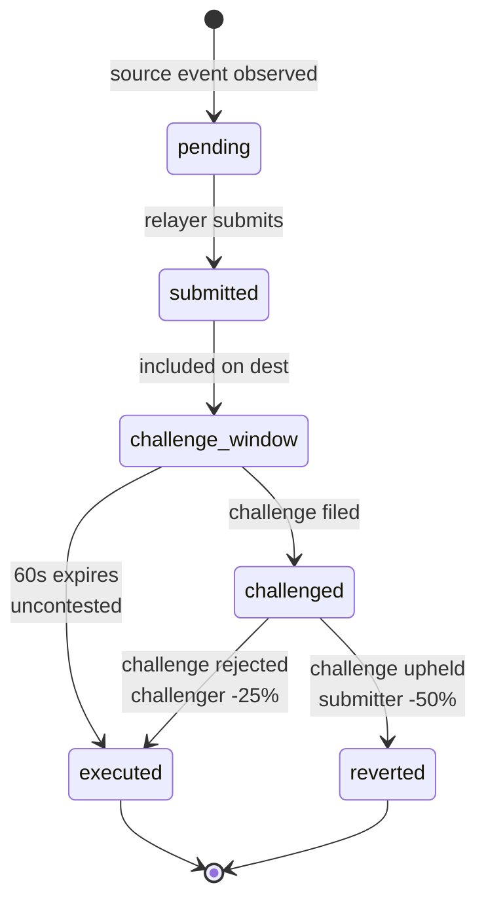

# State & Database

Tessera has two state stores, with a strict separation of concerns. **On-chain** contracts hold the authoritative state — bonds, submission status, executed msgIds. **Supabase** is the operator-facing mirror used by the dashboard, indexed off chain events, and never relied on for security decisions. If Supabase disappears, the bridge keeps working. If a chain disappears, that direction stalls — exactly as you'd want.

---

## Where State Lives

| Store | Authority | Consumed by | Failure mode |
|-------|-----------|-------------|--------------|
| Sepolia + Neutron contracts | Authoritative — on-chain truth | Relayer + Verifier dispatch | Chain outage stalls that direction |
| Supabase (Postgres) | Mirror only | Frontend, benchmark page, demo log | Stale dashboard; bridge unaffected |

---

## Entity-Relationship Diagram

Six tables. `messages` is the parent; `submissions` and `benchmark_runs` hang off it. `disputes` hang off submissions. `bonds` and `events` are independent of any specific message.



---

## Tables

| Table | Granularity | Purpose |
|-------|-------------|---------|
| `messages` | one row / cross-chain message | Lifecycle FSM — `pending → submitted → challenge_window → executed \| reverted` |
| `submissions` | one row / relayer attempt | Tracks who submitted, what fingerprint, and dest tx outcome |
| `disputes` | one row / challenge filed | Outcome: `upheld` (submitter slashed) or `rejected` (challenger slashed) |
| `bonds` | one row / relayer / chain | Periodically synced from on-chain Bond contract; powers dashboard |
| `events` | one row / raw chain event | Source-of-truth for the live dashboard event log; deduplicated by `(chain_id, tx_hash, event_type)` |
| `benchmark_runs` | one row / completed message | Per-direction latency + gas; powers the benchmark page |

---

## Message Status FSM

The `messages.status` column is a finite state machine driven by chain events. The relayer only writes from a small set of allowed transitions — these are enforced in code (`relayer/internal/state/transitions.go`), not by the database, because the database is a mirror, not the authority.



Only two terminal states: `executed` (success) and `reverted` (challenge upheld). Both clear the challenge window for downstream consumers.

---

## Why Two State Stores

| Question | Answer |
|----------|--------|
| Where is the authoritative bond balance? | On chain. The `bonds` Supabase table is a periodically-synced cache. |
| Where is the authoritative msgId-executed flag? | On chain. The Verifier rejects a duplicate msgId regardless of what Supabase says. |
| What if Supabase is wrong? | The dashboard shows stale data; the bridge still works. Operator backfill replays events. |
| What if the chain RPC is wrong? | L-1 limitation. Future work: sync committee for Sepolia. |

---

## Realtime + RLS

The frontend subscribes to `messages`, `submissions`, `disputes`, and `events` via Supabase realtime (Postgres logical replication). All six tables are RLS-enabled with `SELECT` public; writes require the service-role key, which only the relayer holds.

```sql
-- supabase/migrations/001_initial_schema.sql
ALTER TABLE messages    ENABLE ROW LEVEL SECURITY;
CREATE POLICY "public read messages" ON messages FOR SELECT USING (true);
-- Writes: service-role key only (relayer)

ALTER PUBLICATION supabase_realtime ADD TABLE messages;
ALTER PUBLICATION supabase_realtime ADD TABLE submissions;
ALTER PUBLICATION supabase_realtime ADD TABLE disputes;
ALTER PUBLICATION supabase_realtime ADD TABLE events;
```

---

> Related: [Architecture](./03-architecture) · [Scripts & Tests](./14-scripts) · [Limitations](./10-limitations)
