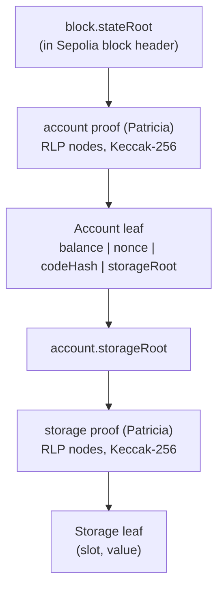
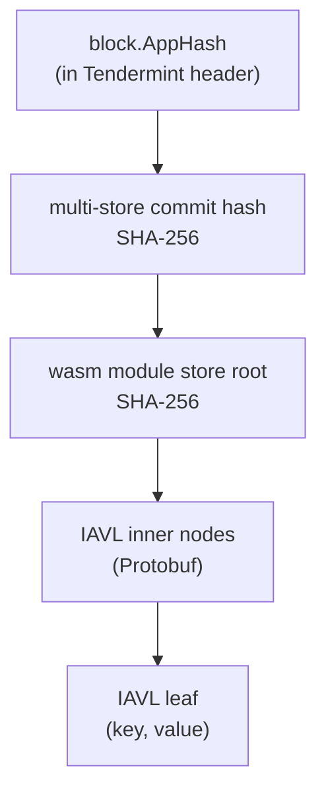
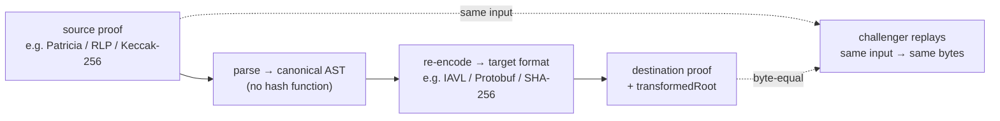
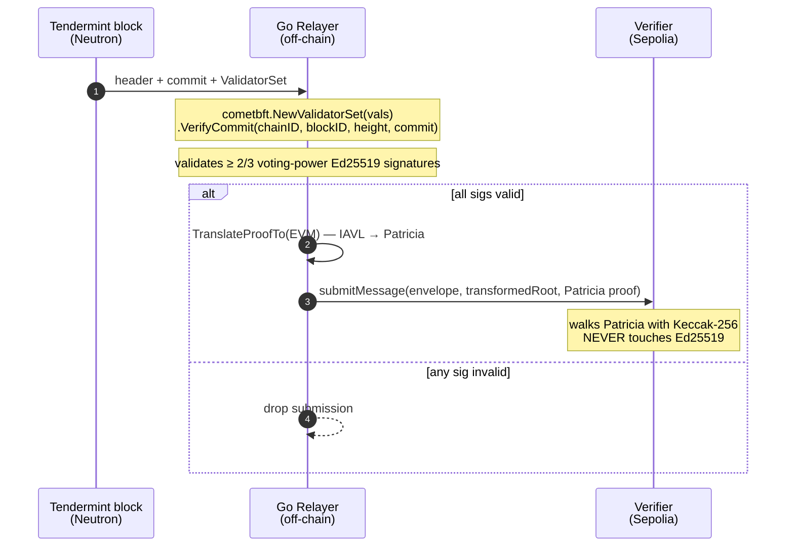

# Cryptography Deep-Dive

The core cryptographic problem Tessera solves: Ethereum and Cosmos use fundamentally different data structures for their state proofs, and use different hash functions to anchor them. The transformation layer bridges them deterministically — without requiring either chain to understand the other's format and without a trusted oracle. This section walks through every cryptographic primitive in the system, what it commits to, and how each piece is verified.

---

## The Four Cryptographic Primitives In Play

| Primitive | Used by | Where verified | Why it matters |
|-----------|---------|----------------|----------------|
| `Keccak-256` | Ethereum (Patricia node hashing) | On-chain in Solidity Verifier (~36 gas/byte) | Anchors Ethereum state root |
| `SHA-256` | Cosmos (IAVL node hashing, Tendermint hashing) | On-chain in CosmWasm Verifier (precompile) | Anchors Tendermint app state root |
| `RLP` | Ethereum (proof node encoding) | Solidity Verifier walks Patricia nodes | Deterministic byte encoding for Patricia |
| `Ed25519` | Tendermint (block validator signatures) | Off-chain in Go (verify-then-bypass) | EVM cost for on-chain Ed25519: prohibitive |

---

## Patricia Merkle Trie — Ethereum Side

Ethereum state is stored in a Modified Merkle Patricia Trie. Proofs are a sequence of RLP-encoded nodes — Branch (16 children + value), Extension (compressed nibble path), and Leaf (terminal value). Every node is hashed with Keccak-256. The root is committed in each block header.



The verifier walks the path from leaf to root, hashing each step with Keccak-256, and asserts the final hash equals the on-chain `block.stateRoot`.

---

## IAVL Tree — Cosmos Side

Cosmos chains use an IAVL+ tree (a self-balancing AVL Merkle tree) for module-store proofs. Nodes are encoded with Protobuf and hashed with SHA-256. The IAVL root is included in the Tendermint commit hash, which is signed by the validator set.



The verifier reconstructs the path from leaf to root, hashing with SHA-256, and asserts the final hash matches the AppHash committed in the block.

---

## Deterministic Transformation — The Byte-Identity Claim

The transformation between Patricia and IAVL is a *pure function of the input proof and the input fingerprint*. The same input always produces the same output byte-for-byte — a property called **determinism**. This is the load-bearing security claim: it's what makes fraud detectable.



The relayer parses the source proof into a chain-neutral canonical AST, then re-encodes it for the target. Any party can replay this — that's the security property.

The acceptance test for the transform layer is exactly this: 100 independent runs on the same input produce 100 byte-identical outputs. The test fixture lives in `relayer/internal/transform/transform_test.go` (35 fixtures, including cross-implementation parity at 100×).

> Both proofs commit to the same logical claim: *"Vault contract storage slot 0x4 has value 100,000,000 at block N"* — anchored differently for each chain's native verification path.

**Why this enables challenge:** the submitter posts `(envelope, transformedRoot, destinationProof)`. Any other relayer can fetch the source proof, re-run the transform, and check whether the submitter's `transformedRoot` matches. If it does, the submission stands. If it doesn't, anyone can call `challenge(...)` with the correct fingerprint and slash 50% of the submitter's bond.

---

## Ed25519 Bypass — The Off-Chain Verification Path

Tendermint validators sign block commits with Ed25519. Verifying one Ed25519 signature on the EVM costs roughly 500k gas; verifying 2/3+ of a typical Cosmos validator set (Neutron pion-1 testnet runs dozens; Cosmos Hub mainnet runs ~150) is not economically viable. Tessera sidesteps this by verifying the entire validator set off-chain in Go, using the production cometbft library, before submitting anything to Sepolia.



The Go relayer is the only place Ed25519 is touched. Sepolia only ever sees Patricia (Keccak-256) — a primitive its precompile already supports.

The hostile-input test for this lives in `relayer/plugins/tendermint/plugin_test.go` (function `TestVerifyConsensusUnit`): a forged signature reordered to the exact slot a legitimate validator occupies is *still rejected* because cometbft's `NewValidatorSet` sorts by (voting power desc, address asc) before `VerifyCommit` runs. This is the subtle bug class the test prevents.

---

## Message ID Derivation

Every cross-chain message has a stable ID — the `msgId` — that's the same on both chains. It's derived from the canonical envelope so that *both* chains compute the identical 32-byte ID without any cross-chain lookup. The Solidity Verifier and the CosmWasm Verifier each compute it independently and check equality on execution.

```
msgId = keccak256(
    abi.encode(
        envelope.sourceChainId,
        envelope.sourceApp,
        envelope.destinationChainId,
        envelope.destinationApp,
        envelope.action,
        envelope.payload,
        envelope.nonce
    )
)

// Sepolia: Verifier._envelopeHash() — same encoding
// Neutron: cosmwasm verifier::msg_id() — same encoding
// Test:    relayer/internal/transform/transform_test.go
//          (TestVerify_WrongMsgID + cross-impl parity fixtures)
```

The nonce is monotonic per `(sourceChain, sourceApp)`, preventing replay across messages. Replay against a different `destinationApp` is impossible: the `destinationApp` field is inside the hash. Replay across chains is impossible: chain IDs are inside the hash.

---

## Verification Claim — What We Actually Prove

1. **Source-event integrity.** The destination chain only executes a message after Merkle-walking a proof against its own native commitment. If the source event didn't happen, the proof doesn't exist and the walk fails.

2. **Validator-set authenticity (Cosmos→EVM).** The Go relayer verifies 2/3+ of the validator set signed the block before the relayer is willing to vouch for the source root. Forged or reordered signatures are rejected by cometbft's reference VerifyCommit.

3. **Transform integrity.** Determinism makes the transform a verifiable computation: any honest relayer can re-run it and reach byte-identical output. A wrong `transformedRoot` is a publicly slashable event.

4. **Replay resistance.** The msgId binds chain IDs, app addresses, action selector, payload, and nonce. The Verifier rejects an already-executed msgId. Cross-chain and within-chain replay both fail.

5. **Source consensus on Sepolia (limitation L-1).** For Sepolia→Neutron, the relayer trusts its configured Sepolia RPC. Mitigation: integrate sync committee verification (Beacon BLS aggregation). Pure off-chain Go change; documented in the roadmap.

---

> Related: [Architecture](./03-architecture) · [Limitations](./10-limitations) · [Future Work](./11-future-work)
