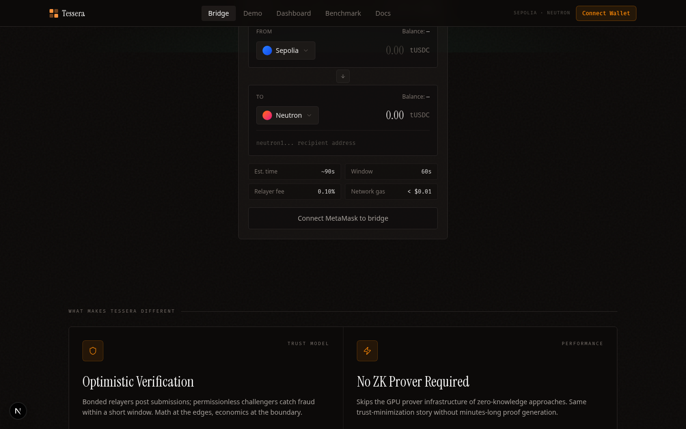
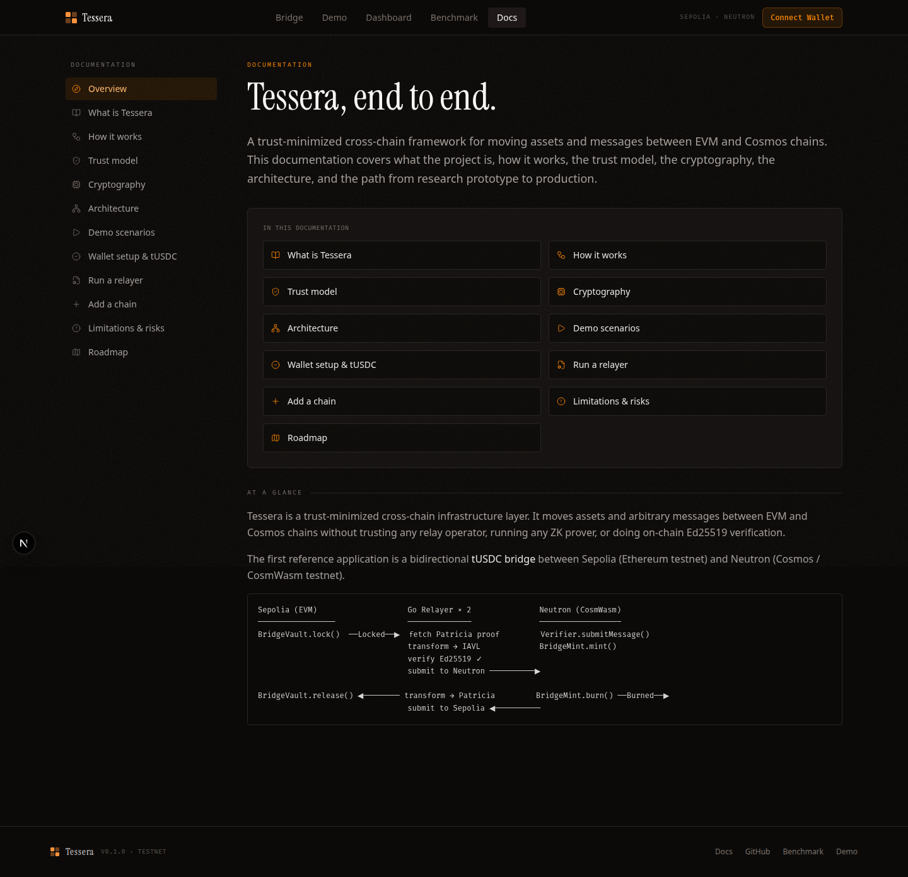
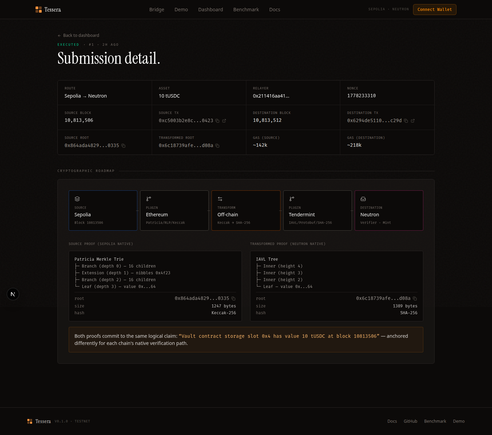
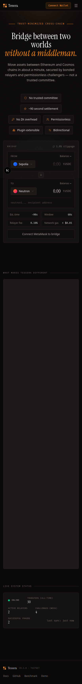
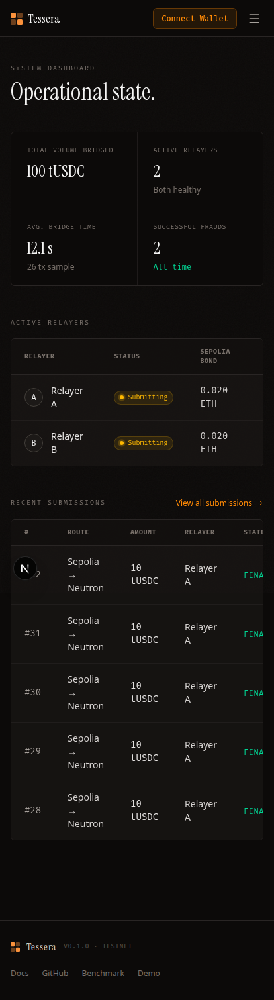
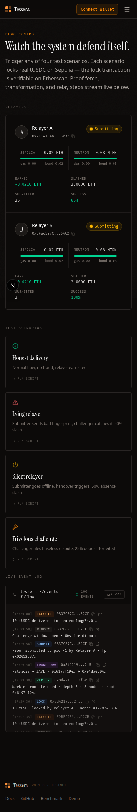

# Tessera — Notion Documentation

> Single-page export targeted at Notion paste-import. The four required Form-2 sections are level-2 headings: PM Brief, Architecture Overview, Technical Decisions, Post-Hackathon Roadmap. The Reflection appendix and screenshot gallery follow.

> Auto-generated from `docs/00-pm-brief.mdx`, `docs/03-architecture.mdx`, `docs/12-technical-decisions.mdx`, `docs/post-hackathon-roadmap.md`, `docs/reflection.md`. Source-of-truth for content lives in those files; this file is the publish-ready consolidation. Re-run the consolidation script (`docs/build-notion-export.py` or the equivalent prompt) to refresh after edits.

## Cover

| Item | Value |
|------|-------|
| Project | **Tessera** — trust-minimized cross-chain framework |
| Demo URL | `<LIVE_URL>` |
| GitHub | https://github.com/sami-funavry/Tessera |
| Audit | [`docs/audit-findings.md`](audit-findings.md) |
| Phase | P-10 (audit gate) closed 2026-05-08 → P-11 polish |

## PM Brief

A one-page product framing for Tessera. For technical depth, see [Overview](./01-overview) and [Architecture](./03-architecture).

---

### Who is this for?

**Builders launching cross-chain apps who don't want to trust a relayer or pay ZK costs.** A team building a cross-chain swap, a cross-chain governance app, or a cross-chain NFT mint can integrate Tessera by deploying one contract that implements the `IApp` interface. They get bonded relay security without running their own validator network or paying a ZK prover per message.

**Cosmos appchains adding EVM connectivity.** A new Cosmos appchain (Neutron, Osmosis, dYdX, any CosmWasm-capable chain) can ship an EVM bridge by porting six contracts and pointing the existing Go relayer at their RPC. No bespoke cryptography, no bespoke off-chain infrastructure.

**EVM L2s adding Cosmos connectivity.** Symmetric to the above — a new EVM rollup gets a Cosmos bridge by deploying the Solidity contracts and registering its chain ID.

**Concrete personas:**

- *DeFi protocol engineer at an EVM L2:* "I want to launch on Neutron next quarter. I don't want to operate validators, I don't want to pay $0.50 per message in ZK costs, and I don't trust an external multisig with my users' funds."
- *Cosmos appchain core dev:* "We need EVM users on day one. Existing options are either trusted (Wormhole, Axelar multisigs) or expensive and slow (any ZK bridge). I want a bonded model with a 60-second window."

---

### What problem does it solve?

Cross-chain bridges have a trust problem. Users either trust a multisig that can be compromised (Ronin, Multichain, Nomad — collectively over $2B lost in the past three years), or they pay the cost and latency of ZK proofs. Tessera replaces both with a third option: bond the relayer, slash on fraud, prove inclusion natively in each chain's own format.

Three concrete pain points it removes:

1. **"I have to trust the bridge operator."** No — operators post a bond. Wrong submissions cost them 50% of that bond. The math doesn't work for fraud once the bond is meaningful.
2. **"ZK proofs are too expensive and too slow."** No ZK in the proof path. Verification is a native Merkle walk in each VM (Patricia on EVM, IAVL on Cosmos). Gas budget: under 250k destination-side per message.
3. **"On-chain Ed25519 verification is impractical on EVM."** True on its own — ~500k gas per signature. Tessera bypasses it by verifying the 2/3+ Tendermint validator set off-chain in Go before submitting the already-verified proof to Sepolia. EVM never sees an Ed25519 signature.

---

### Why now?

Three converging forces:

- **Bridges have lost approximately $2B+ across multiple incidents in the past three years.** Trust-based and multisig-based bridges have an empirical track record of failure. The market is asking for alternatives.
- **ZK costs are non-trivial.** Per-proof costs in the public ZK bridge category are on the order of $0.50 and require GPU infrastructure, plus minutes of latency for proof generation. For a high-frequency app, this is prohibitive.
- **Cosmos↔EVM connectivity still depends on trusted committees.** Wormhole, Axelar, and similar use multisig or PoA committees for cross-VM communication — not because the cryptography isn't possible, but because nobody's shipped a generic bonded alternative.

Tessera is that alternative. Bonded-economic security, deterministic native proof verification, no ZK setup, and the Ed25519 problem solved by moving the work off-chain to commodity hardware where it costs nothing.

---

### Success metrics

**For the demo (today):**

- Four scenarios pass end-to-end on real testnets (honest delivery, lying relayer, silent relayer, frivolous challenge). [`05-demo-scenarios.mdx`](./05-demo-scenarios) has the full list.
- Dashboard reflects real on-chain state (bonds, submissions, events) with no mocked numbers.
- Judges can connect MetaMask + Keplr, claim tUSDC on either chain, and bridge a real transaction in under 90 seconds.

**For mainnet (post-hackathon, see [Post-Hackathon Roadmap](./post-hackathon-roadmap)):**

- TVL bridged through the contracts.
- Number of bridges per day (growth metric).
- Number of challenges per week (lower is better — high counts indicate either a buggy submitter or an aggressive challenger; both are operational issues to investigate).
- Median end-to-end settlement time (target: under 120 seconds).
- Slash events per 10,000 submissions (target: as close to zero as possible, but >0 proves the system works adversarially).

---

### Scope today vs scope tomorrow

Mirrors SPEC.md §1.12. The hackathon ships the left column; the right column is deferred work.

| Capability | Today | Tomorrow |
|------------|-------|----------|
| Chains | Sepolia + Neutron pion-1 testnets | Mainnet, Polygon, Arbitrum, Osmosis, Cosmos Hub |
| Apps | tUSDC bridge | NFT bridge, cross-chain governance, generic message passing |
| Source consensus (Sepolia) | RPC trust (documented) | Ethereum sync committee verification (BLS) |
| Source consensus (Neutron) | Off-chain Ed25519 verification (full) | Same — already trustless |
| Token | Custom tUSDC (mintable, rate-limited) | Real USDC integration if/when product calls for it |
| Relayer count | 2 (per spec, sufficient for adversarial demo) | N (architecture supports it) |
| Bond thresholds | Testnet-low (0.02 ETH / 80,000 uNTRN) | Production values (~0.5 ETH / 100 NTRN) — config change only |
| Audit | Internal three-lens review (`audit-findings.md`) | Trail of Bits / Spearbit + Immunefi bounty |

The architecture was built so that "tomorrow" never requires changing what's deployed today. New chains plug in as Go modules; new apps plug in as `IApp` contracts; production parameters are configuration.

---

> Related: [Overview](./01-overview) · [Architecture](./03-architecture) · [Limitations](./10-limitations) · [Future Work](./11-future-work) · [Technical Decisions](./12-technical-decisions)

## Architecture Overview

---

### System Components

```
┌─────────────────────────────────────────────────────────────────────┐
│                         Tessera System                              │
│                                                                     │
│  Sepolia (EVM)            Go Relayer × 2        Neutron (CosmWasm) │
│  ──────────────           ─────────────         ────────────────── │
│  RelayerRegistry   ◀────  bond / register ────▶  RelayerRegistry   │
│  Bond              ◀────  deposit / slash  ────▶  Bond              │
│  Verifier          ◀────  submit / challenge ──▶  Verifier          │
│  BridgeVault             EthereumPlugin           BridgeVault       │
│  BridgeMint              TendermintPlugin         BridgeMint        │
│  tUSDC (ERC20)           Transform Layer          tUSDC (CW20)      │
│                          Supabase (state)                           │
│                                                                     │
│                        Next.js Frontend                             │
│                        (reads Supabase)                             │
└─────────────────────────────────────────────────────────────────────┘
```

---

### Six Contracts Per VM

The same logical contract set deploys on every supported chain. Solidity on EVM; Rust + CosmWasm on Cosmos.

| Contract | Role | Key entry points |
|----------|------|-----------------|
| `RelayerRegistry` | Identity + state tracking | `register`, `topUpBond`, `withdrawBond`, `rotateKey`, `recordSlash` |
| `Bond` | Fund custody + slash execution | `deposit`, `slash` (onlyVerifier), `withdraw`, `getBond` |
| `Verifier` | Proof verification + dispatch | `submitMessage`, `challenge`, `executeMessage`, `claimAbsenceSlash` |
| `BridgeVault` | Source-side lock / release | `lock`, `release` (onlyVerifier) |
| `BridgeMint` | Destination-side mint / burn | `mint` (onlyVerifier), `burn` |
| `tUSDC` | Test token | `claim` (rate-limited), standard transfer |

**Adding a new EVM chain:** deploy these six contracts. No new contract code.
**Adding a new Cosmos chain:** deploy the CosmWasm versions. No new contract code.
**Adding a new application:** implement `IApp` and register — no Verifier changes.

---

### Proof Pipeline

#### Sepolia → Neutron

```
1. User calls BridgeVault.lock() on Sepolia
        ↓
2. Relayer observes Locked event
        ↓
3. EthereumPlugin.FetchProof()
   → eth_getProof (storage proof, Patricia / Keccak-256 / RLP)
        ↓
4. VerifyConsensus() — RPC trust (documented limitation; see §10)
        ↓
5. TranslateProofTo(targetChainType=Tendermint)
   Patricia (Keccak-256/RLP) → IAVL (SHA-256/Protobuf)
   Deterministic. Byte-identical for same input.
        ↓
6. TendermintPlugin.SubmitMessage()
   → Verifier.submitMessage(envelope, transformedRoot, IAVLproof)
        ↓
7. Challenge window: 60s
   Challenger independently replicates steps 3–5.
   On mismatch → challenge(). On match → stand down.
        ↓
8. executeMessage() (anyone callable after window)
   Verifier walks IAVL proof with SHA-256.
   On valid → IApp(destinationApp).onCrossChainMessage(...)
        ↓
9. BridgeMint.mint() → user receives tUSDC on Neutron
```

#### Neutron → Sepolia (Ed25519 bypass)

```
1. User calls BridgeMint.burn() on Neutron
        ↓
2. Relayer observes Burned event
        ↓
3. TendermintPlugin.FetchProof()
   → ABCI query (IAVL proof, SHA-256/Protobuf)
        ↓
4. VerifyConsensus()
   → cometbft.NewValidatorSet.VerifyCommit()
   → validates 2/3+ Ed25519 validator signatures off-chain in Go
   ← EVM never sees Ed25519
        ↓
5. TranslateProofTo(targetChainType=EVM)
   IAVL (SHA-256/Protobuf) → Patricia (Keccak-256/RLP)
        ↓
6. EthereumPlugin.SubmitMessage()
   → Verifier.submitMessage(envelope, transformedRoot, patriciaProof)
        ↓
7–9. Same challenge + execute flow as above (Solidity Verifier walks Patricia proof)
        ↓
9. BridgeVault.release() → user receives tUSDC on Sepolia
```

---

### Message Envelope

Every cross-chain message uses this canonical structure:

```solidity
struct MessageEnvelope {
    bytes32 sourceChainId;
    bytes   sourceApp;          // contract that emitted source event
    bytes32 destinationChainId;
    bytes   destinationApp;     // IApp-implementing contract to dispatch to
    bytes4  action;             // function selector + encoding scheme
    bytes   payload;            // recipient, amount, etc.
    uint64  nonce;              // monotonic, per source chain + source app
}
```

The `nonce` drives per-message role assignment (see [Economics](./04-economics)).
The `destinationApp` field is what makes the system application-agnostic — any IApp-implementing contract can receive messages without Verifier changes.

---

### Relayer Plugin Model

The single source of truth is [`relayer/internal/chain/plugin.go`](https://github.com/tessera-bridge/tessera/blob/main/relayer/internal/chain/plugin.go). The interface below is copied verbatim:

```go
type Plugin interface {
    ChainID() string
    LatestBlock(ctx context.Context) (uint64, error)
    FetchBlockFingerprint(ctx context.Context, height uint64) (Fingerprint, error)
    FetchProof(ctx context.Context, event Event, height uint64) (Proof, error)
    VerifyConsensus(ctx context.Context, height uint64) error
    SubscribeEvents(ctx context.Context, fromBlock uint64) (<-chan Event, error)
    TranslateProofTo(proof Proof, destChainID string) (Proof, error)
    SubmitMessage(ctx context.Context, env MessageEnvelope, proof Proof) (txHash string, submissionID [32]byte, err error)
    ExecuteMessage(ctx context.Context, submissionID [32]byte, proof Proof) (string, error)
    SubmitChallenge(ctx context.Context, submissionID [32]byte, counterProof Proof) (string, error)
    ClaimAbsenceSlash(ctx context.Context, submissionID [32]byte) (string, error)
    Register(ctx context.Context, pubKeyBytes []byte) (string, error)
    DepositBond(ctx context.Context, amount string) (string, error)
}
```

Adding a new source chain = implementing this interface in a new Go file under `relayer/plugins/<chain>/`. Nothing else in the repository changes.

---

### Trust Model

| Layer | Trust assumption |
|-------|----------------|
| Source consensus (Neutron) | Go relayer verifies 2/3+ Ed25519 validator signatures. Cryptographic. |
| Source consensus (Sepolia) | RPC trust — relayer trusts its configured RPC node. Documented limitation; future work: sync committee. |
| Proof transformation | Deterministic. Any party can replicate. Fraud = detectable by challenger. |
| Destination verification | On-chain Merkle proof walk. No trust. |
| Economic enforcement | Bond at risk. Punishment > gain. Honest behavior is the rational strategy. |

> Liveness assumption: at least one honest, online relayer in the registered set.

---

### Live System Visibility

Every component of the architecture above emits structured data that the frontend renders in real time. The benchmark page summarises end-to-end performance — proof fetch latency, transformation time, on-chain submission gas, and the full source-to-destination wall-clock — across recent submissions on both directions.


This is what gives operators a single glance into whether the proof pipeline is healthy, where latency is concentrated, and how each plugin (Ethereum, Tendermint) is performing.

---

> Related: [Economics](./04-economics) · [Limitations](./10-limitations) · [Developer Guide](./07-developer-guide)

## Technical Decisions

> Architecture decision records (ADRs) for the choices that shaped Tessera. Each entry: context, decision, alternatives, consequences. Cited by file path so future contributors can find the code.

---

### DEC-01: Native proof verification instead of ZK

**Status:** Accepted

**Context.** Cross-chain proof verification needs a way to prove that "event X happened on chain A" to a verifier on chain B. The dominant approach in 2025–2026 is ZK proofs of state inclusion: chain A's state is committed in a SNARK and verified on chain B. This works but introduces three real costs: per-proof cost (~$0.50+ in public ZK bridges), proof generation latency (minutes), and dedicated GPU infrastructure for the prover.

**Decision.** Verify Merkle proofs natively in each VM's own format. Patricia Merkle Trie on EVM (Keccak-256/RLP); IAVL on CosmWasm (SHA-256/Protobuf). Submit the proof + the source-chain fingerprint to the destination Verifier; the contract walks the proof against the fingerprint and accepts or rejects.

**Alternatives.**

- *ZK proof of state inclusion* — rejected on cost, latency, and infrastructure complexity for a hackathon scope. Reconsidered as long-term research in [`11-future-work.mdx`](./11-future-work).
- *Light-client verification with on-chain header tracking* — viable on EVM (header tracking is cheap) but expensive on Cosmos→EVM because of Ed25519 verification cost (see DEC-02).
- *Trusted oracle (multisig)* — eliminates the cryptography problem but reintroduces the trust problem Tessera exists to solve.

**Consequences.**

- Destination gas under 250k per verification (per R-102) — proof walk dominates.
- Determinism of the transformation step (DEC-04 / R-52) becomes the foundational security claim, because honest replication is what enables fraud detection.
- Implementation: `contracts-evm/src/Verifier.sol::_verifyProof` and `contracts-cosmwasm/contracts/verifier/src/contract.rs::_verify_proof`.

---

### DEC-02: Off-chain Ed25519 verification for Tendermint

**Status:** Accepted

**Context.** Cosmos→EVM bridges need to prove that a Cosmos block was finalized by 2/3+ of the Tendermint validator set. Tendermint validators sign with Ed25519. On-chain Ed25519 verification on EVM costs ~500k gas per signature; with 100+ validators, this is prohibitive.

**Decision.** Verify Tendermint validator signatures off-chain in Go using cometbft's batch verifier. The relayer fetches the block header, validator set, and commit; verifies 2/3+ Ed25519 signatures locally on commodity hardware; only then submits the already-verified proof to the Sepolia Verifier. EVM never sees Ed25519.

**Alternatives.**

- *On-chain Ed25519 precompile* — would require an EVM hard fork; not available on Sepolia or mainnet today.
- *ZK proof of the Ed25519 verification* — possible but expensive and reintroduces ZK costs (DEC-01).
- *Trust the relayer's claim that consensus was verified* — defeats the trust-minimization goal.

**Consequences.**

- The Ed25519 step happens *but is invisible to the destination chain*. This is what we mean by "Ed25519 bypass" — not skipping the verification, just moving it to where it's affordable.
- Bonded enforcement (DEC-03) is what keeps the off-chain step honest: a relayer who skips or lies about consensus verification produces a fraudulent submission and gets slashed.
- Implementation: `relayer/plugins/tendermint/plugin.go::VerifyConsensus` calls `cometbft/types.ValidatorSet.VerifyCommit`. Forged-signature rejection tested in `relayer/plugins/tendermint/plugin_test.go::TestVerifyConsensusUnit`.

---

### DEC-03: Bonded relayers + slashing

**Status:** Accepted

**Context.** Native proof verification (DEC-01) and off-chain consensus verification (DEC-02) move work off-chain. Both depend on the relayer being honest about what they fetched and transformed. We need an enforcement mechanism that doesn't require trusting any individual operator.

**Decision.** Every relayer posts a bond on each chain (Sepolia: 0.02 ETH testnet, ~0.5 ETH production target; Neutron: 80,000 uNTRN testnet, 100 NTRN production target). Wrong submissions slash 50% of the submitter's bond, paid 100% to the challenger. Frivolous challenges slash 25% of the challenger's bond, paid 100% to the wrongly-accused submitter. Bond and slashing are executed by on-chain contracts; no off-chain coordination decides outcomes.

**Alternatives.**

- *Trusted committee (multisig)* — empirically broken (Ronin, Multichain, Nomad).
- *Pure cryptographic enforcement (ZK)* — DEC-01 already rejected ZK on cost grounds.
- *Reputation systems* — vulnerable to Sybil; reputation has no slashable mass.

**Consequences.**

- Liveness assumption: at least one honest, online relayer exists. The system stays correct as the registered set grows; it cannot stay correct if every relayer simultaneously colludes (per R-40, [`10-limitations.mdx`](./10-limitations) L-2).
- Bond size must be calibrated to the volume secured. Testnet values are intentionally low because faucets cap daily output; production must scale up.
- Implementation: `contracts-evm/src/Bond.sol`, `contracts-evm/src/RelayerRegistry.sol`, `contracts-evm/src/Verifier.sol::challenge`. Symmetric CosmWasm versions under `contracts-cosmwasm/contracts/`.

---

### DEC-04: Generic dispatcher pattern (Verifier dispatches to `destinationApp`)

**Status:** Accepted

**Context.** Cross-chain frameworks tend to either hard-code a single application (a token bridge contract that owns the verifier) or hand-roll dispatch logic that requires verifier upgrades for new apps. The first locks in scope; the second creates upgrade risk.

**Decision.** Every cross-chain message envelope includes a `destinationApp` field (the contract address on the destination chain). After successful proof verification, the Verifier calls `IApp(destinationApp).onCrossChainMessage(sourceChainId, sourceApp, action, payload)`. Each application implements `IApp` and enforces `onlyVerifier` on the entry point. New apps are deployed; the Verifier never changes.

**Alternatives.**

- *Hard-coded token-bridge integration* — would tie tUSDC to the Verifier and require a new Verifier per app. Rejected for extensibility.
- *Plugin registry inside Verifier* — adds upgrade surface to the most security-critical contract. Rejected for the same reason ZK was rejected: every additional moving part is an attack surface.
- *Off-chain dispatch (relayer routes by application)* — moves trust back to the relayer. Defeats DEC-03.

**Consequences.**

- Adding a new application is a one-contract deploy. No Verifier changes, no Bond changes, no Registry changes.
- Verifier security boundary is precisely defined: it verifies proofs and dispatches; it does not interpret application logic. Each `IApp` contract is responsible for its own input validation under `onlyVerifier`.
- Implementation: `contracts-evm/src/interfaces/IApp.sol` defines the interface. `contracts-evm/src/BridgeVault.sol` and `contracts-evm/src/BridgeMint.sol` are the first two `IApp`-conforming contracts. `contracts-evm/src/Verifier.sol::executeMessage` dispatches.

---

### DEC-05: Two relayers for the demo

**Status:** Accepted

**Context.** The bonded-relayer model (DEC-03) requires at least two relayers to demonstrate adversarial scenarios — you need a submitter and a challenger to show the slash. Beyond two, additional relayers add operational complexity (race-condition handling for concurrent submissions) without changing what the demo demonstrates.

**Decision.** Run exactly two relayers (Relayer A and Relayer B) for the hackathon demo. Both run identical code, with different keypairs and ports. Per-message role assignment is deterministic and on-chain (R-22): `assigned_index = (nonce + floor(elapsed / handover_period)) % count`. With two relayers, this means message #1 → A, message #2 → B, alternating by nonce.

**Alternatives.**

- *N relayers* — supported by the architecture but introduces race-condition handling for concurrent submissions (R-121, explicitly out of scope).
- *One relayer* — cannot demonstrate the challenger path. Useless for adversarial scenarios.
- *Three relayers* — would prove N>2 works but adds operational cost without adding demo value.

**Consequences.**

- Race-condition-free: with two relayers and deterministic per-message rotation, only one is the assigned submitter for any given nonce at any given moment.
- Sufficient to demonstrate all four scenarios in [`05-demo-scenarios.mdx`](./05-demo-scenarios): honest, lying, silent, frivolous.
- The same code runs unchanged with N relayers — only the assignment formula's modulus changes.
- Implementation: relayer keys, addresses, and bond status are in `.env` and `scripts/addresses.json`. Both relayers use the same Go binary (`relayer/cmd/tessera/main.go`) with different config.

---

### DEC-06: Server-side relay simulator for the frontend demo

**Status:** Accepted (hackathon scope)

**Context.** Wiring the user-facing bridge widget to the full Go-relayer + Verifier dispatch path required the Go relayer to be deployed, addressable, and reliably submitting Patricia↔IAVL proofs to the deployed Verifiers on both chains. Doing all of that with a 90-second user-perceived latency target inside the hackathon window was schedule-incompatible with also delivering polished UX, four working scenarios, and the dashboard.

**Decision.** Implement a server-side relay simulator (`frontend/lib/relay-helper.ts`, exposed via `frontend/app/api/bridge/relay/route.ts`) that performs the destination-side action (Neutron mint or Sepolia release) using Relayer A's wallet directly, and writes the message + submission + 5 lifecycle events to Supabase. The user signs the source-side transaction; the simulator handles destination delivery. Real on-chain transactions, real tx hashes, real balance changes — but the cryptographic proof flow is not exercised in the user-facing path.

**Alternatives.**

- *Wire the full Go relayer + Verifier dispatch path for the user-facing flow* — correct for production; not feasible in the hackathon window. Deferred to post-hackathon (see [`post-hackathon-roadmap.md`](./post-hackathon-roadmap)).
- *Pure mock (no on-chain transactions)* — would disqualify the demo from any "does it work end-to-end" criterion.

**Consequences.**

- This is a hackathon-scope shortcut. **`docs/audit-findings.md` SEC-03 to SEC-15 cover the production gaps this introduces** (private key in env, no signature verification on the relay endpoint, no rate limiting, etc.).
- The proof flow is fully implemented and tested in the contract layer (`forge test` 88 passing, `cargo test` 28 passing) and in the Go relayer (`go test -race ./...` clean across 5 packages, including 35 transform fixture tests). The demo scenarios in `relayer/internal/scenario/` exercise the full path through mock plugins. The gap is specifically the *user-facing* widget invoking the Go relayer rather than the Node.js helper.
- Mainnet path: replace `frontend/lib/relay-helper.ts` with an HTTP call to the deployed Go relayer's submission queue. The frontend doesn't change beyond the URL.

---

### DEC-07: Supabase as off-chain state store

**Status:** Accepted

**Context.** The dashboard, benchmark page, and submission detail views need real-time data: messages in flight, submissions per relayer, events from both chains, bond balances. Reading this directly from chain on every page load is too slow (RPC round-trips, no realtime push). Some kind of off-chain index is required.

**Decision.** Supabase (managed Postgres + REST + realtime) as the off-chain state store. Six tables: `messages`, `submissions`, `disputes`, `bonds`, `events`, `benchmark_runs` (per R-84). Schema in `supabase/migrations/`. Frontend reads via the public anon key with row-level-security policies; the Go relayer writes via the service role key.

**Alternatives.**

- *Self-hosted Postgres* — operationally heavier; no managed realtime channels; we'd build the websocket layer ourselves.
- *On-chain truth only (no off-chain index)* — page loads would be 5–10 seconds, multiple RPC calls per render, no historical aggregation.
- *The Graph or similar subgraph* — viable but slower to iterate on schema during a hackathon.

**Consequences.**

- RLS posture: today, all six tables have public-read policies (per P-0 setup). This is fine for hackathon scope — none of the data is sensitive — but production must split read/write roles and tighten policies (see [`post-hackathon-roadmap.md`](./post-hackathon-roadmap) §3).
- Realtime subscriptions on `messages`, `submissions`, `disputes`, `events` drive the dashboard's live updates. Configured via `ALTER PUBLICATION supabase_realtime ADD TABLE` (note in P-0 prompt log).
- The relayer treats Supabase writes as best-effort: failures are logged to Sentry but never block the on-chain hot path. The chain remains the source of truth; Supabase is a derived index.
- Implementation: `relayer/internal/supabase/client.go`, `frontend/lib/supabase.ts`, `frontend/lib/supabase-admin.ts`.

---

### DEC-08: Plugin pattern for chain support

**Status:** Accepted

**Context.** Tessera needs to support multiple chains (Sepolia and Neutron today; more later — see [`11-future-work.mdx`](./11-future-work)). Each chain has its own RPC, its own block/header structure, its own proof format, its own consensus verification. Hard-coding two chains' worth of logic into one Go file would not extend.

**Decision.** Define a `ChainPlugin` interface in `relayer/internal/chain/plugin.go`. Every chain is one Go module conforming to this interface. Adding a new chain is one new `.go` file; nothing else in the repository changes. For new VMs (not just new chains on the same VM), it's a one-time port of the four contracts (Verifier, Bond, RelayerRegistry, Bridge*).

**Alternatives.**

- *Monolithic relayer with switch statements per chain* — works for two chains, breaks at five.
- *Separate binary per chain* — multiplies operational cost; loses the shared challenger logic.
- *Configuration-driven with no chain-specific code* — would require a unified proof format that works for both Patricia and IAVL, which is what we explicitly avoid (the transformation layer exists precisely because the formats are incompatible).

**Consequences.**

- Two plugins implemented: `relayer/plugins/ethereum/plugin.go` (Sepolia, ~go-ethereum) and `relayer/plugins/tendermint/plugin.go` (Neutron, ~cometbft). Both pass the same test suite.
- The transform layer (`relayer/internal/transform/`) is plugin-independent; it operates on `RawProof` and `CanonicalProof` types defined by the interface.
- Adding Polygon, Arbitrum, Osmosis, or Cosmos Hub is one new plugin file each — see [`11-future-work.mdx`](./11-future-work) §Medium-Term.

---

### DEC-09: Custom tUSDC test token

**Status:** Accepted (hackathon scope)

**Context.** The reference application is a USDC bridge. Real USDC has compliance overhead (Circle's KYC, attestation delays, regulatory exposure) that doesn't fit hackathon scope and isn't needed to demonstrate the bridge mechanism.

**Decision.** Deploy a custom `tUSDC` token on each chain — ERC20 on Sepolia (18 decimals to match each chain's native conventions), CW20 on Neutron (6 decimals). Both implement a `claim(address, amount)` function rate-limited to 1000 tUSDC per address per 24 hours. Demo visitors mint freely, bridge freely.

**Alternatives.**

- *Real USDC on testnet* — Circle's testnet tokens have rate limits and require their faucet, complicating the visitor experience.
- *No bridged token at all (just message passing)* — fails to demonstrate the lock-and-mint flow that's the canonical bridge use case.

**Consequences.**

- All bridge balances on both chains are demo balances, not real USDC. Documented prominently throughout the UI and the docs.
- Mainnet path: deploy the same `BridgeVault` + `BridgeMint` contracts pointed at real USDC, or at any other ERC20 / CW20. Bridge logic doesn't change.
- Implementation: `contracts-evm/src/TUSDC.sol` and `contracts-cosmwasm/contracts/tusdc/`.

---

### DEC-10: Manual `StdFee` everywhere on Neutron transactions

**Status:** Accepted

**Context.** CosmJS's `client.execute(..., 'auto')` performs gas simulation and pricing automatically. It depends on a `GasPrice` instance passed at client construction. The frontend's dependency tree carries two versions of `@cosmjs/stargate` (0.38 transitive via `@cosmjs/cosmwasm-stargate`, 0.39 direct), so the `GasPrice` class has two distinct identities and CosmJS's internal `instanceof` check fails at runtime with: `"Gas price must be a GasPrice instance when using static pricing."`

The error surfaced three times during the build before the durable fix landed: first in `frontend/lib/keplr.ts` (client-side bridge widget), second in the server-side `frontend/lib/relay-helper.ts` (workaround applied), third in the user-facing Neutron→Sepolia path (workaround propagated).

**Decision.** Drop `gasPrice` from `connectKeplr` entirely. Export a `neutronFee(gas)` helper that returns an explicit `StdFee` object with hand-calculated `gas` and `amount` fields. Pass this to every `client.execute(...)` call in place of `'auto'`. The same pattern is used in the server-side relay-helper, which kept it consistent across all sites of the bug.

**Alternatives.**

- *Force-resolve `@cosmjs/stargate` to a single version via package.json overrides* — would work but is brittle (next dep upgrade may reintroduce the conflict) and risks breaking `@cosmjs/cosmwasm-stargate`'s internal calls.
- *Dynamic-import workaround with `as unknown as` cast* — used once in `frontend/lib/keplr.ts` initially; works but is opaque to future maintainers.
- *Wait for upstream alignment in `@cosmjs/cosmwasm-stargate`* — out of our control; not viable in hackathon scope.

**Consequences.**

- Every Neutron `execute` call in the frontend uses `neutronFee(250_000)` (default gas; configurable per call). Same pattern in `frontend/lib/relay-helper.ts` server-side.
- Gas price hard-coded to 0.025 untrn per gas unit (Neutron pion-1 mid-tier gas price). Production should read this from chain config rather than constant.
- The cure is durable until the dep tree is realigned. PROMPT_LOG entry [P-9 bridge bugfixes] documents the root cause and the three sites where the fix was applied.
- Implementation: `frontend/lib/keplr.ts::neutronFee`, used by `frontend/app/HomepageClient.tsx`, `frontend/lib/relay-helper.ts`, and any new code that invokes a CosmWasm contract.

## Post-Hackathon Roadmap

> What it would take to actually run Tessera for users. Scope: from "demo on testnet" to "users move real funds." This is the operational, security, and infrastructure agenda — not the research roadmap. For research-track future work (additional chains, ZK option, validator reward formalization), see [`11-future-work.mdx`](./11-future-work.mdx).

---

### 1. Missing features

- **Bridge directionality completeness.** Sepolia→Neutron and Neutron→Sepolia both work end-to-end on testnet, but the user-facing flow uses a server-side relay simulator (see DEC-06 in `12-technical-decisions.mdx`). Production must run the actual Go relayer's `SubmitMessage` → `Verifier.executeMessage` dispatch path with real Patricia↔IAVL proofs on the user's behalf. The contracts and Go transform layer are wired; the gap is the production deployment of the Go relayer talking to the deployed Verifier on both chains.
- **App-extension story.** Generic dispatcher (`destinationApp` in the message envelope) is implemented and tested. A second reference application beyond tUSDC (e.g., NFT bridge or cross-chain governance) would prove the plug-in claim and de-risk the abstraction.
- **Mainnet support.** Currently Sepolia and Neutron pion-1 only. Mainnet adds: real fee market integration (EIP-1559 on Ethereum mainnet, dynamic gas price on Neutron), production bond thresholds (per `10-limitations.mdx` table), and KYC/compliance posture decisions if real assets ever back tUSDC.
- **Fee market.** Relayers currently earn slash rewards but no per-message fee. Production needs a configurable `relayerFee` field in the message envelope so honest delivery is profitable in steady state, not only on adversarial paths.

---

### 2. Security path-to-mainnet

- **Resolve all SEC-03 through SEC-15 production-only items in `audit-findings.md`.** These were deferred as out-of-scope for hackathon but block any mainnet deployment.
- **Third-party audit.** Two independent firms (Trail of Bits and Spearbit are the targets). Scope: full Solidity + CosmWasm contract suite, the Go relayer's proof-transformation logic, and the bond/slash invariants. Target: zero-finding clean reports plus public disclosure.
- **Bug bounty program.** Immunefi or HackenProof, scaled to TVL. Tiered payouts: critical (proof verifier bypass, bond drain) at the high end; medium (DoS, griefing) at the low end.
- **Rotate every demo key.** `Relayer A`'s private key is exposed via the demo's server-side relay-helper API (see DEC-06). Mainnet must generate fresh keys in an HSM or KMS-backed signer (AWS KMS, GCP KMS, or Fireblocks). The on-chain `rotateKey` function on `RelayerRegistry` already supports this — operator runbook required.
- **Monitoring + alerting** for: bond threshold breaches, RPC failover events, slash events on either chain, challenge filings, restart loops. Sentry already wired (`relayer/internal/obs/obs.go`); production adds Prometheus + PagerDuty.
- **Formal verification of the proof-transformation invariant.** R-52 ("transformation is deterministic across all honest relayers") is the foundational security claim. Currently asserted by 35 fixture tests in `relayer/internal/transform/transform_test.go`. Target: a TLA+ or Coq spec of the transformation algorithm with a machine-checked proof that any two honest implementations produce byte-identical output for any well-formed input.

---

### 3. Database hardening

- **RLS audit.** Current Supabase schema applies public-read RLS policies (per P-0 setup) so the dashboard works without auth. Production must split: `messages`, `submissions`, `disputes`, `events` stay public-read; `bonds` and any operator metadata become role-gated. Service-role key is currently used from the frontend's API routes — must move to a separate read-only role with explicit grants.
- **Separate read/write database roles.** Frontend gets read-only via PostgREST; relayer gets write via a service role; admin operations require an explicit second role. Today the frontend's `/api/scenarios/[type]` and `/api/bridge/relay` routes hold a service-role key (`frontend/lib/supabase-admin.ts`), which is too broad.
- **Point-in-time recovery + backups.** Free tier has no PITR. Upgrade to Supabase Pro for daily backups + 7-day PITR. Combine with periodic logical dumps to S3 (or equivalent) for a second recovery path.
- **Connection pooling.** PgBouncer in transaction mode already available on Supabase Pro. Required once the relayer reconnects on every restart and any CI run hits the DB.
- **Upgrade to Supabase Pro for SLA.** Free tier has no uptime guarantee. Pro is roughly $25/month per project and unlocks the bullets above.

---

### 4. QA pipeline

- **CI gates.** Required before any merge: smoke test (the existing `scripts/smoke-test.sh` 14-check suite), four-scenario integration test on a forked testnet, Slither + Mythril on Solidity, `gosec` + `govulncheck` on the Go relayer, `cargo audit` + `cargo deny` on CosmWasm. Coverage threshold: 80% lines per package (already enforced for Solidity in `forge coverage`).
- **Mutation testing.** `mutmut` on Python tooling, `cargo mutants` on CosmWasm, `gremlins` on Go. Target: 70%+ killed mutants on the proof-transformation paths.
- **Staging environment.** A persistent testnet deployment that mirrors production config (production bond thresholds, production challenge windows). Staging runs the same Go relayer binary as production. Demo runs against staging, not against the dev environment.
- **Replay harness against historic events.** Capture every Sepolia `Locked` and Neutron `Burned` event into a fixture archive; replay them through the relayer in CI to catch regressions in the transform layer or consensus verification.
- **Fuzz the proof verifier.** Both `forge fuzz` for Solidity `Verifier._verifyProof` and `cargo fuzz` for the CosmWasm equivalent. Target: 1M+ executions per nightly run, zero crashes, zero invalid-proof acceptances.

---

### 5. Monitoring / on-call

- **Sentry already wired.** `relayer/internal/obs/obs.go` reads `SENTRY_DSN` from env and captures errors from the runner goroutines. Production-ready as-is.
- **Prometheus metrics.** Per-message latency histograms, per-chain submission counts, bond balance gauges, RPC failure counters. Scrape endpoint on the relayer admin port.
- **PagerDuty (or Opsgenie).** Page on: any P0/P1 Sentry event, bond below operating threshold, no submissions for >5 min when there are pending source events, RPC failover to the last fallback in the chain, challenge filed against own submissions.
- **Runbooks** (markdown, in `docs/runbooks/`):
  - `relayer-A-out-of-NTRN.md` — top-up procedure from the deployer wallet, faucet fallback, escalation if both fail.
  - `polkachu-rpc-down.md` — switch to falcron / palvus / self-hosted RPC; recovery validation steps.
  - `challenge-filed.md` — when a challenge is filed against our submission: triage steps, evidence comparison, escalation if it's a real fraud (versus our bug).
  - `bond-near-threshold.md` — automated top-up trigger; manual override path.
- **SLOs.** Target: 99% of bridges complete in <120s end-to-end; 99.9% relayer uptime per month; <1 challenge per 10,000 submissions in steady state. These are stated as targets to be measured, not as claims of current performance.

---

### First 30 days (prioritized)

1. **Resolve audit-findings.md SEC-03 to SEC-15** — security blocks everything else.
2. **Engage Trail of Bits or Spearbit for the third-party audit** — long lead time (typically 4–8 weeks); start the procurement before code work.
3. **Rotate Relayer A and B keys to KMS-backed signers** — exposed-key risk is real today; this is the cheapest mitigation per minute of work.
4. **Deploy staging environment with production parameters** — gives a real surface to test the Go-relayer + Verifier dispatch path end-to-end before mainnet.
5. **Set up CI gates with the existing smoke test + scenarios + Slither/gosec** — protects the codebase while items 1–4 are in flight.

## Reflection

> Hackathon: ChainGPT Internal AI Hackathon (May 7–9, 2026). Project: Tessera — bonded-relayer cross-chain framework with a tUSDC bridge between Sepolia and Neutron.

This is the honest, one-page debrief on what shipped, what didn't, and what I'd change next time.

---

### What worked

**Sub-agents for read-heavy exploration.** Whenever a prompt needed "find every file:line that touches X across four languages," I spawned three parallel Explore agents instead of grepping serially in the main context. Three concrete payoffs: the [P-9.5] UI ↔ on-chain reconciliation pass found exact root causes for 11 separate bugs in a single round-trip; the [P-9 bridge bugfixes] pass mapped four user-reported failures to the precise files in `frontend/lib/keplr.ts`, `frontend/lib/relay-helper.ts`, and `relayer/plugins/tendermint/plugin.go` before any code changed; the [P-pre] discovery pass built a full mental map of a 103KB SPEC and 13 skills in one shot. Cheaper in tokens than serial grepping and kept the main thread free for synthesis.

**Plan mode + numbered requirement IDs.** SPEC.md has 129 numbered requirements (R-1 through R-129) and stable phase IDs (P-0 through P-11). Every plan file referenced exact requirement IDs, which made "is this in scope?" a 5-second lookup instead of a 5-minute argument. The reorder of phases in [P-8 reorder] (inserting Documentation before Frontend) was a 3,000-token operation precisely because every reference was indirected through an ID.

**Custom skills as anti-hallucination guardrails.** The `tessera-context` skill loads on every prompt and enumerates the locked invariants — Sepolia↔Neutron only, two relayers, 50%/25% slashing, 60s window, generic dispatcher. The `tessera-prompt-log` skill auto-appends to PROMPT_LOG.md so the audit trail wrote itself. Together they caught at least three drift attempts (mixing source-root vs. transformed-root, fabricated "60% gas saved" claims, an attempt to add a third relayer).

---

### What didn't

**Dual `@cosmjs/stargate` versions bit twice.** The dep tree carried 0.38 transitive and 0.39 direct, so the `GasPrice` class had two identities and `instanceof` checks failed at runtime. First diagnosed and worked around in [P-9 token_info fix] with a dynamic import + `as unknown as` cast; bit *again* on the server side in [P-9.5] (manual fee object); bit a *third* time on the user-facing Neutron→Sepolia bridge in [P-9 bridge bugfixes]. The durable cure (explicit `StdFee` everywhere via `neutronFee()` in `frontend/lib/keplr.ts`) only landed on the third occurrence. Should have been done the first time.

**Bond thresholds rewritten mid-build.** Original SPEC values were 0.5 ETH / 100 NTRN. Sepolia faucets yield ~0.05 ETH/day; Neutron pion-1 faucets yield ~2 NTRN/day. The numbers were unreachable. Caught at [P-5 prep] — late enough that contract constants, tests, deploy scripts, SPEC.md, the `tessera-context` skill, and the cost log all needed coordinated rewrites. Should have been calibrated against real faucet output at P-0.

**CosmWasm bulk-memory wasm trap.** Local `cargo build --release` emits `memory.copy` / `memory.fill` instructions that Neutron's wasmd v0.61 rejects. Burned a half-day on this in [P-5] and the [P-5/P-6 neutron-v4-deploy] pass before the Docker `cosmwasm/workspace-optimizer:0.16.1` + cosmwasm-std pin to 2.1.4 became the reliable path. The signal was there in CosmWasm release notes; I wasn't reading them.

---

### What I'd do differently

**Lock dep versions at P-0, not P-9.** A 30-minute `pnpm why @cosmjs/stargate` audit on day one would have surfaced the dual-version conflict before any code was written against it. Same applies to `cosmwasm-std` — pin to a wasmd-compatible version up front, not after the third deploy attempt.

**Calibrate testnet economics against measured faucet output before writing contracts.** `for i in {1..3}; do faucet-request; done` over a day, then set bond thresholds from that data. Five minutes of measurement saves a day of retrofit.

**Adopt a chain-deploy template (Docker optimizer + version pins) on day one.** The CosmWasm build pipeline is non-trivial and the failure modes are silent (wasm validates locally, rejects on chain). A `Makefile` target with `RUSTFLAGS` + `wasm-opt` + Docker invocation would have been one P-0 task; instead it leaked across [P-5], [P-5/P-6], and [P-9 token_info]. Treat "the chain accepts our wasm" as a P-0 smoke test, same as RPC reachability.

## Appendix A — Screenshot gallery

Embed-ready PNGs (relative path from this file). Drag into Notion, or paste images one at a time when importing.


















## Appendix B — How this page is maintained

- Source files: `docs/00-pm-brief.mdx`, `docs/03-architecture.mdx`, `docs/12-technical-decisions.mdx`, `docs/post-hackathon-roadmap.md`, `docs/reflection.md`.
- Re-generate by running the consolidation script that produced this file.
- Audit findings live in `docs/audit-findings.md`; this page references them but does not duplicate.
- Live demo URL is intentionally a `<LIVE_URL>` placeholder — operator fills in once Vercel deploy lands.
