# Tessera — Notion Documentation

> Trust-minimized cross-chain infrastructure, Sepolia ↔ Neutron.
> Built for the **ChainGPT Let's AI Hackathon** (May 7–9, 2026).
> This file is the canonical Notion paste-import. It is rebuilt from `docs/*.mdx` after every doc change — do not hand-edit.

---

## Resources

| Asset | Link |
|-------|------|
| Live demo | `<LIVE_URL>` (operator: replace once Vercel deploy lands) |
| GitHub repo | https://github.com/sami-funavry/Tessera |
| Notion doc | https://www.notion.so/Tessera-35a23e3815fc81a08b60c8fd039ba123 |
| Audit findings | [`docs/audit-findings.md`](./audit-findings.md) |
| Reflection | [`docs/reflection.md`](./reflection.md) |
| Post-hackathon roadmap | [`docs/post-hackathon-roadmap.md`](./post-hackathon-roadmap.md) |
| Cost log | [`docs/cost-log.md`](./cost-log.md) |
| Prompt-log highlights (5 best + 3 worst) | [`docs/prompt-log-highlights.md`](./prompt-log-highlights.md) |

---

## PM Brief

A one-page product framing for Tessera. For technical depth, see [Overview](./01-overview) and [Architecture](./03-architecture).

---

## Who is this for?

**Builders launching cross-chain apps who don't want to trust a relayer or pay ZK costs.** A team building a cross-chain swap, a cross-chain governance app, or a cross-chain NFT mint can integrate Tessera by deploying one contract that implements the `IApp` interface. They get bonded relay security without running their own validator network or paying a ZK prover per message.

**Cosmos appchains adding EVM connectivity.** A new Cosmos appchain (Neutron, Osmosis, dYdX, any CosmWasm-capable chain) can ship an EVM bridge by porting six contracts and pointing the existing Go relayer at their RPC. No bespoke cryptography, no bespoke off-chain infrastructure.

**EVM L2s adding Cosmos connectivity.** Symmetric to the above — a new EVM rollup gets a Cosmos bridge by deploying the Solidity contracts and registering its chain ID.

**Concrete personas:**

- *DeFi protocol engineer at an EVM L2:* "I want to launch on Neutron next quarter. I don't want to operate validators, I don't want to pay $0.50 per message in ZK costs, and I don't trust an external multisig with my users' funds."
- *Cosmos appchain core dev:* "We need EVM users on day one. Existing options are either trusted (Wormhole, Axelar multisigs) or expensive and slow (any ZK bridge). I want a bonded model with a 60-second window."

---

## What problem does it solve?

Cross-chain bridges have a trust problem. Users either trust a multisig that can be compromised (Ronin, Multichain, Nomad — collectively over $2B lost in the past three years), or they pay the cost and latency of ZK proofs. Tessera replaces both with a third option: bond the relayer, slash on fraud, prove inclusion natively in each chain's own format.

Three concrete pain points it removes:

1. **"I have to trust the bridge operator."** No — operators post a bond. Wrong submissions cost them 50% of that bond. The math doesn't work for fraud once the bond is meaningful.
2. **"ZK proofs are too expensive and too slow."** No ZK in the proof path. Verification is a native Merkle walk in each VM (Patricia on EVM, IAVL on Cosmos). Gas budget: under 250k destination-side per message.
3. **"On-chain Ed25519 verification is impractical on EVM."** True on its own — ~500k gas per signature. Tessera bypasses it by verifying the 2/3+ Tendermint validator set off-chain in Go before submitting the already-verified proof to Sepolia. EVM never sees an Ed25519 signature.

---

## Why now?

Three converging forces:

- **Bridges have lost approximately $2B+ across multiple incidents in the past three years.** Trust-based and multisig-based bridges have an empirical track record of failure. The market is asking for alternatives.
- **ZK costs are non-trivial.** Per-proof costs in the public ZK bridge category are on the order of $0.50 and require GPU infrastructure, plus minutes of latency for proof generation. For a high-frequency app, this is prohibitive.
- **Cosmos↔EVM connectivity still depends on trusted committees.** Wormhole, Axelar, and similar use multisig or PoA committees for cross-VM communication — not because the cryptography isn't possible, but because nobody's shipped a generic bonded alternative.

Tessera is that alternative. Bonded-economic security, deterministic native proof verification, no ZK setup, and the Ed25519 problem solved by moving the work off-chain to commodity hardware where it costs nothing.

---

## Success metrics

**For the demo (today):**

- Four scenarios pass end-to-end on real testnets (honest delivery, lying relayer, silent relayer, frivolous challenge). [`05-demo-scenarios.mdx`](./05-demo-scenarios) has the full list.
- Dashboard reflects real on-chain state (bonds, submissions, events) with no mocked numbers.
- Judges can connect MetaMask + Keplr, claim tUSDC on either chain, and bridge a real transaction in under 90 seconds.

**For mainnet (post-hackathon, see [Post-Hackathon Roadmap](./post-hackathon-roadmap)):**

- TVL bridged through the contracts.
- Number of bridges per day (growth metric).
- Number of challenges per week (lower is better — high counts indicate either a buggy submitter or an aggressive challenger; both are operational issues to investigate).
- Median end-to-end settlement time (target: under 120 seconds).
- Slash events per 10,000 submissions (target: as close to zero as possible, but >0 proves the system works adversarially).

---

## Scope today vs scope tomorrow

Mirrors SPEC.md §1.12. The hackathon ships the left column; the right column is deferred work.

| Capability | Today | Tomorrow |
|------------|-------|----------|
| Chains | Sepolia + Neutron pion-1 testnets | Mainnet, Polygon, Arbitrum, Osmosis, Cosmos Hub |
| Apps | tUSDC bridge | NFT bridge, cross-chain governance, generic message passing |
| Source consensus (Sepolia) | RPC trust (documented) | Ethereum sync committee verification (BLS) |
| Source consensus (Neutron) | Off-chain Ed25519 verification (full) | Same — already trustless |
| Token | Custom tUSDC (mintable, rate-limited) | Real USDC integration if/when product calls for it |
| Relayer count | 2 (per spec, sufficient for adversarial demo) | N (architecture supports it) |
| Bond thresholds | Testnet-low (0.02 ETH / 80,000 uNTRN) | Production values (~0.5 ETH / 100 NTRN) — config change only |
| Audit | Internal three-lens review (`audit-findings.md`) | Trail of Bits / Spearbit + Immunefi bounty |

The architecture was built so that "tomorrow" never requires changing what's deployed today. New chains plug in as Go modules; new apps plug in as `IApp` contracts; production parameters are configuration.

---

> Related: [Overview](./01-overview) · [Architecture](./03-architecture) · [Limitations](./10-limitations) · [Future Work](./11-future-work) · [Technical Decisions](./12-technical-decisions)

---

## Overview


Tessera is a trust-minimized cross-chain infrastructure layer. It moves assets and arbitrary messages between EVM and Cosmos chains without trusting any relay operator, running any ZK prover, or doing on-chain Ed25519 verification.

The first reference application is a bidirectional **tUSDC bridge** between Sepolia (Ethereum testnet) and Neutron (Cosmos / CosmWasm testnet).

---

## Three Problems Solved

| Problem | How most bridges handle it | How Tessera handles it |
|---------|---------------------------|------------------------|
| Relayer trust | Trust the operator, or use a multisig | Bond the relayer; slash on fraud. No trust required. |
| Cross-chain proof verification | ZK provers (expensive, slow, GPU-dependent) | Native proof verification in each VM's own format — no ZK. |
| Ed25519 on EVM | On-chain verify (~500k gas, impractical) | Off-chain verify in Go (commodity hardware); EVM never sees Tendermint signatures. |

---

## Novel Contributions

**Deterministic Patricia ↔ IAVL proof transformation.**
Ethereum uses Patricia Merkle Tries (Keccak-256 / RLP). Cosmos uses IAVL trees (SHA-256 / Protobuf). Tessera's relayer transforms proofs deterministically between these formats. Because the transformation is deterministic, any honest party can replicate it — making fraud detectable without a trusted oracle.

**Ed25519 bypass.**
Tendermint validator signatures are Ed25519. Verifying them on EVM costs ~500k gas per signature, making it unusable in practice. Tessera's Go relayer verifies the 2/3+ validator set off-chain, then submits the already-verified proof transformed to Patricia format. Sepolia never sees Ed25519.

**Bonded economic enforcement.**
Relayers post bonds. A relayer who submits a fraudulent proof loses 50% of their bond to the challenger who caught them. Punishment strictly exceeds any realistic gain from fraud — the network stays honest by economic design, not by social trust.

**VM-agnostic dispatch.**
Every cross-chain message uses a canonical envelope with a `destinationApp` field. After proof verification, the Verifier contract dispatches to that address via `onCrossChainMessage(...)`. New applications plug in without touching the Verifier.

---

## At a Glance

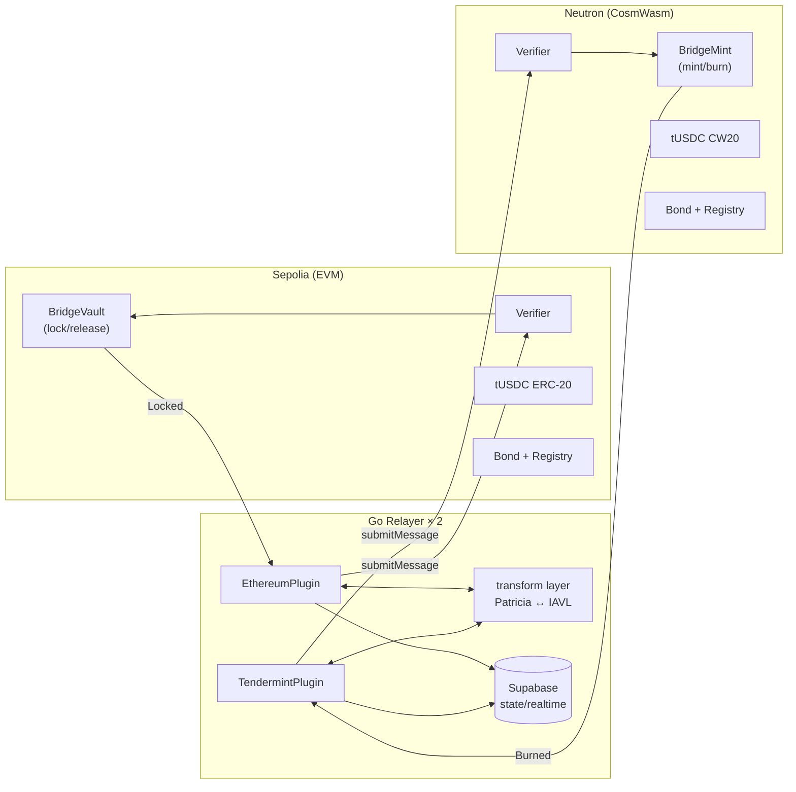

> **Deep dive:** [Architecture](./03-architecture) covers the full component map, proof pipeline, and message envelope format.

---

## External Documentation

The full Notion submission doc lives at: **https://www.notion.so/Tessera-35a23e3815fc81a08b60c8fd039ba123**

It mirrors this in-app guide and adds the PM brief, technical decisions, post-hackathon roadmap, and Form-2 reflection.

---

## Quick Start

```bash
cp .env.example .env             # then fill in keys
cd contracts-evm && forge install && forge test
cd ../relayer && go build ./...
go run ./cmd/tessera test-scenario mock   # in-process dry run, no funds needed
# Live demo: <LIVE_URL>
```

Operator: replace `<LIVE_URL>` with the deployed frontend URL before submission.

The bridge widget is the primary user-facing surface, designed to work identically on desktop and mobile:


---

## Background & Comparison

Cross-chain infrastructure is a solved problem in many ways — dozens of bridges exist. Tessera is not competing with them. It makes different trade-offs, and those trade-offs are the point.

---

## The Design Space

Every bridge sits somewhere on two axes:

**Trust axis:** who do you trust to relay the message?
- **Trusted relay:** operator promises not to lie. Fast, cheap, fragile.
- **Multisig / MPC:** N-of-M committee. More robust, still requires honesty of a majority.
- **Economic enforcement (Tessera):** operators are bonded. Lying costs more than it can gain.
- **ZK proof:** cryptographic correctness, no trust. Expensive, slow, hardware-dependent.
- **Light client / sync committee:** trustless on-chain consensus verification. Requires native support on destination chain.

**Verification axis:** how does the destination know the source event really happened?
- **Oracle attestation:** authorized signers attest to the event. Off-chain trust.
- **Optimistic:** assume correct, dispute if wrong. Cheap but slow (7-day windows).
- **ZK proof:** verifiable computation. Trustless but resource-intensive.
- **Native proof (Tessera):** destination contract verifies a proof in its own native format. No ZK, no oracle. The proof itself is the evidence.

Tessera occupies the **economic enforcement + native proof** corner. This combination has a specific profile:

---

## Comparison Table

| Property | Trusted bridge | Optimistic bridge | ZK bridge | Tessera |
|----------|---------------|-------------------|-----------|---------|
| Relayer trust | Full | Minority honest assumed | None | None (bonded economic) |
| Proof verification | Oracle attestation | Dispute game | ZK verifier on-chain | Native Merkle proof in destination VM format |
| Ed25519 on EVM | N/A or skipped | N/A or skipped | ZK circuit | Off-chain in Go (bypass) |
| Latency | ~30s | 7 days | minutes (proof gen) | 75–90s (challenge window) |
| New chain cost | Config change | Config change | New ZK circuit | New Go plugin module |
| New app cost | N/A | N/A | N/A | Implement `IApp`, no contract change |
| On-chain gas | Low | Low | High (verifier) | Medium (Merkle walk) |
| Hardware requirement | Relayer server | Relayer server | GPU prover | Commodity server |

> **Note:** Tessera's 75–90s latency is driven by the 60-second challenge window — a configurable parameter, not an architectural limit. Production deployments with higher bond thresholds can reasonably tighten this.

---

## What Tessera Does Not Try to Be

- **Not a ZK bridge.** ZK provers require dedicated hardware and produce latency measured in minutes. Tessera's proof transformation is CPU-only and deterministic.
- **Not a light-client bridge.** Full on-chain light clients require the destination chain to implement the source chain's consensus mechanism natively. Tessera's Ed25519 bypass avoids this without sacrificing cryptographic security — the relayer does the Ed25519 work and the destination verifies the resulting Merkle proof.
- **Not a generalized message bus.** Tessera's envelope format supports arbitrary `action` + `payload`, so it can carry arbitrary messages — but the reference application is a token bridge, and the demo is scoped to that.

---

## Where the Architecture Argument Is

The case for Tessera is not "we're better than X." It's that the **combination** of:
1. Native-format proof verification (no ZK, no oracle)
2. Deterministic cross-format proof transformation (Patricia ↔ IAVL)
3. Bonded economic enforcement with per-message role rotation

...produces a system where fraud is detectable by anyone, punishable on-chain, and economically irrational — without requiring ZK hardware, a trusted committee, or chain-native light client support.

> See [Architecture](./03-architecture) for how the pieces connect.
> See [Economics](./04-economics) for the incentive model in detail.

---

## Architecture

---

## System Components


---

## Six Contracts Per VM

The same logical contract set deploys on every supported chain. Solidity on EVM; Rust + CosmWasm on Cosmos.

| Contract | Role | Key entry points |
|----------|------|-----------------|
| `RelayerRegistry` | Identity + state tracking | `register`, `topUpBond`, `withdrawBond`, `rotateKey`, `recordSlash` |
| `Bond` | Fund custody + slash execution | `deposit`, `slash` (onlyVerifier), `withdraw`, `getBond` |
| `Verifier` | Proof verification + dispatch | `submitMessage`, `challenge`, `executeMessage`, `claimAbsenceSlash` |
| `BridgeVault` | Source-side lock / release | `lock`, `release` (onlyVerifier) |
| `BridgeMint` | Destination-side mint / burn | `mint` (onlyVerifier), `burn` |
| `tUSDC` | Test token | `claim` (rate-limited), standard transfer |

**Adding a new EVM chain:** deploy these six contracts. No new contract code.
**Adding a new Cosmos chain:** deploy the CosmWasm versions. No new contract code.
**Adding a new application:** implement `IApp` and register — no Verifier changes.

---

## Proof Pipeline

### Sepolia → Neutron

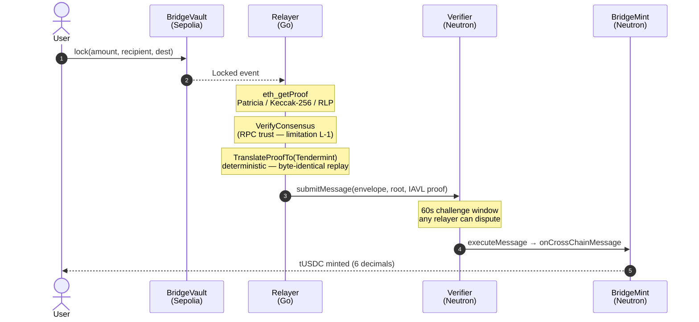

### Neutron → Sepolia (Ed25519 bypass)

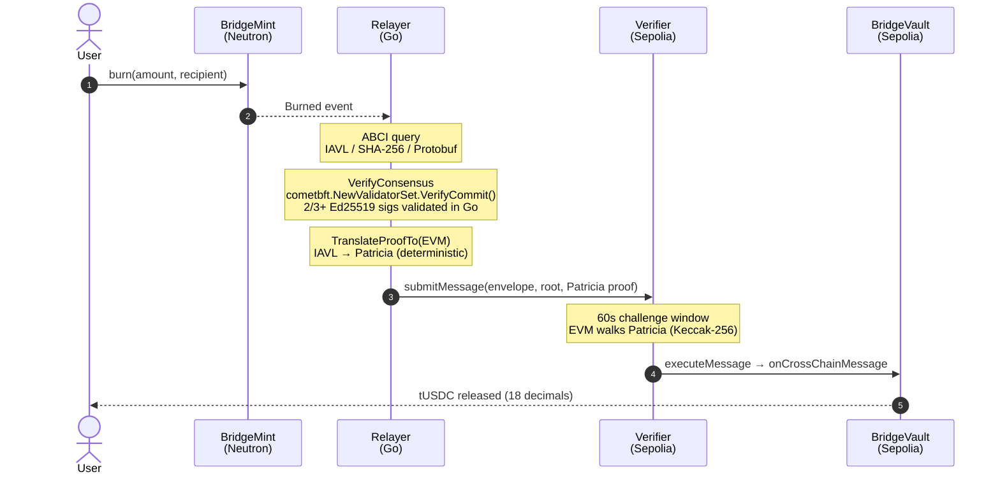

---

## Message Envelope

Every cross-chain message uses this canonical structure:

```solidity
struct MessageEnvelope {
    bytes32 sourceChainId;
    bytes   sourceApp;          // contract that emitted source event
    bytes32 destinationChainId;
    bytes   destinationApp;     // IApp-implementing contract to dispatch to
    bytes4  action;             // function selector + encoding scheme
    bytes   payload;            // recipient, amount, etc.
    uint64  nonce;              // monotonic, per source chain + source app
}
```

The `nonce` drives per-message role assignment (see [Economics](./04-economics)).
The `destinationApp` field is what makes the system application-agnostic — any IApp-implementing contract can receive messages without Verifier changes.

---

## Relayer Plugin Model

The single source of truth is [`relayer/internal/chain/plugin.go`](https://github.com/sami-funavry/Tessera/blob/main/relayer/internal/chain/plugin.go). The interface below is copied verbatim:

```go
type Plugin interface {
    ChainID() string
    LatestBlock(ctx context.Context) (uint64, error)
    FetchBlockFingerprint(ctx context.Context, height uint64) (Fingerprint, error)
    FetchProof(ctx context.Context, event Event, height uint64) (Proof, error)
    VerifyConsensus(ctx context.Context, height uint64) error
    SubscribeEvents(ctx context.Context, fromBlock uint64) (<-chan Event, error)
    TranslateProofTo(proof Proof, destChainID string) (Proof, error)
    SubmitMessage(ctx context.Context, env MessageEnvelope, proof Proof) (txHash string, submissionID [32]byte, err error)
    ExecuteMessage(ctx context.Context, submissionID [32]byte, proof Proof) (string, error)
    SubmitChallenge(ctx context.Context, submissionID [32]byte, counterProof Proof) (string, error)
    ClaimAbsenceSlash(ctx context.Context, submissionID [32]byte) (string, error)
    Register(ctx context.Context, pubKeyBytes []byte) (string, error)
    DepositBond(ctx context.Context, amount string) (string, error)
}
```

Adding a new source chain = implementing this interface in a new Go file under `relayer/plugins/<chain>/`. Nothing else in the repository changes.

---

## Trust Model

| Layer | Trust assumption |
|-------|----------------|
| Source consensus (Neutron) | Go relayer verifies 2/3+ Ed25519 validator signatures. Cryptographic. |
| Source consensus (Sepolia) | RPC trust — relayer trusts its configured RPC node. Documented limitation; future work: sync committee. |
| Proof transformation | Deterministic. Any party can replicate. Fraud = detectable by challenger. |
| Destination verification | On-chain Merkle proof walk. No trust. |
| Economic enforcement | Bond at risk. Punishment > gain. Honest behavior is the rational strategy. |

> Liveness assumption: at least one honest, online relayer in the registered set.

---

## Live System Visibility

Every component of the architecture above emits structured data that the frontend renders in real time. The benchmark page summarises end-to-end performance — proof fetch latency, transformation time, on-chain submission gas, and the full source-to-destination wall-clock — across recent submissions on both directions.


This is what gives operators a single glance into whether the proof pipeline is healthy, where latency is concentrated, and how each plugin (Ethereum, Tendermint) is performing.

---

> Related: [Economics](./04-economics) · [Limitations](./10-limitations) · [Developer Guide](./07-developer-guide)

---

## Economics

Tessera's security model is economic. Relayers are bonded; wrong behavior costs more than it can gain. This section covers the full incentive structure.

---

## Roles Are Per-Message, Not Per-Relayer

Every running relayer is simultaneously a potential submitter and a potential challenger. There is no dedicated "challenger" instance.

**Per-message role assignment (on-chain, deterministic):**

```
assigned_index = (nonce + floor(elapsed_since_event / handover_period)) % registered_relayer_count
```

- `handover_period` = 30 seconds (testnet)
- With 2 relayers: message #1 → relayer[0] submits, message #2 → relayer[1] submits, alternating by nonce
- If the assigned relayer doesn't act within 30s, assignment rotates to the next. The original is slashed for absence.
- Every non-assigned relayer independently verifies the submission and challenges if wrong.

---

## Bond Thresholds

*Testnet values — intentionally low due to daily faucet limits (~0.05 ETH/day Sepolia, ~2 NTRN/day Neutron).*

| Threshold | Sepolia | Neutron (uNTRN) | Meaning |
|-----------|---------|-----------------|---------|
| **Initial bond** (register) | 0.02 ETH | 80,000 uNTRN (0.08 NTRN) | Required to join the registry |
| **Operating** (50% of initial) | 0.01 ETH | 40,000 uNTRN (0.04 NTRN) | Below this: no new submissions accepted |
| **Deregistration** (25% of initial) | 0.005 ETH | 20,000 uNTRN (0.02 NTRN) | Below this: fully removed from registry |

> See [Limitations §L-3](./10-limitations#l-3-testnet-parameters-are-deliberately-low) for the production-recommended bond schedule.

> **Production note:** These values would be significantly higher in production (e.g., 0.5 ETH / 100 NTRN). The slashing ratios and all mechanisms are identical — only the absolute amounts change.

Both submission slashing and challenge slashing draw from **one bond per relayer per chain**. There is no separate challenger deposit.

---

## Slashing Rules

| Trigger | Who is slashed | Amount | Who receives it | Outcome |
|---------|---------------|--------|-----------------|---------|
| Wrong submission (fraud) | Submitter | 50% of submitter's bond | 100% to challenger | Submission reverts; user refunded |
| Frivolous challenge | Challenger | 25% of challenger's bond | 100% to submitter | Submission executes normally; user receives tokens |
| Absence (no submission in handover window) | Original assigned submitter | 50% of their bond | 100% to whoever submitted instead | Submission executes normally |

**Dispute settlement is on-chain.** The Bond contract verifies which party is right by checking the submitted evidence. No off-chain coordination decides outcomes.

---

## User Protection

In all four scenarios, the user is made whole:

- Honest delivery → user receives bridged tokens.
- Lying relayer → submission reverts; source-chain lock is returned to user.
- Silent relayer → successor submits; user receives bridged tokens.
- Frivolous challenge → original honest submission executes; user receives bridged tokens.

The bond is the financial guarantee. Slashing is the enforcement mechanism.

---

## Relayer Lifecycle

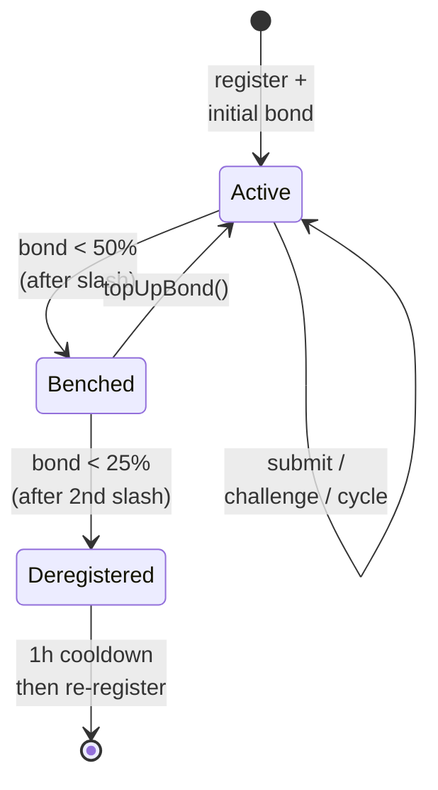

**Voluntary exit:** call `withdrawBond()` after 1-hour idle period (no pending submissions).

---

## Why the Network Stays Honest

For fraud to be profitable, a lying relayer would need:
- The challenger to be offline or corrupted (liveness assumption: at least one honest relayer is online)
- The benefit of fraud to exceed 50% of their bond

If the bridge is handling meaningful volume, the bond must be meaningful. At any reasonable bond size, fraud is economically irrational. The network is honest not because operators are trusted, but because dishonesty is reliably punished.

> See [Demo Scenarios](./05-demo-scenarios) for each slash trigger played out step-by-step.

---

## Demo Scenarios

Four scenarios cover the complete state space of the economic enforcement model. Each is a real on-testnet execution, not a simulation.

Test scripts read on-chain rotation state at runtime to determine which physical relayer (A or B) is the assigned submitter for each scenario. Role assignment is never hardcoded.


---

## Outcome Summary

| Scenario | Submitter action | Challenger action | User outcome | Relayer outcome |
|----------|-----------------|-------------------|--------------|-----------------|
| S-1 Honest | Correct proof | Verifies, stands down | Receives bridged tokens | Submitter earns fee |
| S-2 Lying | Wrong fingerprint | Detects fraud, challenges | Source lock returned | Submitter slashed 50%; challenger +50% |
| S-3 Silent | Does not act | — | Receives bridged tokens | Original slashed 50%; successor +fee +slash |
| S-4 Frivolous | Correct proof | Challenges incorrectly | Receives bridged tokens | Challenger slashed 25%; submitter +25% |

---

## S-1: Honest Delivery

**Setup:** Two relayers registered. Message #N assigned to relayer[0].

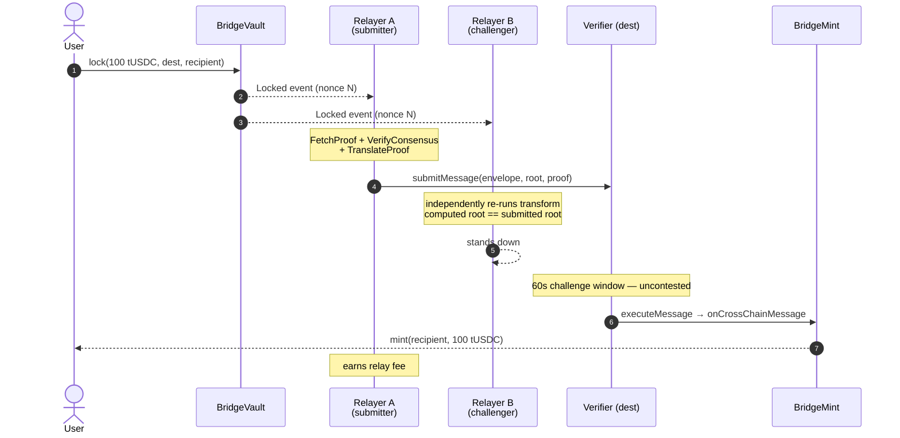

**Pass condition:** User balance +100 tUSDC on destination. No slash events.

---

## S-2: Lying Relayer

**Setup:** Relayer A is assigned submitter. A submits a deliberately wrong proof fingerprint.

```mermaid
sequenceDiagram
    autonumber
    actor U as User
    participant SV as BridgeVault
    participant A as Relayer A<br/>(lying)
    participant B as Relayer B<br/>(challenger)
    participant V as Verifier (dest)
    participant Bd as Bond

    U->>SV: lock(100 tUSDC, ...)
    SV-->>A: Locked event
    SV-->>B: Locked event
    A->>V: submitMessage(envelope, WRONG_FINGERPRINT, fabricated proof)
    Note over B: re-runs transform → real_root<br/>real_root ≠ WRONG_FINGERPRINT
    B->>V: challenge(submissionId, real_root, evidence)
    V->>Bd: verify evidence
    Note over Bd: real_root matches source state ✓<br/>WRONG_FINGERPRINT does not ✗
    Bd-->>A: slash 50% of A's bond
    Bd-->>B: transfer 100% of slash to B
    V-->>U: submission reverted; lock returned
```

**Pass condition:** Relayer A bond −50%. Relayer B balance +50% of A's slashed bond. User source balance restored. No mint on destination.

---

## S-3: Silent Relayer

**Setup:** Relayer A is assigned submitter. A does not act within 30s handover period.

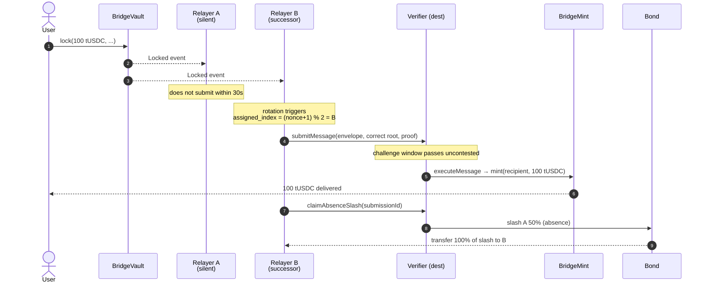

**Pass condition:** User receives 100 tUSDC on destination. Relayer A bond −50%. Relayer B earns fee + absence slash reward.

---

## S-4: Frivolous Challenge

**Setup:** Relayer A submits a correct proof. Relayer B files a baseless challenge.

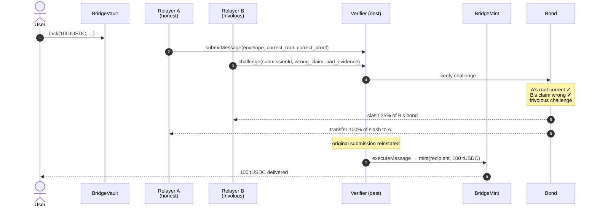

**Pass condition:** Relayer B bond −25%. Relayer A balance +25% of B's slashed bond. User receives 100 tUSDC. Original submission executed.

---

## Running Scenarios

These run as in-process simulations. For testnet runs, see `scripts/scenarios/0N-*.sh`.

```bash
# From repo root — in-process simulations (no funds needed)
go run ./cmd/tessera test-scenario 1
go run ./cmd/tessera test-scenario 2
go run ./cmd/tessera test-scenario 3
go run ./cmd/tessera test-scenario 4
```

Each run prints the assigned roles, simulated transaction hashes, and final bond states. To exercise the same flows against live testnets (real gas, real bonds, real explorers), run the matching shell scripts under `scripts/scenarios/` after `.env` is populated.

> See [Developer Guide](./07-developer-guide) for environment setup prerequisites.

---

## Repo Structure & Scalability

---

## Directory Layout

Generated from `find . -maxdepth 3 -type d` (filtered to skip `node_modules`, `.git`, `target`, `.next`, `cache`, `out`, `info`, `dist`).

```
tessera/
├── contracts-evm/                       # Solidity contracts (Foundry)
│   ├── src/
│   │   ├── RelayerRegistry.sol
│   │   ├── Bond.sol
│   │   ├── Verifier.sol
│   │   ├── BridgeVault.sol
│   │   ├── BridgeMint.sol
│   │   ├── TUSDC.sol
│   │   ├── interfaces/                  # IApp.sol and friends
│   │   └── libraries/
│   ├── test/
│   │   ├── unit/
│   │   ├── integration/
│   │   └── helpers/
│   ├── script/                          # Deploy.s.sol etc.
│   └── broadcast/                       # forge broadcast artifacts
│
├── contracts-cosmwasm/                  # Rust + CosmWasm contracts
│   ├── contracts/
│   │   ├── relayer-registry/
│   │   ├── bond/
│   │   ├── verifier/
│   │   ├── bridge-vault/
│   │   ├── bridge-mint/
│   │   └── tusdc/
│   ├── packages/
│   │   └── tessera-types/               # shared message types
│   └── artifacts/                       # optimized .wasm output
│
├── relayer/                             # Go service
│   ├── cmd/tessera/                     # binary entry point (cmd/tessera/main.go)
│   ├── internal/
│   │   ├── chain/                       # Plugin interface (chain/plugin.go)
│   │   ├── cli/                         # cobra subcommands (relayer/bond/fetch/test-scenario)
│   │   ├── config/                      # env-var loading
│   │   ├── cosmwasm/                    # low-level CosmWasm/Tendermint client
│   │   ├── obs/                         # observability (slog, sentry)
│   │   ├── pipeline/                    # mock end-to-end pipeline runner
│   │   ├── relayer/                     # submitter, challenger, runner
│   │   ├── scenario/                    # in-process S-1..S-4 simulations
│   │   ├── supabase/                    # state persistence
│   │   └── transform/                   # Patricia ↔ IAVL transformation
│   └── plugins/
│       ├── ethereum/                    # EthereumPlugin
│       └── tendermint/                  # TendermintPlugin
│
├── frontend/                            # Next.js 14 App Router
│   ├── app/                             # routes (bridge, demo, dashboard, docs, benchmark, submissions, api)
│   ├── components/                      # shared UI (incl. components/ui)
│   ├── hooks/                           # data hooks
│   ├── lib/                             # wagmi, keplr, supabase, config
│   ├── public/
│   └── types/
│
├── scripts/                             # deploy + scenario + ops scripts
│   ├── addresses.json                   # canonical deployed contract addresses
│   ├── deploy/                          # solidity deploy helpers
│   ├── scenarios/                       # 01-honest.sh, 02-lying.sh, 03-silent.sh, 04-frivolous.sh (live testnet)
│   ├── register-relayers.sh             # cross-chain bond + register
│   ├── register-sepolia-relayers.sh
│   ├── register-neutron-relayers.js
│   ├── deploy-neutron-v4.js             # current Neutron deploy entrypoint
│   ├── deploy-tusdc-v2.js
│   ├── complete-neutron-deploy.js
│   ├── finalize-neutron-deploy.js
│   ├── redeploy-all-neutron.js
│   ├── redeploy-bond-neutron.js
│   ├── redeploy-tusdc-neutron.js
│   ├── redeploy-verifier-neutron.js
│   ├── claim-neutron-tusdc.js
│   ├── fund-all-neutron-v2.js
│   ├── fund-neutron-relayers.js
│   ├── smoke-test.sh
│   └── smoke-test.log
│
├── docs/                                # in-app documentation (this directory) + images/
└── supabase/
    └── migrations/                      # 001_initial_schema.sql, 002_indexes_and_constraints.sql
```

The Go binary lives at `relayer/cmd/tessera/`; invocations elsewhere in the docs use `go run ./cmd/tessera ...` from inside `relayer/`.

---

## What's in `frontend/`

The Next.js app is the single user- and operator-facing surface for the live deployment. It reads from Supabase (for relayer state, submissions, events) and from both chains directly (for bonds and balances). The dashboard is the primary operator view — every card, table, and metric below is rendered from real on-chain and Supabase data, not fixtures.


---

## Why This Layout

**One contract set, multiple chains.**
`contracts-evm/src/` contains six `.sol` files. The same compiled bytecode deploys on Sepolia today and on any other EVM chain tomorrow. The only change is deployment configuration. Same principle applies to `contracts-cosmwasm/` — same Rust code, new addresses.

**Plugin isolation.**
Each chain plugin lives in `relayer/plugins/<chain-name>/plugin.go`. The plugin has one responsibility: implement `ChainPlugin`. No other file in the relayer knows the difference between Ethereum and Tendermint at the implementation level.

**Shared packages for correctness.**
`packages/tessera-types/` is shared across all CosmWasm contracts so message-type definitions stay consistent — a single fix propagates to every destination app.

---

## Adding a New Source Chain

**What changes:** one new file.

```
relayer/plugins/polygon/plugin.go   ← new file
```

That file implements the `chain.Plugin` interface (defined in `relayer/internal/chain/plugin.go`) for the new chain. The 13-method interface is reproduced verbatim in the [Architecture → Relayer Plugin Model](./03-architecture#relayer-plugin-model) section.

The relayer wires plugins together in `internal/cli/root.go` (the `relayer` subcommand). Adding a chain there is a few lines: construct your plugin from env-var config and pass it to the runner. There is no YAML config file — all runtime configuration is via env vars (see [Developer Guide](./07-developer-guide#prerequisites)).

**What does not change:**
- No existing plugin files.
- No `internal/` files (the plugin pattern keeps chain-specific logic out of the core).
- No contract code.
- No frontend code (new chain appears in the chain selector automatically if the frontend reads from `scripts/addresses.json` / `frontend/lib/config.ts`).

---

## Adding a New Destination VM

**What changes:** one new directory of contracts, ported to the new VM's language.

```
contracts-<new-vm>/
├── relayer-registry/
├── bond/
├── verifier/
├── bridge-vault/
├── bridge-mint/
└── tusdc/
```

The six contracts implement the same logical interface. The Verifier dispatches to `IApp`-equivalent in the new VM's style. Existing contracts on Sepolia and Neutron are unchanged.

---

## Adding a New Application

**What changes:** one new contract.

```solidity
// MyApp.sol
contract MyApp is IApp {
    address public immutable verifier;

    modifier onlyVerifier() {
        require(msg.sender == verifier, "not verifier");
        _;
    }

    function onCrossChainMessage(
        bytes32 sourceChainId,
        bytes calldata sourceApp,
        bytes4 action,
        bytes calldata payload
    ) external onlyVerifier {
        // custom application logic
    }
}
```

Register `MyApp`'s address as the `destinationApp` in the message envelope. The Verifier dispatches to it after proof verification. No Verifier changes. No relayer changes. No registry changes.

---

## Contract Addresses (Deployed)

| Contract | Sepolia | Neutron (pion-1) |
|----------|---------|-----------------|
| tUSDC | [`0x7dcA285EFe722EdC1D9c93C3878fb58b255EC5B0`](https://sepolia.etherscan.io/address/0x7dcA285EFe722EdC1D9c93C3878fb58b255EC5B0) | [`neutron1fw6unz7a9j4zf9gnvhup5qe6dlftytdc0y0rwyn3lyxdazz22rtsck0vld`](https://neutron.celat.one/pion-1/contracts/neutron1fw6unz7a9j4zf9gnvhup5qe6dlftytdc0y0rwyn3lyxdazz22rtsck0vld) |
| Bond | [`0x8c7dc28559B75AF8c3d59B62C87309E65cb37912`](https://sepolia.etherscan.io/address/0x8c7dc28559B75AF8c3d59B62C87309E65cb37912) | [`neutron1nnz9j6c3d25wnwj4h3jqkvazgawcmgjjk5unysvf6e0j90gavvsseunvg8`](https://neutron.celat.one/pion-1/contracts/neutron1nnz9j6c3d25wnwj4h3jqkvazgawcmgjjk5unysvf6e0j90gavvsseunvg8) |
| RelayerRegistry | [`0x43677d5Da5701E061Eefa65e36A4fF6D4BFC1109`](https://sepolia.etherscan.io/address/0x43677d5Da5701E061Eefa65e36A4fF6D4BFC1109) | [`neutron1jq5kku3r0sxdkcxvkx7ke4dlcwq4my0m2gncrx4zf7g37hxtwj7qfrya5k`](https://neutron.celat.one/pion-1/contracts/neutron1jq5kku3r0sxdkcxvkx7ke4dlcwq4my0m2gncrx4zf7g37hxtwj7qfrya5k) |
| Verifier | [`0x2EfAB8cC7ed7C11cfC23C215731aaFA2A602F72a`](https://sepolia.etherscan.io/address/0x2EfAB8cC7ed7C11cfC23C215731aaFA2A602F72a) | [`neutron1sda4ucdq06de7h7lxg66n6sq29ft9hk76a5mpjwehk3a8wfga0eqf002f0`](https://neutron.celat.one/pion-1/contracts/neutron1sda4ucdq06de7h7lxg66n6sq29ft9hk76a5mpjwehk3a8wfga0eqf002f0) |
| BridgeVault | [`0x2C3544434185DD65F058494816bB816e5314a29E`](https://sepolia.etherscan.io/address/0x2C3544434185DD65F058494816bB816e5314a29E) | [`neutron12z7xqgwgp6vsk5s96z4n6vjupqjg3zmvv5v068vvy3n69gshvhaq8j7dam`](https://neutron.celat.one/pion-1/contracts/neutron12z7xqgwgp6vsk5s96z4n6vjupqjg3zmvv5v068vvy3n69gshvhaq8j7dam) |
| BridgeMint | [`0x61cab20856b16003b6a3FB213F86355515AD43cd`](https://sepolia.etherscan.io/address/0x61cab20856b16003b6a3FB213F86355515AD43cd) | [`neutron18am0spqaanz75mh2tl43ychhvf537wcklf3rjlv0y03tvrn6gdksq8ltt7`](https://neutron.celat.one/pion-1/contracts/neutron18am0spqaanz75mh2tl43ychhvf537wcklf3rjlv0y03tvrn6gdksq8ltt7) |

Source of truth: [`scripts/addresses.json`](../scripts/addresses.json)

---

## Developer Guide

---

## Prerequisites

| Tool | Version | Purpose |
|------|---------|---------|
| Go | ≥ 1.22 | Relayer |
| Rust + `wasm32-unknown-unknown` target | ≥ 1.78 | CosmWasm contracts |
| Foundry (`forge`, `cast`, `anvil`) | latest | Solidity contracts |
| Docker | ≥ 24 | CosmWasm optimizer (required for Neutron deploy) |
| Node.js + pnpm | ≥ 20 / ≥ 9 | Frontend |
| `neutrond` CLI | v4.x | Neutron transactions |

All runtime configuration is via environment variables. There is no YAML config file — `cp .env.example .env` and fill in the values; the relayer reads them directly.

The canonical list is `.env.example` at the repo root. The variables the running relayer actually reads (per `relayer/internal/config/config.go`):

| Variable | Required | Purpose |
|----------|----------|---------|
| `ETHEREUM_SEPOLIA_ENDPOINT` | yes | Sepolia JSON-RPC URL (Alchemy / Infura / self-hosted) |
| `NEUTRON_RPC_URL` | yes | Neutron Tendermint RPC |
| `NEUTRON_GRPC_URL` | yes | Neutron gRPC endpoint (used for some Cosmos queries) |
| `NEUTRON_REST_URL` | yes | Neutron REST / LCD endpoint |
| `NEUTRON_CHAIN_ID` | yes | `pion-1` for testnet |
| `RELAYER_PRIVATE_KEY` | yes | The running relayer's hex secp256k1 key (no `0x` prefix). Same key signs both Sepolia and Neutron txs. |
| `SUPABASE_PROJECT_URL` | yes | Supabase project URL |
| `SUPABASE_SERVICE_ROLE_KEY` | yes | Service-role key (server-side only) |
| `ETHERSCAN_API_KEY` | yes | Used by Foundry for source verification |
| `ETHERSCAN_API_URL` | yes | e.g. `https://api-sepolia.etherscan.io/api` |
| `SEPOLIA_DEPLOYER_PRIVATE_KEY` | deploy only | Hex key used by `forge script Deploy.s.sol` |
| `NEUTRON_DEPLOYER_PRIVATE_KEY` | deploy only | Hex key used by Neutron deploy + `bond fund-neutron` |
| `RELAYER_A_PRIVATE_KEY` / `RELAYER_B_PRIVATE_KEY` | scripts only | Read by `scripts/register-relayers.sh` to register both relayers in one shot. The running daemon ignores these. |
| `SEPOLIA_*` / `NEUTRON_*` contract addresses | optional | Override `scripts/addresses.json`. Most operators leave unset. |

To run a second relayer instance, set `RELAYER_PRIVATE_KEY` to the second key and rerun the binary in another terminal — there are no per-instance config files.

---

## Local Setup

```bash
git clone <repo>
cd tessera

# Solidity (Foundry)
cd contracts-evm && forge install && forge build

# CosmWasm
cd contracts-cosmwasm && cargo build

# Go relayer
cd relayer && go mod download && go build ./...

# Frontend
cd frontend && pnpm install
```

---

## Running Tests

### Solidity (Foundry)

```bash
cd contracts-evm

# All tests with verbose output
forge test -vvv

# Coverage report
forge coverage

# Gas snapshot (run after any contract change)
forge snapshot
```

Expected: 88 tests, ~91% line coverage.

### CosmWasm

```bash
cd contracts-cosmwasm

# Unit + integration tests
cargo test

# Lint (warnings = errors)
cargo clippy -- -D warnings

# Check wasm targets build
cargo wasm
```

Expected: full workspace passes, clippy clean.

### Go Relayer

```bash
cd relayer

# All tests including race detector
go test -race ./...

# Transform layer specifically (determinism tests run 100x)
go test -race -run TestPatriciaToIAVL ./internal/transform/...
go test -race -run TestIAVLToPatricia ./internal/transform/...
```

Expected: transform tests pass both directions, 100x determinism confirmed.

---

## Running the Relayer (Against Testnets)

Requires `.env` populated and contracts deployed (addresses in `scripts/addresses.json`).

```bash
cd relayer

# Run Relayer A
RELAYER_PRIVATE_KEY=<A_KEY> go run ./cmd/tessera relayer

# Run Relayer B (separate terminal — reuses the same .env, but RELAYER_PRIVATE_KEY is overridden)
RELAYER_PRIVATE_KEY=<B_KEY> go run ./cmd/tessera relayer

# Check bond status (currently prints a hint; use the block explorer for now)
go run ./cmd/tessera bond status

# Inspect a chain at a given block (debugging)
go run ./cmd/tessera fetch --chain sepolia --block 0
go run ./cmd/tessera fetch --chain neutron --block 0 --transform
```

To run a second relayer instance, set `RELAYER_PRIVATE_KEY` to the second key (inline as above, or via a second `.env`) and rerun.

---

## Running Demo Scenarios

These run as in-process simulations. For testnet runs, see `scripts/scenarios/0N-*.sh`.

```bash
# In-process simulations — no funds required
go run ./cmd/tessera test-scenario mock   # pipeline dry run, no scenario logic
go run ./cmd/tessera test-scenario 1      # S-1 Honest
go run ./cmd/tessera test-scenario 2      # S-2 Lying
go run ./cmd/tessera test-scenario 3      # S-3 Silent
go run ./cmd/tessera test-scenario 4      # S-4 Frivolous
```

The matching shell scripts at `scripts/scenarios/01-honest.sh`, `02-lying.sh`, `03-silent.sh`, and `04-frivolous.sh` exercise the same scenarios against live Sepolia + Neutron testnets.

---

## Adding a New Chain Plugin

1. Create `relayer/plugins/<chain-name>/plugin.go`.
2. Implement the `chain.Plugin` interface — every method is required. The single source of truth is [`relayer/internal/chain/plugin.go`](https://github.com/sami-funavry/Tessera/blob/main/relayer/internal/chain/plugin.go); read it before writing any plugin code. The 13 methods are:

   ```go
   type Plugin interface {
       ChainID() string
       LatestBlock(ctx context.Context) (uint64, error)
       FetchBlockFingerprint(ctx context.Context, height uint64) (Fingerprint, error)
       FetchProof(ctx context.Context, event Event, height uint64) (Proof, error)
       VerifyConsensus(ctx context.Context, height uint64) error
       SubscribeEvents(ctx context.Context, fromBlock uint64) (<-chan Event, error)
       TranslateProofTo(proof Proof, destChainID string) (Proof, error)
       SubmitMessage(ctx context.Context, env MessageEnvelope, proof Proof) (txHash string, submissionID [32]byte, err error)
       ExecuteMessage(ctx context.Context, submissionID [32]byte, proof Proof) (string, error)
       SubmitChallenge(ctx context.Context, submissionID [32]byte, counterProof Proof) (string, error)
       ClaimAbsenceSlash(ctx context.Context, submissionID [32]byte) (string, error)
       Register(ctx context.Context, pubKeyBytes []byte) (string, error)
       DepositBond(ctx context.Context, amount string) (string, error)
   }
   ```

3. Wire it up in `internal/cli/root.go` (the `relayer`, `bond`, and `fetch` subcommands construct the existing `ethereum` and `tendermint` plugins from env-var config — add your plugin alongside them).
4. Add the env-vars your plugin needs to `internal/config/config.go` and `.env.example`. There is no YAML config; everything is env-var driven.
5. Run `go test -race ./plugins/<chain-name>/...`.

The proof transformation layer (`internal/transform/`) handles both directions automatically. The plugin only needs to know how to fetch and submit in its chain's native format.

---

## Adding a New Application

**Solidity (EVM):**

```solidity
import {IApp} from "./interfaces/IApp.sol";

contract MyApp is IApp {
    address public immutable verifier;

    constructor(address _verifier) {
        verifier = _verifier;
    }

    modifier onlyVerifier() {
        require(msg.sender == verifier, "not verifier");
        _;
    }

    function onCrossChainMessage(
        bytes32 sourceChainId,
        bytes calldata sourceApp,
        bytes4 action,
        bytes calldata payload
    ) external override onlyVerifier {
        // decode payload, execute application logic
    }
}
```

**CosmWasm (Neutron):**

```rust
// In execute.rs
pub fn execute_on_cross_chain_message(
    deps: DepsMut,
    env: Env,
    info: MessageInfo,
    source_chain_id: String,
    source_app: String,
    action: [u8; 4],
    payload: Binary,
) -> Result<Response, ContractError> {
    // Enforce only-verifier
    if info.sender != VERIFIER_ADDR.load(deps.storage)? {
        return Err(ContractError::Unauthorized {});
    }
    // application logic
}
```

No changes to Verifier, Bond, Registry, BridgeVault, or BridgeMint. Deploy the app contract and use its address as `destinationApp` in the message envelope.

---

## Contract Verification

Sepolia contracts are verified on Etherscan. Neutron contracts are verified on Celatone.

- Etherscan Sepolia: `https://sepolia.etherscan.io/address/<address>`
- Celatone Neutron pion-1: `https://neutron.celat.one/pion-1/contracts/<address>`

> Full address list: [Repo Structure → Contract Addresses](./06-repo-structure#contract-addresses-deployed)

---

## Inspecting State

The relayer mirrors observed events and submission state into a Supabase project. Schema migrations live in `supabase/migrations/` (`001_initial_schema.sql`, `002_indexes_and_constraints.sql`).

- Supabase project URL: `<SUPABASE_PROJECT_URL>` (set in `.env`; the running deployment uses the URL configured by the operator).
- Open the SQL editor in the Supabase dashboard and run ad-hoc queries against the project.

A useful starting query:

```sql
select *
from messages
order by created_at desc
limit 10;
```

This returns the most recently observed cross-chain messages with their current status, source/destination chain, and submission timestamps. Other tables (`submissions`, `events`, `relayers`, `bond_balances`) are joined on `message_id` / `submission_id` — see the migration files for the full schema.

---

## Protocol User Guide

This section covers two audiences: **relayer operators** (who run the Go binary and post bonds) and **bridge users** (who lock/burn tokens). The bridge UI covers the user path visually — this page covers the protocol-level mechanics.

---

## Relayer Operator Guide

### Prerequisites

- A secp256k1 private key (same key works for both Sepolia and Neutron — it derives both `0x...` and `neutron1...` addresses)
- ETH on Sepolia for gas + bond: minimum 0.02 ETH bond + ~0.005 ETH gas
- NTRN on Neutron for gas + bond: minimum 80,000 uNTRN (0.08 NTRN) bond + ~5,000 uNTRN gas
- Tessera relayer binary built (see [Developer Guide](./07-developer-guide))

---

### Register and Bond

**Sepolia:**

```bash
# 1. Deposit bond to Bond contract
cast send <BOND_ADDRESS> "deposit(address)" <YOUR_ADDRESS> \
  --value 20000000000000000 \
  --private-key <YOUR_PRIVATE_KEY> \
  --rpc-url <SEPOLIA_RPC>

# 2. Register on RelayerRegistry
cast send <REGISTRY_ADDRESS> "register(bytes)" <YOUR_PUBKEY_HEX> \
  --private-key <YOUR_PRIVATE_KEY> \
  --rpc-url <SEPOLIA_RPC>

# 3. Verify active status
cast call <REGISTRY_ADDRESS> "isActive(address)(bool)" <YOUR_ADDRESS> \
  --rpc-url <SEPOLIA_RPC>
```

**Neutron (via neutrond CLI):**

```bash
# Deposit bond
neutrond tx wasm execute <BOND_ADDRESS> \
  '{"deposit":{"relayer":"<YOUR_NEUTRON_ADDRESS>"}}' \
  --amount 80000untrn \
  --from <YOUR_KEY_NAME> \
  --chain-id pion-1 \
  --node <NEUTRON_RPC>

# Register
neutrond tx wasm execute <REGISTRY_ADDRESS> \
  '{"register":{"pubkey":"<YOUR_PUBKEY_BASE64>"}}' \
  --from <YOUR_KEY_NAME> \
  --chain-id pion-1 \
  --node <NEUTRON_RPC>
```

Or use the relayer CLI which handles both chains. All runtime config is via env vars; copy `.env.example` to `.env` and fill in. To run a second relayer instance, set `RELAYER_PRIVATE_KEY` to the second key and rerun.

```bash
# register on both chains (or pass --chain sepolia | neutron)
go run ./cmd/tessera bond register

# deposit bond — amount is in wei for sepolia, uNTRN for neutron
go run ./cmd/tessera bond deposit --chain sepolia --amount 20000000000000000
go run ./cmd/tessera bond deposit --chain neutron --amount 80000
```

The available `bond` subcommands are `register`, `deposit`, `status`, and `fund-neutron`. Run `go run ./cmd/tessera bond --help` for the canonical list.

---

### Monitor Bond Status

```bash
go run ./cmd/tessera bond status
```

The current build prints a hint suggesting the block explorer until the on-chain query is wired up. For now, check live bonds via:

- Sepolia: `cast call <BOND_ADDRESS> "balanceOf(address)(uint256)" <YOUR_ADDRESS> --rpc-url <SEPOLIA_RPC>`
- Neutron: `neutrond query wasm contract-state smart <BOND_ADDRESS> '{"bond_of":{"relayer":"<YOUR_NEUTRON_ADDRESS>"}}' --node <NEUTRON_RPC>`

Or open the contract in [Etherscan / Celatone](./06-repo-structure#contract-addresses-deployed) and read `bondBalances` / `BondOf` directly.

---

### Top Up Bond

If your bond falls below the operating threshold (50% of initial), top up by depositing again on the affected chain:

```bash
# Sepolia top-up: 0.01 ETH
go run ./cmd/tessera bond deposit --chain sepolia --amount 10000000000000000

# Neutron top-up: 40,000 uNTRN
go run ./cmd/tessera bond deposit --chain neutron --amount 40000
```

---

### Withdraw Bond

> Not yet implemented in the CLI. The Bond contracts expose a withdraw entry point — call it directly via `cast` or `neutrond` until a `bond withdraw` subcommand is added.

```bash
# Sepolia
cast send <BOND_ADDRESS> "withdraw(uint256)" <AMOUNT_WEI> \
  --private-key <YOUR_PRIVATE_KEY> \
  --rpc-url <SEPOLIA_RPC>

# Neutron
neutrond tx wasm execute <BOND_ADDRESS> \
  '{"withdraw":{"amount":"<AMOUNT_UNTRN>"}}' \
  --from <YOUR_KEY_NAME> \
  --chain-id pion-1 \
  --node <NEUTRON_RPC>
```

A 1-hour idle period (no pending submissions) is enforced on-chain.

---

## How Disputes Work

When a challenge is filed, the Bond contract resolves it on-chain. No off-chain arbitration.

**Filing a challenge (automated — relayer does this):**

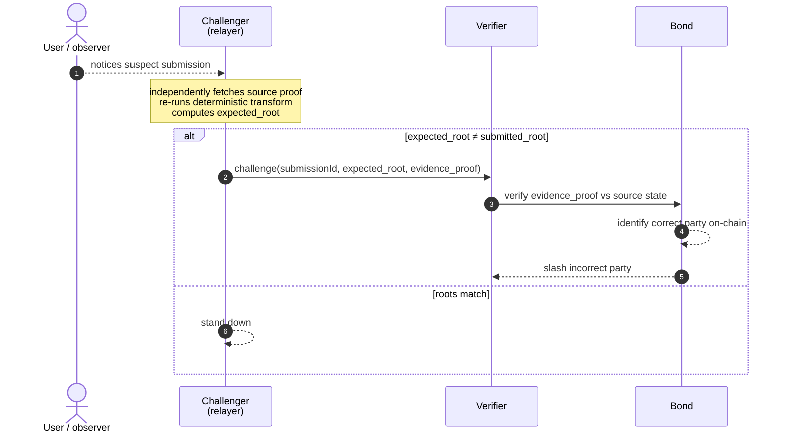

**Challenging a challenge (S-4 scenario):**
If the submitter's original proof was correct, the bond contract will find the challenger's "evidence" to be wrong and slash the challenger instead.

---

## Bridge User Guide

The steps below describe the protocol-level (CLI / `cast` / `neutrond`) flow. For UI users see [tUSDC Bridge → UI walkthrough](./09-tusdc-bridge#ui).

### Lock tUSDC (Sepolia → Neutron)

1. Connect MetaMask (Sepolia)
2. Approve `BridgeVault` to spend your tUSDC: `tUSDC.approve(BRIDGE_VAULT, amount)`
3. Call `BridgeVault.lock(amount, destinationChainId, recipientNeutronAddress)`
4. Note the `nonce` emitted in the `Locked` event — this is your message ID
5. Wait for the relayer to submit and the challenge window to pass (~75–90s)
6. tUSDC appears in your Neutron wallet

### Burn tUSDC (Neutron → Sepolia)

1. Connect Keplr (Neutron)
2. Call `BridgeMint.burn(amount, destinationChainId, recipientSepoliaAddress)`
3. Wait for relay + challenge window (~75–90s)
4. tUSDC released from BridgeVault on Sepolia

### Claim Test Tokens

Both chains have a no-argument `claim()` entry point on the tUSDC contract that mints 1000 tUSDC to `msg.sender` (per-address 24h cooldown).

```bash
# Sepolia — claim() takes no arguments; tokens go to msg.sender
cast send <TUSDC_SEPOLIA> "claim()" \
  --private-key <KEY> \
  --rpc-url <SEPOLIA_RPC>

# Neutron — Claim {} takes no fields; tokens go to the message sender
neutrond tx wasm execute <TUSDC_NEUTRON> \
  '{"claim":{}}' \
  --from <KEY> \
  --chain-id pion-1 \
  --node <NEUTRON_RPC>
```

---

## Reference App — tUSDC Bridge

The tUSDC bridge is Tessera's reference application. It demonstrates the full cross-chain lifecycle — both directions — using a custom ERC20/CW20 test token. It is not real USDC.

The bridge exists to prove that the Tessera infrastructure works end-to-end. Every piece of the system is exercised: proof fetch, transformation, on-chain verification, `IApp` dispatch, economic enforcement.

---

## What It Demonstrates

| Capability | Demonstrated by |
|-----------|----------------|
| EVM → Cosmos asset transfer | Sepolia lock → Neutron mint |
| Cosmos → EVM asset transfer | Neutron burn → Sepolia release |
| Fraud prevention | S-2: challenger catches lying relayer |
| Liveness enforcement | S-3: successor submits; original slashed |
| Frivolous challenge prevention | S-4: bad challenger slashed |
| Ed25519 bypass | Neutron→Sepolia direction; Go verifies off-chain |
| Patricia ↔ IAVL transformation | Both directions |
| IApp dispatch pattern | BridgeMint + BridgeVault implement IApp |

---

## Sepolia → Neutron Flow


---

## Neutron → Sepolia Flow


---

## Token Details

| Property | Sepolia (ERC20) | Neutron (CW20) |
|----------|----------------|---------------|
| Name | tUSDC | tUSDC |
| Symbol | tUSDC | tUSDC |
| Decimals | 18 | 6 |
| Claim limit | 1000 tUSDC / address / 24h | 1000 tUSDC / address / 24h |
| Real USDC? | No | No |

Contract addresses:
- Sepolia: `0x7dcA285EFe722EdC1D9c93C3878fb58b255EC5B0`
- Neutron: `neutron1fw6unz7a9j4zf9gnvhup5qe6dlftytdc0y0rwyn3lyxdazz22rtsck0vld`

---

## UI

The bridge UI is the homepage of the live deployment. The same widget works on desktop and mobile; the steps below describe a full Sepolia → Neutron bridge using both wallets.


1. **Connect wallets.** Connect MetaMask on Sepolia (chainId `11155111`) and Keplr on Neutron (`pion-1`). The widget shows both connection statuses and the active source/destination direction.
2. **Click "Claim 1000 tUSDC".** First-time users click the claim button on the source chain. This triggers **MetaMask popup #1** — a `claim()` call on the tUSDC contract (no arguments, mints 1000 tUSDC to `msg.sender`, 24h cooldown). After confirmation your balance updates to 1000 tUSDC.
3. **Enter the amount.** Type the amount you want to bridge into the widget's amount field. The recipient field auto-fills with the connected destination wallet; you can override it.
4. **Click "Bridge".** On the very first bridge from this wallet, **MetaMask popup #2** asks you to approve `BridgeVault` to spend your tUSDC (`tUSDC.approve(BridgeVault, amount)`). This approval is one-time per wallet per direction.
5. **Confirm the lock.** **MetaMask popup #3** is the actual `BridgeVault.lock(amount, "pion-1", neutronRecipient)` transaction. After confirmation, the source-chain lock is on-chain and the relayer picks up the `Locked` event.
6. **Watch the curvy roadmap fill.** The bridge widget renders a progress roadmap that fills in as each stage completes — proof fetched, transformed, submitted, challenge window passed, executed. Each segment links to the corresponding transaction on Etherscan or Celatone.

   

7. **Tokens appear in Keplr.** Once `executeMessage` runs on Neutron and `BridgeMint.mint` fires, the bridged tUSDC shows up in the connected Keplr wallet.

The reverse direction (Neutron → Sepolia) is identical — flip the direction selector, sign the burn from Keplr, and watch the same roadmap drive the release on Sepolia.

After a bridge is submitted, a per-submission detail page exposes the full cryptographic state: source and destination tx hashes, proof inspector with the raw fingerprint and Merkle path, route summary, and a Cryptographic Roadmap that walks every stage in order.


---

> See [Demo Scenarios](./05-demo-scenarios) for step-by-step S-1 through S-4 walkthroughs.
> See [Protocol User Guide](./08-protocol-user-guide) for CLI-level bridge operations.

---

## Limitations

Tessera is a hackathon build. These are the real constraints — not limitations to hide, but trade-offs that were made deliberately to ship a working system within the build window. Each has a clear mitigation path.

---

## L-1: RPC Trust on Sepolia

**What it means:** The relayer trusts the data returned by its configured Sepolia RPC node when verifying source events. If the RPC node lies about a block's state root, the relayer will relay a fraudulent message.

**Why we accept it for now:** Ethereum's sync committee (a set of 512 validators who sign block headers every ~27 hours using BLS signatures) provides a trustless verification mechanism. Implementing sync committee verification requires BLS signature aggregation and beacon chain header tracking — non-trivial additional work beyond the hackathon scope.

**Mitigation path:** Integrate sync committee verification in the EthereumPlugin. The relayer would fetch and verify a sync committee signature on the block header before trusting the state root. This is a pure off-chain Go change; no contract changes required.

**Current exposure:** Low in practice — Alchemy and Infura, the standard RPCs, would not lie about block state. This is an assumption about RPC provider honesty, not about the relayer network's honesty.

---

## L-2: Liveness Assumption

**What it means:** The system is secure only if at least one honest, online relayer is in the registered set. If all registered relayers collude or go offline simultaneously, messages can be delayed or fraudulently relayed.

**Why this is acceptable:** This is the standard liveness assumption for all optimistic and bonded relay systems. It is explicit, documented, and enforced by the bond mechanism — anyone can register as a relayer, so the registered set can grow without permission.

**Mitigation path:** As more independent relayers register (with independent bond sources and independent infrastructure), the probability of simultaneous collusion or outage approaches zero. The bond threshold can be tuned upward to raise the cost of Sybil attacks.

---

## L-3: Testnet Parameters Are Deliberately Low

**What it means:** Bond thresholds (0.02 ETH / 80,000 uNTRN) and the challenge window (60s) are set for testnet conditions. Production deployments require significantly tighter parameters.

| Parameter | Testnet | Production recommendation |
|-----------|---------|--------------------------|
| Initial bond (ETH) | 0.02 ETH | 0.5 ETH |
| Initial bond (NTRN) | 80,000 uNTRN | 100 NTRN (100,000,000 uNTRN) |
| Challenge window | 60 seconds | 10 minutes |
| Handover period | 30 seconds | 5 minutes |
| Re-registration cooldown | 1 hour | 24 hours |

**Why testnet values are low:** Sepolia faucets yield ~0.05 ETH/day. Neutron pion-1 faucets yield ~2 NTRN/day. Setting bonds at production levels would make the demo non-repeatable within the hackathon window.

**All slashing ratios (50%/25%) and economic mechanisms are identical between testnet and production.** Only the absolute amounts change.

---

## L-4: Neutron submissionId Parsing

**What it means:** The Go relayer currently returns a zero `[32]byte{}` submissionId after a Neutron `SubmitMessage` call because it does not parse the `MessageSubmitted` event from the CosmWasm `TxResponse.Events`. The submissionId is emitted in the event but not read back.

**Current impact:** Works correctly for the demo because only one message is in flight at a time. If multiple messages were pending simultaneously, submissionId collisions (all-zeros key) would cause incorrect challenger lookups.

**Mitigation path:** Parse `TxResponse.Events` in the TendermintPlugin after broadcast, extract the `submission_id` attribute from the `tessera.MessageSubmitted` event, and return it. Pure Go change; no contract changes.

---

## Summary

| Limitation | Current impact | Production risk | Fix complexity |
|-----------|---------------|----------------|----------------|
| RPC trust (Sepolia) | Low (trusted RPC providers) | Medium | Medium (BLS sync committee in Go) |
| Liveness assumption | Low (2 independent relayers running) | Low (grows better with more relayers) | N/A (inherent to model) |
| Testnet parameters | Demo only — not production-safe bond amounts | High if deployed as-is | Low (config change) |
| Neutron submissionId | Safe for single in-flight message | Medium (concurrent messages) | Low (event parsing) |

> See [Future Work](./11-future-work) for the full roadmap beyond these mitigations.

---

## Future Work

The architecture was designed for extension. Everything on this list is additive — none of it requires changing deployed contracts.

---

## Near-Term (Production Readiness)

### Fix Known Limitations

See [Limitations](./10-limitations) for the full list. Priority order for production:

1. **Testnet → production parameters** — bond thresholds and windows to production values. Config change only.
2. **Neutron submissionId parsing** — parse `tessera.MessageSubmitted` event after broadcast. Go change only.
3. **Sync committee verification for Sepolia** — eliminate RPC trust. BLS aggregation in the EthereumPlugin.

### Production Operational Requirements

- Multi-region relayer deployment (eliminate single point of liveness failure)
- On-call alerting for bond threshold breaches
- Relayer key rotation playbook
- RPC fallback chain (primary → secondary → tertiary)
- Automated bond top-up from a separate treasury wallet

---

## Medium-Term (Expansion)

### Additional Source Chains

Each new chain is one Go plugin file. Highest-value candidates:

| Chain | Plugin type | Note |
|-------|-------------|------|
| Polygon | `EthereumPlugin` variant | Same EVM code; different chain ID |
| Arbitrum | `EthereumPlugin` variant | Same; different L2 proof structure |
| Osmosis | `TendermintPlugin` variant | CosmWasm-capable; Cosmos IBC neighbor |
| Cosmos Hub | `TendermintPlugin` variant | Highest Cosmos TVL |

**What changes:** one new plugin file. No contract changes. No other Go changes.

### Additional Destination VMs

Any VM where you can deploy contracts and verify Merkle proofs natively is supportable. The proof transformation layer already produces Patricia or IAVL proofs — a new VM just needs a verifier for one of those formats (or we add a new output format to the transform layer).

### Additional Applications

Any cross-chain application can plug in by implementing `IApp`:
- NFT bridges
- Cross-chain governance (vote on chain A, execute on chain B)
- Cross-chain lending (collateral on one chain, borrow on another)
- Cross-chain oracle updates

**What changes:** one new contract per chain. No Verifier, Bond, Registry, or relayer changes.

---

## Long-Term (Research)

### ZK Option

The proof transformation step (Patricia ↔ IAVL) could be replaced by a ZK proof of correct transformation. This would eliminate the need for challengers to re-run the transformation and would make fraud detection instant rather than relying on the challenge window.

**Trade-off:** ZK proof generation requires dedicated hardware and adds latency measured in minutes. The current optimistic approach is faster and cheaper at the cost of a 60-second window.

This is future work, not a current priority. The current system is already trustless for the destination chain — the ZK option would also make the transformation step trustless, which is an additional (not foundational) improvement.

### Validator Reward Mechanism

Currently, relayers earn fees for honest submissions and slash rewards for catching fraud. Future work would formalize this into a more explicit reward model:

**Proposed design:**
- Do good (honest submission, correct challenge, successful catch) → earn reward
- Do bad (fraud, frivolous challenge, absence) → get punished
- Punishment > maximum possible gain from bad behavior → honest network by design

This creates a formally analyzed incentive-compatible mechanism where:
- Rational actors are honest because dishonesty has negative expected value
- The network self-selects for honest operators
- Bond requirements can be lower because the reward asymmetry does the security work

**Key insight:** A relayer who stays honest over many messages earns more from accumulated fees than they could ever gain from a single fraud attempt (which costs 50% of their bond + reputation). The current implementation already has this property implicitly; the future work is to formalize and quantify it.

---

## What Will Never Be In Scope

These are explicitly out of scope and would require a new product decision to include:

- Real USDC integration (regulatory risk; use tUSDC as the interface, let the market decide what backs it)
- Mainnet deployment without a formal security audit
- Centralized components (no admin keys on deployed contracts beyond the `setVerifier` one-time setter)
- Competitor integration or compatibility layers

---

> The architecture decisions that make this extensible are documented in [Architecture](./03-architecture) and [Repo Structure](./06-repo-structure).

---

## Technical Decisions

> Architecture decision records (ADRs) for the choices that shaped Tessera. Each entry: context, decision, alternatives, consequences. Cited by file path so future contributors can find the code.

---

## DEC-01: Native proof verification instead of ZK

**Status:** Accepted

**Context.** Cross-chain proof verification needs a way to prove that "event X happened on chain A" to a verifier on chain B. The dominant approach in 2025–2026 is ZK proofs of state inclusion: chain A's state is committed in a SNARK and verified on chain B. This works but introduces three real costs: per-proof cost (~$0.50+ in public ZK bridges), proof generation latency (minutes), and dedicated GPU infrastructure for the prover.

**Decision.** Verify Merkle proofs natively in each VM's own format. Patricia Merkle Trie on EVM (Keccak-256/RLP); IAVL on CosmWasm (SHA-256/Protobuf). Submit the proof + the source-chain fingerprint to the destination Verifier; the contract walks the proof against the fingerprint and accepts or rejects.

**Alternatives.**

- *ZK proof of state inclusion* — rejected on cost, latency, and infrastructure complexity for a hackathon scope. Reconsidered as long-term research in [`11-future-work.mdx`](./11-future-work).
- *Light-client verification with on-chain header tracking* — viable on EVM (header tracking is cheap) but expensive on Cosmos→EVM because of Ed25519 verification cost (see DEC-02).
- *Trusted oracle (multisig)* — eliminates the cryptography problem but reintroduces the trust problem Tessera exists to solve.

**Consequences.**

- Destination gas under 250k per verification (per R-102) — proof walk dominates.
- Determinism of the transformation step (DEC-04 / R-52) becomes the foundational security claim, because honest replication is what enables fraud detection.
- Implementation: `contracts-evm/src/Verifier.sol::_verifyProof` and `contracts-cosmwasm/contracts/verifier/src/contract.rs::_verify_proof`.

---

## DEC-02: Off-chain Ed25519 verification for Tendermint

**Status:** Accepted

**Context.** Cosmos→EVM bridges need to prove that a Cosmos block was finalized by 2/3+ of the Tendermint validator set. Tendermint validators sign with Ed25519. On-chain Ed25519 verification on EVM costs ~500k gas per signature; with 100+ validators, this is prohibitive.

**Decision.** Verify Tendermint validator signatures off-chain in Go using cometbft's batch verifier. The relayer fetches the block header, validator set, and commit; verifies 2/3+ Ed25519 signatures locally on commodity hardware; only then submits the already-verified proof to the Sepolia Verifier. EVM never sees Ed25519.

**Alternatives.**

- *On-chain Ed25519 precompile* — would require an EVM hard fork; not available on Sepolia or mainnet today.
- *ZK proof of the Ed25519 verification* — possible but expensive and reintroduces ZK costs (DEC-01).
- *Trust the relayer's claim that consensus was verified* — defeats the trust-minimization goal.

**Consequences.**

- The Ed25519 step happens *but is invisible to the destination chain*. This is what we mean by "Ed25519 bypass" — not skipping the verification, just moving it to where it's affordable.
- Bonded enforcement (DEC-03) is what keeps the off-chain step honest: a relayer who skips or lies about consensus verification produces a fraudulent submission and gets slashed.
- Implementation: `relayer/plugins/tendermint/plugin.go::VerifyConsensus` calls `cometbft/types.ValidatorSet.VerifyCommit`. Forged-signature rejection tested in `relayer/plugins/tendermint/plugin_test.go::TestVerifyConsensusUnit`.

---

## DEC-03: Bonded relayers + slashing

**Status:** Accepted

**Context.** Native proof verification (DEC-01) and off-chain consensus verification (DEC-02) move work off-chain. Both depend on the relayer being honest about what they fetched and transformed. We need an enforcement mechanism that doesn't require trusting any individual operator.

**Decision.** Every relayer posts a bond on each chain (Sepolia: 0.02 ETH testnet, ~0.5 ETH production target; Neutron: 80,000 uNTRN testnet, 100 NTRN production target). Wrong submissions slash 50% of the submitter's bond, paid 100% to the challenger. Frivolous challenges slash 25% of the challenger's bond, paid 100% to the wrongly-accused submitter. Bond and slashing are executed by on-chain contracts; no off-chain coordination decides outcomes.

**Alternatives.**

- *Trusted committee (multisig)* — empirically broken (Ronin, Multichain, Nomad).
- *Pure cryptographic enforcement (ZK)* — DEC-01 already rejected ZK on cost grounds.
- *Reputation systems* — vulnerable to Sybil; reputation has no slashable mass.

**Consequences.**

- Liveness assumption: at least one honest, online relayer exists. The system stays correct as the registered set grows; it cannot stay correct if every relayer simultaneously colludes (per R-40, [`10-limitations.mdx`](./10-limitations) L-2).
- Bond size must be calibrated to the volume secured. Testnet values are intentionally low because faucets cap daily output; production must scale up.
- Implementation: `contracts-evm/src/Bond.sol`, `contracts-evm/src/RelayerRegistry.sol`, `contracts-evm/src/Verifier.sol::challenge`. Symmetric CosmWasm versions under `contracts-cosmwasm/contracts/`.

---

## DEC-04: Generic dispatcher pattern (Verifier dispatches to `destinationApp`)

**Status:** Accepted

**Context.** Cross-chain frameworks tend to either hard-code a single application (a token bridge contract that owns the verifier) or hand-roll dispatch logic that requires verifier upgrades for new apps. The first locks in scope; the second creates upgrade risk.

**Decision.** Every cross-chain message envelope includes a `destinationApp` field (the contract address on the destination chain). After successful proof verification, the Verifier calls `IApp(destinationApp).onCrossChainMessage(sourceChainId, sourceApp, action, payload)`. Each application implements `IApp` and enforces `onlyVerifier` on the entry point. New apps are deployed; the Verifier never changes.

**Alternatives.**

- *Hard-coded token-bridge integration* — would tie tUSDC to the Verifier and require a new Verifier per app. Rejected for extensibility.
- *Plugin registry inside Verifier* — adds upgrade surface to the most security-critical contract. Rejected for the same reason ZK was rejected: every additional moving part is an attack surface.
- *Off-chain dispatch (relayer routes by application)* — moves trust back to the relayer. Defeats DEC-03.

**Consequences.**

- Adding a new application is a one-contract deploy. No Verifier changes, no Bond changes, no Registry changes.
- Verifier security boundary is precisely defined: it verifies proofs and dispatches; it does not interpret application logic. Each `IApp` contract is responsible for its own input validation under `onlyVerifier`.
- Implementation: `contracts-evm/src/interfaces/IApp.sol` defines the interface. `contracts-evm/src/BridgeVault.sol` and `contracts-evm/src/BridgeMint.sol` are the first two `IApp`-conforming contracts. `contracts-evm/src/Verifier.sol::executeMessage` dispatches.

---

## DEC-05: Two relayers for the demo

**Status:** Accepted

**Context.** The bonded-relayer model (DEC-03) requires at least two relayers to demonstrate adversarial scenarios — you need a submitter and a challenger to show the slash. Beyond two, additional relayers add operational complexity (race-condition handling for concurrent submissions) without changing what the demo demonstrates.

**Decision.** Run exactly two relayers (Relayer A and Relayer B) for the hackathon demo. Both run identical code, with different keypairs and ports. Per-message role assignment is deterministic and on-chain (R-22): `assigned_index = (nonce + floor(elapsed / handover_period)) % count`. With two relayers, this means message #1 → A, message #2 → B, alternating by nonce.

**Alternatives.**

- *N relayers* — supported by the architecture but introduces race-condition handling for concurrent submissions (R-121, explicitly out of scope).
- *One relayer* — cannot demonstrate the challenger path. Useless for adversarial scenarios.
- *Three relayers* — would prove N>2 works but adds operational cost without adding demo value.

**Consequences.**

- Race-condition-free: with two relayers and deterministic per-message rotation, only one is the assigned submitter for any given nonce at any given moment.
- Sufficient to demonstrate all four scenarios in [`05-demo-scenarios.mdx`](./05-demo-scenarios): honest, lying, silent, frivolous.
- The same code runs unchanged with N relayers — only the assignment formula's modulus changes.
- Implementation: relayer keys, addresses, and bond status are in `.env` and `scripts/addresses.json`. Both relayers use the same Go binary (`relayer/cmd/tessera/main.go`) with different config.

---

## DEC-06: Server-side relay simulator for the frontend demo

**Status:** Accepted (hackathon scope)

**Context.** Wiring the user-facing bridge widget to the full Go-relayer + Verifier dispatch path required the Go relayer to be deployed, addressable, and reliably submitting Patricia↔IAVL proofs to the deployed Verifiers on both chains. Doing all of that with a 90-second user-perceived latency target inside the hackathon window was schedule-incompatible with also delivering polished UX, four working scenarios, and the dashboard.

**Decision.** Implement a server-side relay simulator (`frontend/lib/relay-helper.ts`, exposed via `frontend/app/api/bridge/relay/route.ts`) that performs the destination-side action (Neutron mint or Sepolia release) using Relayer A's wallet directly, and writes the message + submission + 5 lifecycle events to Supabase. The user signs the source-side transaction; the simulator handles destination delivery. Real on-chain transactions, real tx hashes, real balance changes — but the cryptographic proof flow is not exercised in the user-facing path.

**Alternatives.**

- *Wire the full Go relayer + Verifier dispatch path for the user-facing flow* — correct for production; not feasible in the hackathon window. Deferred to post-hackathon (see [`post-hackathon-roadmap.md`](./post-hackathon-roadmap)).
- *Pure mock (no on-chain transactions)* — would disqualify the demo from any "does it work end-to-end" criterion.

**Consequences.**

- This is a hackathon-scope shortcut. **`docs/audit-findings.md` SEC-03 to SEC-15 cover the production gaps this introduces** (private key in env, no signature verification on the relay endpoint, no rate limiting, etc.).
- The proof flow is fully implemented and tested in the contract layer (`forge test` — 88 passing, `cargo test --workspace` — green) and in the Go relayer (`go test -race ./...` clean, including the 35 transform fixture tests). The demo scenarios in `relayer/internal/scenario/` exercise the full path through mock plugins. The gap is specifically the *user-facing* widget invoking the Go relayer rather than the Node.js helper.
- Mainnet path: replace `frontend/lib/relay-helper.ts` with an HTTP call to the deployed Go relayer's submission queue. The frontend doesn't change beyond the URL.

---

## DEC-07: Supabase as off-chain state store

**Status:** Accepted

**Context.** The dashboard, benchmark page, and submission detail views need real-time data: messages in flight, submissions per relayer, events from both chains, bond balances. Reading this directly from chain on every page load is too slow (RPC round-trips, no realtime push). Some kind of off-chain index is required.

**Decision.** Supabase (managed Postgres + REST + realtime) as the off-chain state store. Six tables: `messages`, `submissions`, `disputes`, `bonds`, `events`, `benchmark_runs` (per R-84). Schema in `supabase/migrations/`. Frontend reads via the public anon key with row-level-security policies; the Go relayer writes via the service role key.

**Alternatives.**

- *Self-hosted Postgres* — operationally heavier; no managed realtime channels; we'd build the websocket layer ourselves.
- *On-chain truth only (no off-chain index)* — page loads would be 5–10 seconds, multiple RPC calls per render, no historical aggregation.
- *The Graph or similar subgraph* — viable but slower to iterate on schema during a hackathon.

**Consequences.**

- RLS posture: today, all six tables have public-read policies (per P-0 setup). This is fine for hackathon scope — none of the data is sensitive — but production must split read/write roles and tighten policies (see [`post-hackathon-roadmap.md`](./post-hackathon-roadmap) §3).
- Realtime subscriptions on `messages`, `submissions`, `disputes`, `events` drive the dashboard's live updates. Configured via `ALTER PUBLICATION supabase_realtime ADD TABLE` (note in P-0 prompt log).
- The relayer treats Supabase writes as best-effort: failures are logged to Sentry but never block the on-chain hot path. The chain remains the source of truth; Supabase is a derived index.
- Implementation: `relayer/internal/supabase/client.go`, `frontend/lib/supabase.ts`, `frontend/lib/supabase-admin.ts`.

---

## DEC-08: Plugin pattern for chain support

**Status:** Accepted

**Context.** Tessera needs to support multiple chains (Sepolia and Neutron today; more later — see [`11-future-work.mdx`](./11-future-work)). Each chain has its own RPC, its own block/header structure, its own proof format, its own consensus verification. Hard-coding two chains' worth of logic into one Go file would not extend.

**Decision.** Define a `ChainPlugin` interface in `relayer/internal/chain/plugin.go`. Every chain is one Go module conforming to this interface. Adding a new chain is one new `.go` file; nothing else in the repository changes. For new VMs (not just new chains on the same VM), it's a one-time port of the four contracts (Verifier, Bond, RelayerRegistry, Bridge*).

**Alternatives.**

- *Monolithic relayer with switch statements per chain* — works for two chains, breaks at five.
- *Separate binary per chain* — multiplies operational cost; loses the shared challenger logic.
- *Configuration-driven with no chain-specific code* — would require a unified proof format that works for both Patricia and IAVL, which is what we explicitly avoid (the transformation layer exists precisely because the formats are incompatible).

**Consequences.**

- Two plugins implemented: `relayer/plugins/ethereum/plugin.go` (Sepolia, ~go-ethereum) and `relayer/plugins/tendermint/plugin.go` (Neutron, ~cometbft). Both pass the same test suite.
- The transform layer (`relayer/internal/transform/`) is plugin-independent; it operates on `RawProof` and `CanonicalProof` types defined by the interface.
- Adding Polygon, Arbitrum, Osmosis, or Cosmos Hub is one new plugin file each — see [`11-future-work.mdx`](./11-future-work) §Medium-Term.

---

## DEC-09: Custom tUSDC test token

**Status:** Accepted (hackathon scope)

**Context.** The reference application is a USDC bridge. Real USDC has compliance overhead (Circle's KYC, attestation delays, regulatory exposure) that doesn't fit hackathon scope and isn't needed to demonstrate the bridge mechanism.

**Decision.** Deploy a custom `tUSDC` token on each chain — ERC20 on Sepolia (18 decimals to match each chain's native conventions), CW20 on Neutron (6 decimals). Both implement a `claim(address, amount)` function rate-limited to 1000 tUSDC per address per 24 hours. Demo visitors mint freely, bridge freely.

**Alternatives.**

- *Real USDC on testnet* — Circle's testnet tokens have rate limits and require their faucet, complicating the visitor experience.
- *No bridged token at all (just message passing)* — fails to demonstrate the lock-and-mint flow that's the canonical bridge use case.

**Consequences.**

- All bridge balances on both chains are demo balances, not real USDC. Documented prominently throughout the UI and the docs.
- Mainnet path: deploy the same `BridgeVault` + `BridgeMint` contracts pointed at real USDC, or at any other ERC20 / CW20. Bridge logic doesn't change.
- Implementation: `contracts-evm/src/TUSDC.sol` and `contracts-cosmwasm/contracts/tusdc/`.

---

## DEC-10: Manual `StdFee` everywhere on Neutron transactions

**Status:** Accepted

**Context.** CosmJS's `client.execute(..., 'auto')` performs gas simulation and pricing automatically. It depends on a `GasPrice` instance passed at client construction. The frontend's dependency tree carries two versions of `@cosmjs/stargate` (0.38 transitive via `@cosmjs/cosmwasm-stargate`, 0.39 direct), so the `GasPrice` class has two distinct identities and CosmJS's internal `instanceof` check fails at runtime with: `"Gas price must be a GasPrice instance when using static pricing."`

The error surfaced three times during the build before the durable fix landed: first in `frontend/lib/keplr.ts` (client-side bridge widget), second in the server-side `frontend/lib/relay-helper.ts` (workaround applied), third in the user-facing Neutron→Sepolia path (workaround propagated).

**Decision.** Drop `gasPrice` from `connectKeplr` entirely. Export a `neutronFee(gas)` helper that returns an explicit `StdFee` object with hand-calculated `gas` and `amount` fields. Pass this to every `client.execute(...)` call in place of `'auto'`. The same pattern is used in the server-side relay-helper, which kept it consistent across all sites of the bug.

**Alternatives.**

- *Force-resolve `@cosmjs/stargate` to a single version via package.json overrides* — would work but is brittle (next dep upgrade may reintroduce the conflict) and risks breaking `@cosmjs/cosmwasm-stargate`'s internal calls.
- *Dynamic-import workaround with `as unknown as` cast* — used once in `frontend/lib/keplr.ts` initially; works but is opaque to future maintainers.
- *Wait for upstream alignment in `@cosmjs/cosmwasm-stargate`* — out of our control; not viable in hackathon scope.

**Consequences.**

- Every Neutron `execute` call in the frontend uses `neutronFee(250_000)` (default gas; configurable per call). Same pattern in `frontend/lib/relay-helper.ts` server-side.
- Gas price hard-coded to 0.025 untrn per gas unit (Neutron pion-1 mid-tier gas price). Production should read this from chain config rather than constant.
- The cure is durable until the dep tree is realigned. PROMPT_LOG entry [P-9 bridge bugfixes] documents the root cause and the three sites where the fix was applied.
- Implementation: `frontend/lib/keplr.ts::neutronFee`, used by `frontend/app/HomepageClient.tsx`, `frontend/lib/relay-helper.ts`, and any new code that invokes a CosmWasm contract.

---

## State & Database

Tessera has two state stores, with a strict separation of concerns. **On-chain** contracts hold the authoritative state — bonds, submission status, executed msgIds. **Supabase** is the operator-facing mirror used by the dashboard, indexed off chain events, and never relied on for security decisions. If Supabase disappears, the bridge keeps working. If a chain disappears, that direction stalls — exactly as you'd want.

---

## Where State Lives

| Store | Authority | Consumed by | Failure mode |
|-------|-----------|-------------|--------------|
| Sepolia + Neutron contracts | Authoritative — on-chain truth | Relayer + Verifier dispatch | Chain outage stalls that direction |
| Supabase (Postgres) | Mirror only | Frontend, benchmark page, demo log | Stale dashboard; bridge unaffected |

---

## Entity-Relationship Diagram

Six tables. `messages` is the parent; `submissions` and `benchmark_runs` hang off it. `disputes` hang off submissions. `bonds` and `events` are independent of any specific message.

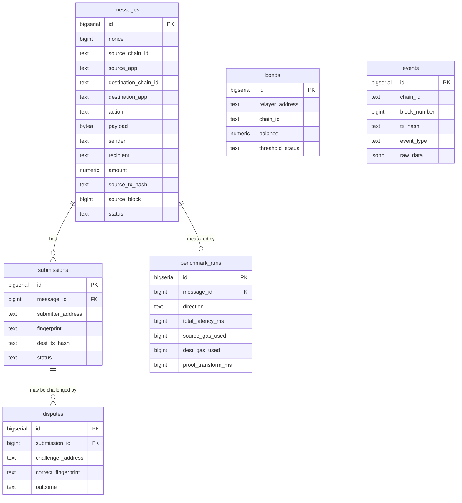

---

## Tables

| Table | Granularity | Purpose |
|-------|-------------|---------|
| `messages` | one row / cross-chain message | Lifecycle FSM — `pending → submitted → challenge_window → executed \| reverted` |
| `submissions` | one row / relayer attempt | Tracks who submitted, what fingerprint, and dest tx outcome |
| `disputes` | one row / challenge filed | Outcome: `upheld` (submitter slashed) or `rejected` (challenger slashed) |
| `bonds` | one row / relayer / chain | Periodically synced from on-chain Bond contract; powers dashboard |
| `events` | one row / raw chain event | Source-of-truth for the live dashboard event log; deduplicated by `(chain_id, tx_hash, event_type)` |
| `benchmark_runs` | one row / completed message | Per-direction latency + gas; powers the benchmark page |

---

## Message Status FSM

The `messages.status` column is a finite state machine driven by chain events. The relayer only writes from a small set of allowed transitions — these are enforced in code (`relayer/internal/state/transitions.go`), not by the database, because the database is a mirror, not the authority.

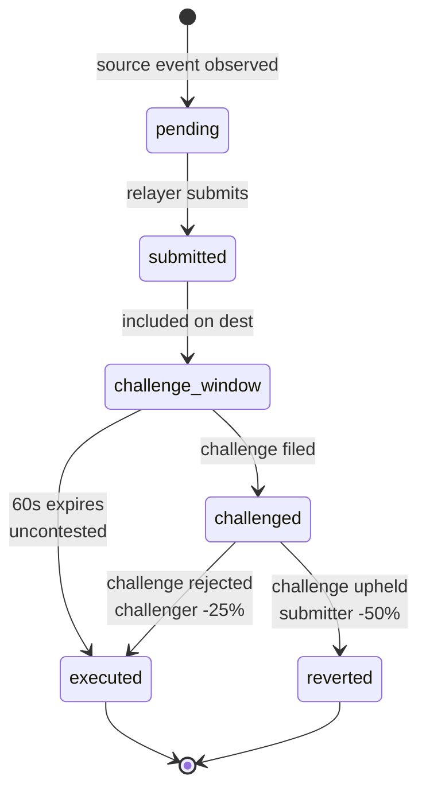

Only two terminal states: `executed` (success) and `reverted` (challenge upheld). Both clear the challenge window for downstream consumers.

---

## Why Two State Stores

| Question | Answer |
|----------|--------|
| Where is the authoritative bond balance? | On chain. The `bonds` Supabase table is a periodically-synced cache. |
| Where is the authoritative msgId-executed flag? | On chain. The Verifier rejects a duplicate msgId regardless of what Supabase says. |
| What if Supabase is wrong? | The dashboard shows stale data; the bridge still works. Operator backfill replays events. |
| What if the chain RPC is wrong? | L-1 limitation. Future work: sync committee for Sepolia. |

---

## Realtime + RLS

The frontend subscribes to `messages`, `submissions`, `disputes`, and `events` via Supabase realtime (Postgres logical replication). All six tables are RLS-enabled with `SELECT` public; writes require the service-role key, which only the relayer holds.

```sql
-- supabase/migrations/001_initial_schema.sql
ALTER TABLE messages    ENABLE ROW LEVEL SECURITY;
CREATE POLICY "public read messages" ON messages FOR SELECT USING (true);
-- Writes: service-role key only (relayer)

ALTER PUBLICATION supabase_realtime ADD TABLE messages;
ALTER PUBLICATION supabase_realtime ADD TABLE submissions;
ALTER PUBLICATION supabase_realtime ADD TABLE disputes;
ALTER PUBLICATION supabase_realtime ADD TABLE events;
```

---

> Related: [Architecture](./03-architecture) · [Scripts & Tests](./14-scripts) · [Limitations](./10-limitations)

---

## Scripts & Tests

Tessera ships with three families of scripts: **tests** (CI gates), **deploys** (one-shot, idempotent), and **scenarios** (the four hackathon demos). Every file in this section is real and pinned to its path; CI runs the test commands on every push.

---

## Test Commands

| Layer | Command | What it covers |
|-------|---------|----------------|
| Solidity | `cd contracts-evm && forge test` (88 tests) | Solidity contracts: unit + integration + scenarios + proof verification fixtures |
| Solidity coverage | `cd contracts-evm && forge coverage` (~91% line coverage) | Coverage report; gating value pre-merge |
| CosmWasm | `cd contracts-cosmwasm && cargo test --workspace` (full workspace) | CosmWasm contracts via cw-multi-test, including the four demo scenarios |
| CosmWasm lint | `cd contracts-cosmwasm && cargo clippy -- -D warnings` (zero warnings) | Lint gate |
| Go relayer | `cd relayer && go test -race ./...` (all packages) | Includes 100× determinism tests on transform layer + Ed25519 forgery test |

---

## Test File Map

| File | What it tests |
|------|---------------|
| `contracts-evm/test/unit/Verifier.t.sol` | submitMessage / challenge / executeMessage state machine; custom errors; access control |
| `contracts-evm/test/unit/Bond.t.sol` | deposit / slash / withdraw; threshold ladder (50% / 25%); CEI compliance |
| `contracts-evm/test/integration/VerifierProof.t.sol` | Real proof bytes (TesseraProof wire format); flags=0 accept, flags=1 reject |
| `contracts-evm/test/integration/BridgeScenarios.t.sol` | S-1 through S-4 end-to-end on a forked Foundry harness |
| `contracts-cosmwasm/contracts/verifier/src/tests/scenarios.rs` | CosmWasm side of the four scenarios (mirror of Solidity) |
| `relayer/internal/transform/transform_test.go` | 35 fixtures · cross-impl parity · 100× byte-identical determinism · msgId derivation |
| `relayer/plugins/tendermint/plugin_test.go` | Ed25519 verify-then-bypass; forged signature reordered to legitimate slot — still rejected |
| `relayer/internal/scenario/runner_test.go` | In-process scenario runner used by `go run ./cmd/tessera test-scenario [1..4]` |

---

## Deployment Scripts

| Script | Chain | Purpose |
|--------|-------|---------|
| `contracts-evm/script/Deploy.s.sol` | Sepolia | Foundry script — deploys all 6 EVM contracts with circular-dep break (Verifier setVerifier) |
| `scripts/deploy/sepolia.sh` | Sepolia | Wrapper that runs Deploy.s.sol with broadcast + verifies on Etherscan |
| `scripts/deploy/neutron.js` | Neutron pion-1 | CosmJS script — uploads + instantiates all 6 CosmWasm contracts; updates addresses.json |
| `scripts/register-sepolia-relayers.sh` | Sepolia | Registers + funds bond for Relayer A and B (post-deploy bootstrap) |
| `scripts/register-neutron-relayers.js` | Neutron | Registers + funds bond on Neutron side |
| `scripts/fund-all-neutron-v2.js` | Neutron | One-pass funding for all Neutron wallets (relayers + dev wallets) with tUSDC + uNTRN |
| `scripts/claim-neutron-tusdc.js` | Neutron | CLI claim helper for `tUSDC.Claim{}` — used during onboarding/QA |
| `scripts/smoke-test.sh` | both | End-to-end smoke: register both relayers, post bond, run honest scenario, verify execution |
| `scripts/addresses.json` | both | Machine-readable contract address registry; updated by every deploy script |

---

## Scenario Scripts (Live Testnet)

The four hackathon scenarios run against real testnet contracts. Each script is idempotent — it re-uses bonded relayers and produces a unique nonce. They mirror the in-process integration tests under `relayer/internal/scenario`.

| Script | Scenario | What it proves |
|--------|----------|----------------|
| `scripts/scenarios/01-honest.sh` | S-1 Honest delivery | Cryptographic verification path is wired correctly end-to-end |
| `scripts/scenarios/02-lying.sh` | S-2 Lying relayer | Challenger detects bad fingerprint → 50% slash to challenger |
| `scripts/scenarios/03-silent.sh` | S-3 Silent relayer | Handover triggers next relayer; original slashed for absence |
| `scripts/scenarios/04-frivolous.sh` | S-4 Frivolous challenge | 25% deposit forfeited; original tx proceeds normally |

> The in-process equivalent (no testnet funds required) is `go run ./cmd/tessera test-scenario [1..4]`.

---

## Verification Suite (Playwright)

Three end-to-end UI suites guard the demo path. They live under `scripts/verify/` and require the dev server running on `:3000`:

- `scripts/verify/ui-verify.py` — homepage, dashboard, demo, submission detail, and explorer-link format checks. Includes SEC-02 same-origin guard (deny no-Origin POST → 403).
- `scripts/verify/demo-verify.py` — demo page UX: page-load scroll position, log-container scroll behavior, Clear-Log button, run separators.
- `scripts/verify/docs-mermaid-verify.py` — every section in `/docs` renders its expected Mermaid diagrams without parse errors.

UI + demo suites pass 11/11 as of P-10 audit gate close; the docs suite passes 9/9 as of the documentation overhaul. They are check-in suites, not replacements for unit tests.

---

> Related: [Demo Scenarios](./05-demo-scenarios) · [Developer Guide](./07-developer-guide) · [Repo Structure](./06-repo-structure)

---

## Cryptography Deep-Dive

The core cryptographic problem Tessera solves: Ethereum and Cosmos use fundamentally different data structures for their state proofs, and use different hash functions to anchor them. The transformation layer bridges them deterministically — without requiring either chain to understand the other's format and without a trusted oracle. This section walks through every cryptographic primitive in the system, what it commits to, and how each piece is verified.

---

## The Four Cryptographic Primitives In Play

| Primitive | Used by | Where verified | Why it matters |
|-----------|---------|----------------|----------------|
| `Keccak-256` | Ethereum (Patricia node hashing) | On-chain in Solidity Verifier (~36 gas/byte) | Anchors Ethereum state root |
| `SHA-256` | Cosmos (IAVL node hashing, Tendermint hashing) | On-chain in CosmWasm Verifier (precompile) | Anchors Tendermint app state root |
| `RLP` | Ethereum (proof node encoding) | Solidity Verifier walks Patricia nodes | Deterministic byte encoding for Patricia |
| `Ed25519` | Tendermint (block validator signatures) | Off-chain in Go (verify-then-bypass) | EVM cost for on-chain Ed25519: prohibitive |

---

## Patricia Merkle Trie — Ethereum Side

Ethereum state is stored in a Modified Merkle Patricia Trie. Proofs are a sequence of RLP-encoded nodes — Branch (16 children + value), Extension (compressed nibble path), and Leaf (terminal value). Every node is hashed with Keccak-256. The root is committed in each block header.

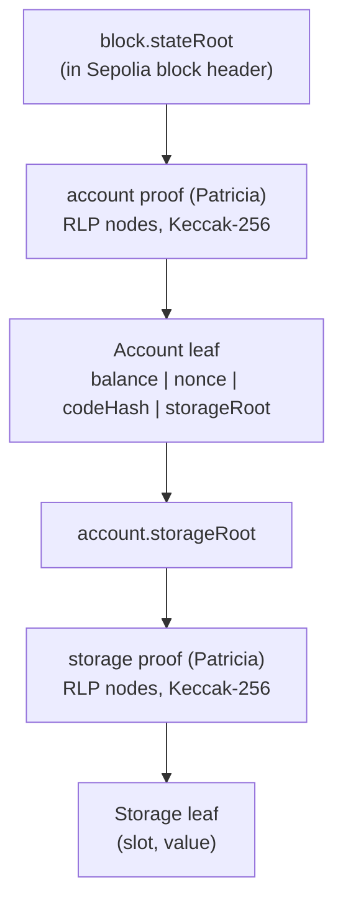

The verifier walks the path from leaf to root, hashing each step with Keccak-256, and asserts the final hash equals the on-chain `block.stateRoot`.

---

## IAVL Tree — Cosmos Side

Cosmos chains use an IAVL+ tree (a self-balancing AVL Merkle tree) for module-store proofs. Nodes are encoded with Protobuf and hashed with SHA-256. The IAVL root is included in the Tendermint commit hash, which is signed by the validator set.

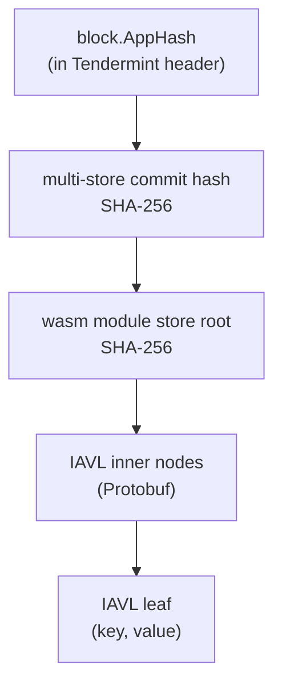

The verifier reconstructs the path from leaf to root, hashing with SHA-256, and asserts the final hash matches the AppHash committed in the block.

---

## Deterministic Transformation — The Byte-Identity Claim

The transformation between Patricia and IAVL is a *pure function of the input proof and the input fingerprint*. The same input always produces the same output byte-for-byte — a property called **determinism**. This is the load-bearing security claim: it's what makes fraud detectable.

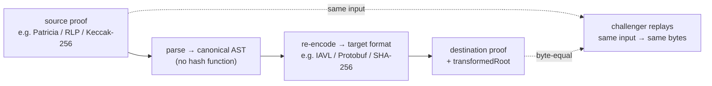

The relayer parses the source proof into a chain-neutral canonical AST, then re-encodes it for the target. Any party can replay this — that's the security property.

The acceptance test for the transform layer is exactly this: 100 independent runs on the same input produce 100 byte-identical outputs. The test fixture lives in `relayer/internal/transform/transform_test.go` (35 fixtures, including cross-implementation parity at 100×).

> Both proofs commit to the same logical claim: *"Vault contract storage slot 0x4 has value 100,000,000 at block N"* — anchored differently for each chain's native verification path.

**Why this enables challenge:** the submitter posts `(envelope, transformedRoot, destinationProof)`. Any other relayer can fetch the source proof, re-run the transform, and check whether the submitter's `transformedRoot` matches. If it does, the submission stands. If it doesn't, anyone can call `challenge(...)` with the correct fingerprint and slash 50% of the submitter's bond.

---

## Ed25519 Bypass — The Off-Chain Verification Path

Tendermint validators sign block commits with Ed25519. Verifying one Ed25519 signature on the EVM costs roughly 500k gas; verifying 2/3+ of a typical Cosmos validator set (Neutron pion-1 testnet runs dozens; Cosmos Hub mainnet runs ~150) is not economically viable. Tessera sidesteps this by verifying the entire validator set off-chain in Go, using the production cometbft library, before submitting anything to Sepolia.

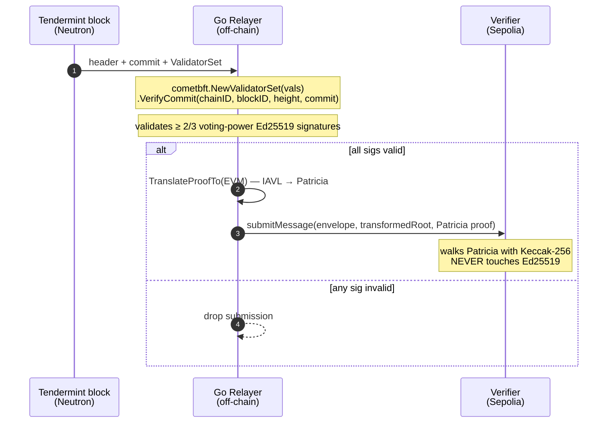

The Go relayer is the only place Ed25519 is touched. Sepolia only ever sees Patricia (Keccak-256) — a primitive its precompile already supports.

The hostile-input test for this lives in `relayer/plugins/tendermint/plugin_test.go` (function `TestVerifyConsensusUnit`): a forged signature reordered to the exact slot a legitimate validator occupies is *still rejected* because cometbft's `NewValidatorSet` sorts by (voting power desc, address asc) before `VerifyCommit` runs. This is the subtle bug class the test prevents.

---

## Message ID Derivation

Every cross-chain message has a stable ID — the `msgId` — that's the same on both chains. It's derived from the canonical envelope so that *both* chains compute the identical 32-byte ID without any cross-chain lookup. The Solidity Verifier and the CosmWasm Verifier each compute it independently and check equality on execution.

```
msgId = keccak256(
    abi.encode(
        envelope.sourceChainId,
        envelope.sourceApp,
        envelope.destinationChainId,
        envelope.destinationApp,
        envelope.action,
        envelope.payload,
        envelope.nonce
    )
)

// Sepolia: Verifier._envelopeHash() — same encoding
// Neutron: cosmwasm verifier::msg_id() — same encoding
// Test:    relayer/internal/transform/transform_test.go
//          (TestVerify_WrongMsgID + cross-impl parity fixtures)
```

The nonce is monotonic per `(sourceChain, sourceApp)`, preventing replay across messages. Replay against a different `destinationApp` is impossible: the `destinationApp` field is inside the hash. Replay across chains is impossible: chain IDs are inside the hash.

---

## Verification Claim — What We Actually Prove

1. **Source-event integrity.** The destination chain only executes a message after Merkle-walking a proof against its own native commitment. If the source event didn't happen, the proof doesn't exist and the walk fails.

2. **Validator-set authenticity (Cosmos→EVM).** The Go relayer verifies 2/3+ of the validator set signed the block before the relayer is willing to vouch for the source root. Forged or reordered signatures are rejected by cometbft's reference VerifyCommit.

3. **Transform integrity.** Determinism makes the transform a verifiable computation: any honest relayer can re-run it and reach byte-identical output. A wrong `transformedRoot` is a publicly slashable event.

4. **Replay resistance.** The msgId binds chain IDs, app addresses, action selector, payload, and nonce. The Verifier rejects an already-executed msgId. Cross-chain and within-chain replay both fail.

5. **Source consensus on Sepolia (limitation L-1).** For Sepolia→Neutron, the relayer trusts its configured Sepolia RPC. Mitigation: integrate sync committee verification (Beacon BLS aggregation). Pure off-chain Go change; documented in the roadmap.

---

> Related: [Architecture](./03-architecture) · [Limitations](./10-limitations) · [Future Work](./11-future-work)

---

## Appendix A — Screenshot Gallery

All UI screenshots are tracked in `docs/images/`. The desktop captures are 1400×900; mobile captures are 414×900 (iPhone 11 viewport).


---

## Appendix B — How This File Is Maintained

This single-file export is the canonical Notion-paste artefact. It is regenerated by `/tmp/build-notion-export.py` (kept out of git — it's a one-shot tool) by stitching every MDX file in `docs/sidebar.json` order. After running the script:

1. Open https://www.notion.so/Tessera-35a23e3815fc81a08b60c8fd039ba123
2. Replace the page body with the contents of this file
3. Notion auto-renders the ```mermaid code blocks as diagrams
4. Notion auto-renders relative `./images/*.png` references — drag the image folder into Notion if needed
